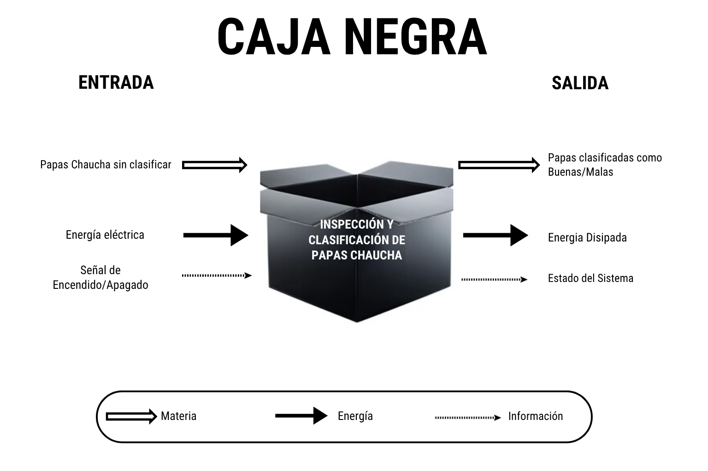
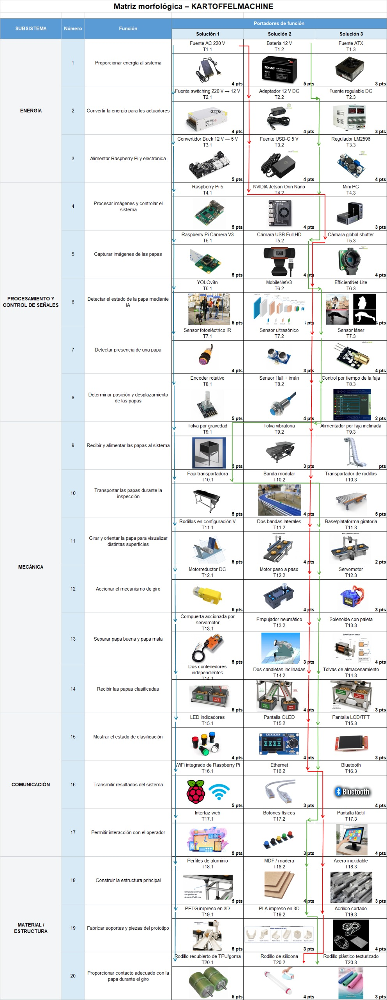
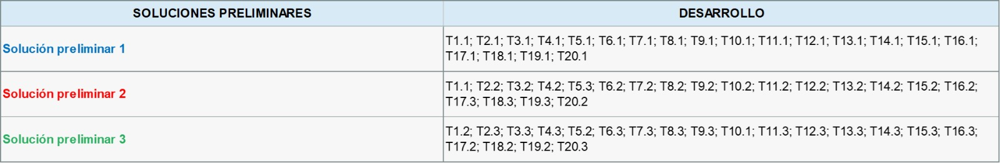
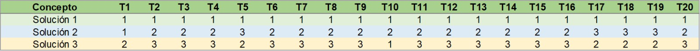
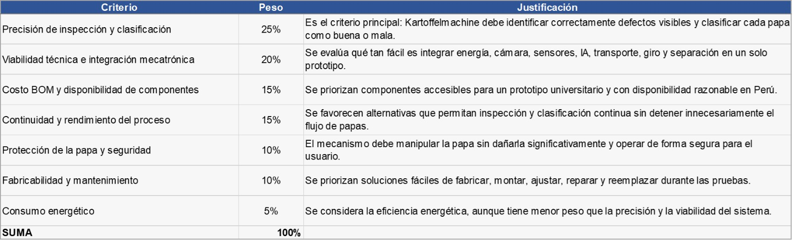
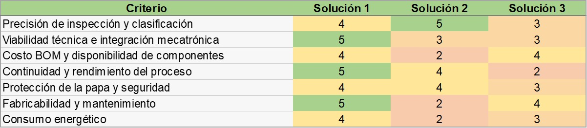
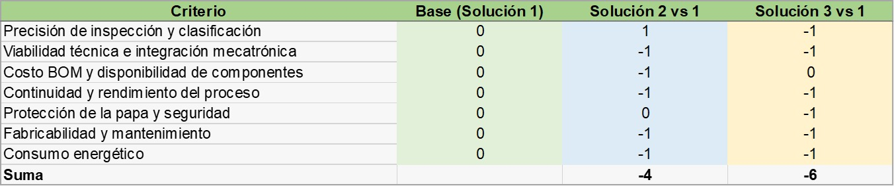
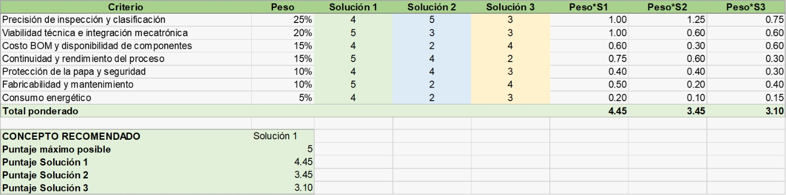

# Caja Negra, Esquema de Funciones y Matriz Morfológica — Kartoffelmaschine

## Caja Negra

<p align="center">
  
</p>

La **Caja Negra** representa el funcionamiento general de **Kartoffelmachine**, un sistema mecatrónico diseñado para la **inspección y clasificación de papas Chaucha**.

Como entradas, el sistema recibe **papas Chaucha sin clasificar**, **energía eléctrica** y una **señal de encendido/apagado** **.

Luego de la inspección mediante visión artificial, se obtienen como salidas las **papas clasificadas como buenas o malas**, además del **estado del sistema**y la **energía disipada** durante el funcionamiento.

### Tipos de flujo

- **Materia:** papas Chaucha que ingresan y salen clasificadas.
- **Energía:** energía eléctrica de entrada y energía disipada.
- **Información:** señales de encendido/apagado, presencia

---

## Esquema de Funciones

<p align="center">
  
</p>


El **Esquema de Funciones** descompone Kartoffelmachine en los principales subsistemas que permiten realizar automáticamente el proceso de inspección y clasificación. El sistema está conformado por los subsistemas de **energía, control, sensores y visión, Machine Learning, actuadores y sistema mecánico**.

Estos subsistemas intercambian flujos de **materia, energía e información**, permitiendo que la papa avance desde la entrada hasta una de las dos salidas según el resultado obtenido por el modelo de visión artificial.

### Subsistema de energía

La energía eléctrica ingresa al sistema y pasa por las siguientes funciones:

1. **Recibir energía eléctrica.**
2. **Regular la energía.**
3. **Distribuir la energía** hacia el sistema de control, sensores, cámara, iluminación y actuadores.

Este subsistema proporciona los niveles de tensión necesarios para el funcionamiento adecuado de los componentes electrónicos y mecánicos.

### Subsistema de control

El sistema de control coordina el funcionamiento general de Kartoffelmachine. Sus principales funciones son:

1. **Detectar la señal de encendido o apagado.**
2. **Recibir la señal de los sensores.**
3. **Enviar las imágenes al sistema de inteligencia artificial.**
4. **Recibir el resultado generado por la IA.**
5. **Activar los actuadores según el resultado obtenido.**

De esta manera, el control actúa como enlace entre la detección de la papa, el procesamiento mediante inteligencia artificial y los mecanismos físicos del sistema.

### Subsistema de sensores y visión

Este subsistema permite detectar la presencia de la papa y obtener las imágenes necesarias para realizar su clasificación.

Sus funciones principales son:

1. **Detectar la papa en posición.**
2. **Capturar imágenes durante la rotación de la papa.**
3. **Enviar la señal digital al sistema de control.**

La rotación de la papa permite observar diferentes zonas de su superficie y obtener mayor información para el proceso de clasificación.

### Subsistema de Machine Learning — YOLO

El procesamiento mediante inteligencia artificial se realiza a partir de las imágenes capturadas durante la inspección.

El flujo de procesamiento es:

1. **Recibir las imágenes enviadas por el control.**
2. **Analizar las imágenes mediante el modelo YOLO.**
3. **Clasificar la papa como buena o mala.**
4. **Enviar el resultado de clasificación al sistema de control.**

El modelo de visión artificial permite identificar características o defectos visibles en la superficie de la papa y generar automáticamente el resultado de clasificación.

### Subsistema de actuadores

Los actuadores convierten las señales enviadas por el control en acciones físicas dentro del prototipo.

Sus principales funciones son:

1. **Girar los motores** encargados de la rotación y el transporte.
2. **Accionar la compuerta separadora.**
3. **Iluminar la zona de captura mediante LED.**
4. **Mostrar el resultado mediante un LED de color.**

### Sistema mecánico

El sistema mecánico se encarga directamente del desplazamiento y manipulación de las papas.

El flujo principal es:

```text
Papa sin clasificar
        ↓
Recibir papa
(Tolva)
        ↓
Sujetar y orientar papa
(Guía / rodillos en V)
        ↓
Rotar la papa 360°
y capturar imágenes
        ↓
Transportar papa
(Faja)
        ↓
Separar papa
(Compuerta)
      ↙     ↘
 Papa buena  Papa mala
 (Salida 1)  (Salida 2)
```

De esta manera, la papa pasa por las etapas de **alimentación, orientación, rotación, captura de imágenes, transporte y separación** hasta llegar al contenedor correspondiente.

### Señales principales del esquema

| Señal | Descripción |
| --- | --- |
| **Z** | Señal de encendido/apagado que habilita el funcionamiento general del sistema. |
| **A** | Señal relacionada con la posición de la papa y la interacción entre el sistema mecánico, sensores y control. |
| **B** | Imágenes enviadas desde el control hacia el sistema de Machine Learning. |
| **C** | Resultado de clasificación enviado por la IA al sistema de control. |
| **E** | Señal de accionamiento enviada hacia los actuadores. |

---

### 2.3.1. Alternativas tecnológicas

Las alternativas propuestas para cada función se identifican mediante la nomenclatura **Tn.m**, donde:

- **T** representa una alternativa tecnológica.
- **n** corresponde al número de la función dentro del sistema.
- **m** identifica la alternativa propuesta para dicha función.

Por ejemplo, **T11.1** representa la primera alternativa tecnológica considerada para la función 11.

Esta nomenclatura permite relacionar cada componente o mecanismo con la función que debe cumplir y facilita la construcción posterior de diferentes configuraciones del sistema.

<p align="center">
  <strong>Figura 3. Matriz morfológica de Kartoffelmachine</strong>
  <br><br>
  
</p>

Las alternativas fueron planteadas considerando las necesidades particulares del prototipo. Algunas opciones ofrecen mayores prestaciones técnicas, mientras que otras presentan ventajas relacionadas con la disponibilidad, el costo, la facilidad de fabricación o la simplicidad de implementación.

La existencia de varias alternativas para una misma función permite evaluar distintas posibilidades antes de definir la arquitectura final de Kartoffelmachine.

---

### 2.3.2. Desarrollo de las soluciones preliminares

A partir de las alternativas definidas en la matriz morfológica se generaron **tres soluciones preliminares**.

Cada solución representa una configuración completa del sistema y se obtiene seleccionando una alternativa tecnológica para cada una de las veinte funciones establecidas.

<p align="center">
  <strong>Figura 4. Desarrollo de las soluciones preliminares</strong>
  <br><br>
  
</p>

La **Solución preliminar 1** está orientada a obtener un equilibrio entre funcionamiento, integración mecatrónica, disponibilidad de componentes y facilidad de construcción.

La **Solución preliminar 2** incorpora alternativas con mayores prestaciones en determinados subsistemas, principalmente en procesamiento y adquisición de imágenes, aunque esto incrementa la complejidad y los requerimientos de implementación.

La **Solución preliminar 3** plantea una arquitectura diferente para realizar las etapas de alimentación, procesamiento, orientación, inspección y clasificación de las papas.

La generación de estas propuestas permite pasar de alternativas tecnológicas individuales a **configuraciones completas capaces de cumplir todas las funciones requeridas por Kartoffelmachine**.

---

### 2.3.3. Configuración de los conceptos

Las tres soluciones preliminares fueron organizadas según las **20 funciones del sistema**, permitiendo identificar de forma resumida la alternativa empleada por cada propuesta.

<p align="center">
  <strong>Figura 5. Configuración tecnológica de las soluciones propuestas</strong>
  <br><br>
  
</p>

Esta organización permite comparar directamente las arquitecturas propuestas y reconocer las principales diferencias existentes entre ellas antes de iniciar la evaluación cuantitativa.

La **Solución 1** utiliza principalmente alternativas orientadas a una implementación funcional y accesible para el prototipo.

La **Solución 2** combina tecnologías con mayores prestaciones en algunos subsistemas, pero requiere una integración más compleja.

La **Solución 3** utiliza una combinación diferente de componentes y mecanismos, proporcionando una tercera posibilidad para el funcionamiento del sistema.

Esta etapa permite analizar las soluciones como un conjunto completo y no únicamente como una selección independiente de componentes.

---

### 2.3.4. Criterios de evaluación

Para determinar cuál de las tres soluciones presenta mejores condiciones para continuar con el desarrollo de Kartoffelmachine, se establecieron diferentes **criterios de evaluación**.

Cada criterio posee una ponderación de acuerdo con su importancia dentro del funcionamiento y construcción del prototipo.

<p align="center">
  <strong>Figura 6. Criterios, ponderaciones y justificación de la evaluación</strong>
  <br><br>
  
</p>

Los criterios considerados fueron:

- **Precisión de inspección y clasificación:** evalúa la capacidad del sistema para identificar correctamente el estado de cada papa mediante visión artificial.

- **Viabilidad técnica e integración mecatrónica:** considera qué tan factible resulta integrar el sistema de energía, procesamiento, cámara, sensores, actuadores y mecanismos dentro de un único prototipo.

- **Costo BOM y disponibilidad de componentes:** considera el costo aproximado de los elementos necesarios y la facilidad para adquirirlos durante el desarrollo del proyecto.

- **Continuidad y rendimiento del proceso:** evalúa la capacidad del sistema para mantener el flujo de las papas durante las etapas de alimentación, inspección y clasificación.

- **Protección de la papa y seguridad:** considera que la manipulación mecánica no produzca daños significativos sobre el producto y que el sistema pueda operar de forma segura.

- **Fabricabilidad y mantenimiento:** evalúa la facilidad para fabricar, montar, ajustar, reparar o sustituir los diferentes elementos del prototipo.

- **Consumo energético:** considera la demanda de energía necesaria para mantener en funcionamiento los componentes electrónicos y mecánicos.

La **precisión de inspección y clasificación** recibe la mayor ponderación debido a que corresponde al objetivo principal de Kartoffelmachine. Asimismo, la **viabilidad técnica e integración mecatrónica** posee una importancia elevada por la necesidad de coordinar correctamente todos los subsistemas involucrados.

---

### 2.3.5. Valoración de las soluciones

Una vez definidos los criterios, cada solución preliminar fue evaluada utilizando una escala de **1 a 5 puntos**.

La escala utilizada se interpreta de la siguiente manera:

| Puntaje | Interpretación |
|:---:|---|
| **1** | Muy desfavorable |
| **2** | Poco favorable |
| **3** | Aceptable |
| **4** | Favorable |
| **5** | Muy favorable |

<p align="center">
  <strong>Figura 7. Valoración de las soluciones preliminares</strong>
  <br><br>
  
</p>

La valoración permite identificar las fortalezas y limitaciones de cada propuesta considerando todos los criterios establecidos.

La **Solución 1** mantiene un desempeño favorable en la mayoría de los aspectos evaluados, destacando especialmente en **viabilidad técnica, continuidad del proceso y fabricabilidad**.

La **Solución 2** presenta una ventaja en la precisión de inspección y clasificación, pero requiere componentes y mecanismos que aumentan el costo, la complejidad de integración y las necesidades de mantenimiento.

La **Solución 3** presenta resultados favorables en algunos aspectos relacionados con disponibilidad y fabricación, aunque muestra mayores limitaciones en la continuidad y rendimiento del proceso.

Por lo tanto, la alternativa con mayor capacidad tecnológica en un criterio específico no necesariamente representa la mejor configuración global para el prototipo.

---

### 2.3.6. Comparación relativa mediante Matriz de Pugh

Como método complementario de evaluación se empleó una **Matriz de Pugh**.

Este método permite comparar diferentes alternativas utilizando una de ellas como referencia. Para Kartoffelmachine se tomó la **Solución 1 como solución base**.

La comparación emplea la siguiente escala:

- **+1:** desempeño superior respecto a la solución de referencia.
- **0:** desempeño equivalente respecto a la solución de referencia.
- **−1:** desempeño inferior respecto a la solución de referencia.

<p align="center">
  <strong>Figura 8. Comparación de las soluciones mediante Matriz de Pugh</strong>
  <br><br>
  
</p>

La **Solución 2** supera a la solución de referencia en precisión de inspección y clasificación; sin embargo, presenta desventajas en varios de los demás criterios considerados, obteniendo un resultado acumulado de **−4**.

La **Solución 3** presenta un mayor número de características desfavorables respecto a la solución base, alcanzando un resultado acumulado de **−6**.

Estos resultados indican que la **Solución 1 mantiene un comportamiento más equilibrado** frente a los requerimientos generales del proyecto.

La Matriz de Pugh permite así complementar la valoración inicial y verificar que una mejora puntual en determinadas prestaciones no compensa necesariamente las dificultades adicionales de costo, integración, fabricación o rendimiento.

---

### 2.3.7. Evaluación ponderada

Para realizar una comparación final se aplicó una **evaluación ponderada**, considerando tanto la puntuación obtenida por cada solución como la importancia asignada a cada criterio.

El cálculo utilizado corresponde a:

**Puntaje ponderado = Peso del criterio × Puntuación de la solución**

Posteriormente, los valores obtenidos para cada criterio son sumados para determinar la valoración global de cada propuesta.

<p align="center">
  <strong>Figura 9. Evaluación ponderada y selección de la solución</strong>
  <br><br>
  
</p>

La evaluación ponderada determina que la **Solución 1 obtiene la mayor valoración global con 4.45 puntos sobre 5**, seguida por la **Solución 2 con 3.45 puntos** y la **Solución 3 con 3.10 puntos**.

Este resultado demuestra que la primera propuesta mantiene el mejor equilibrio entre los diferentes requerimientos considerados para el desarrollo del prototipo.

Aunque la Solución 2 presenta mejores prestaciones en precisión, la Solución 1 obtiene mejores resultados generales al considerar conjuntamente la **integración mecatrónica, continuidad del proceso, costo, fabricación, mantenimiento, seguridad y consumo energético**.

---

### 2.3.8. Selección de la solución final

La aplicación conjunta de la **matriz morfológica, la valoración técnica, la Matriz de Pugh y la evaluación ponderada** permitió realizar una selección estructurada de la arquitectura más conveniente para Kartoffelmachine.

La **Solución preliminar 1** fue seleccionada como la alternativa de referencia para continuar con el desarrollo del proyecto.

Su principal ventaja consiste en mantener un equilibrio adecuado entre los subsistemas encargados de la **alimentación, inspección mediante visión artificial, procesamiento, detección, transporte, giro, separación, comunicación y estructura mecánica**.

La selección no se basa únicamente en utilizar los componentes con mayores prestaciones individuales, sino en determinar qué combinación puede integrarse de manera más eficiente dentro de un prototipo funcional y viable.

El proceso empleado para obtener la configuración final puede resumirse como:

**Funciones del sistema → Alternativas tecnológicas → Soluciones preliminares → Configuración de conceptos → Criterios de evaluación → Valoración técnica → Matriz de Pugh → Evaluación ponderada → Selección de la Solución 1**

De esta manera, la **Solución preliminar 1** queda establecida como base para continuar con las siguientes etapas de **diseño detallado, integración y construcción de Kartoffelmachine**.
