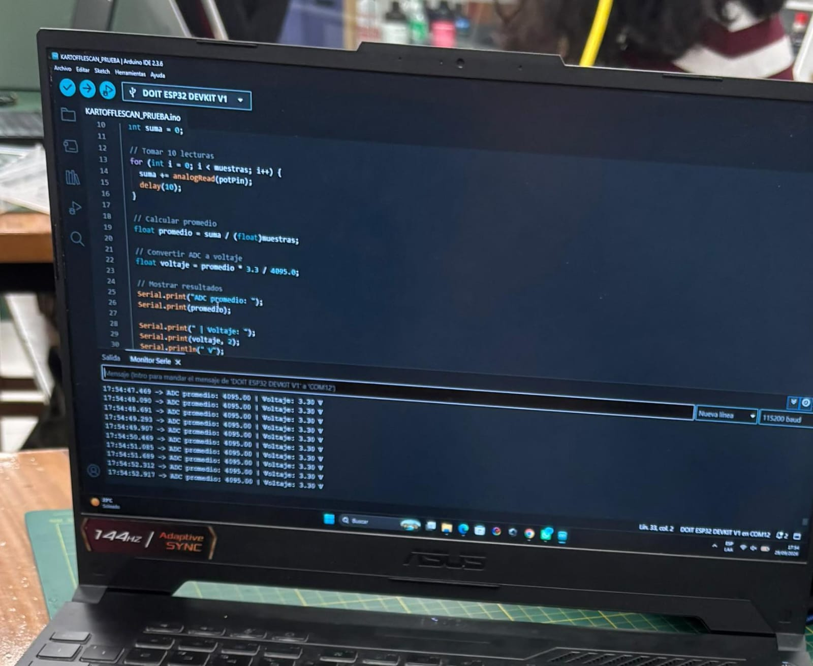
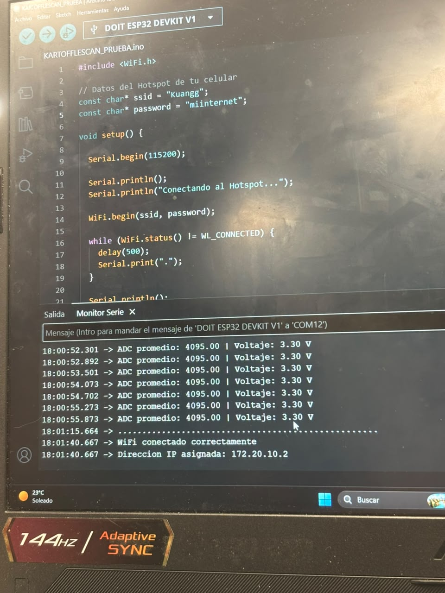

## TALLER DE INTERNET DE LAS COSAS 

El Internet de las Cosas (IoT) es la idea de conectar objetos físicos a internet para que puedan captar datos, enviarlos y, a veces, recibir órdenes, sin que una persona tenga que intervenir cada vez.

Los materiales que usamos:
- 01 ESP32 Dev Kit 1
- 01 Arduino EXPLORE IoT Kit
- 01 Kit de sensores Keystudio 48 en 1
- 01 Multímetro
- 01 Protoboard

## Actividad 1: Lectura de un Potenciómetro con ESP32
Mejorar el código anterior haciendo uso de un promediado de los datos y convirtiendo los
valores del ADC a valores de voltaje.

Código Básico:
```cpp
int potPin = 34; 

void setup() {

Serial.begin(115200); 

}

void loop() {

int valor = analogRead(potPin); 

Serial.println(valor); 

delay(500); 

}
```




El monitor muestra el ADC promedio (0–4095) y su equivalente en voltaje (0–3.3 V).

**Código:**

```cpp
const int pinPot = 34;
const int totalMuestras = 10;

void setup() {
  Serial.begin(115200);
}

void loop() {
  long acumulado = 0;

  // Se toman varias muestras para suavizar la lectura
  for (int i = 0; i < totalMuestras; i++) {
    acumulado += analogRead(pinPot);
    delay(10);
  }

  float adcPromedio = acumulado / (float)totalMuestras;
  float voltios = adcPromedio * 3.3 / 4095.0;

  Serial.print("ADC promedio: ");
  Serial.print(adcPromedio);
  Serial.print(" | Voltaje: ");
  Serial.print(voltios, 2);
  Serial.println(" V");

  delay(500);
}
```

---

## Actividad 2: Scanner WIFI con ESP32

Crear una red WIFI usando su Smartphone como Hotspot, y conectarse a ella con el ESP32. En el
monitor serial se deberá visualizar la dirección IP asignada.




