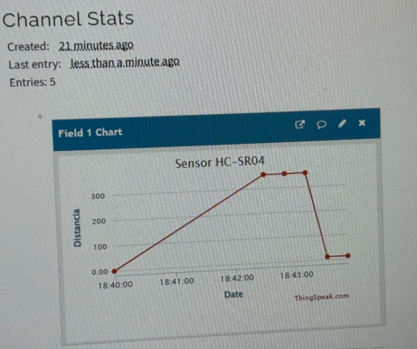
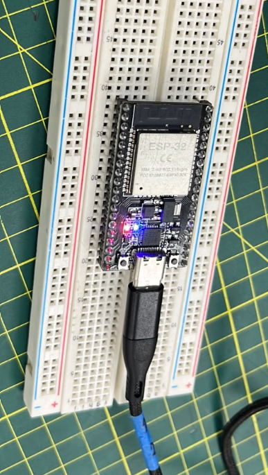

## TALLER DE INTERNET DE LAS COSAS 

El Internet de las Cosas (IoT) es la idea de conectar objetos físicos a internet para que puedan captar datos, enviarlos y, a veces, recibir órdenes, sin que una persona tenga que intervenir cada vez.

Los materiales que usamos:
- 01 ESP32 Dev Kit 1
- 01 Arduino EXPLORE IoT Kit
- 01 Kit de sensores Keystudio 48 en 1
- 01 Multímetro
- 01 Protoboard

## Actividad 1: Lectura de un Potenciómetro con ESP32
Mejorar el código anterior haciendo uso de un promediado de los datos y convirtiendo los
valores del ADC a valores de voltaje.

Código Básico:
```cpp
int potPin = 34; 

void setup() {

Serial.begin(115200); 

}

void loop() {

int valor = analogRead(potPin); 

Serial.println(valor); 

delay(500); 

}
```


El monitor muestra el ADC promedio (0–4095) y su equivalente en voltaje (0–3.3 V).

Código:

```cpp
const int pinPot = 34;
const int totalMuestras = 10;

void setup() {
  Serial.begin(115200);
}

void loop() {
  long acumulado = 0;

  // Se toman varias muestras para suavizar la lectura
  for (int i = 0; i < totalMuestras; i++) {
    acumulado += analogRead(pinPot);
    delay(10);
  }

  float adcPromedio = acumulado / (float)totalMuestras;
  float voltios = adcPromedio * 3.3 / 4095.0;

  Serial.print("ADC promedio: ");
  Serial.print(adcPromedio);
  Serial.print(" | Voltaje: ");
  Serial.print(voltios, 2);
  Serial.println(" V");

  delay(500);
}
```

---

## Actividad 2: Scanner WIFI con ESP32

Crear una red WIFI usando su Smartphone como Hotspot, y conectarse a ella con el ESP32. En el
monitor serial se deberá visualizar la dirección IP asignada.


El ESP32 se conectó al hotspot y el monitor serie mostró la IP asignada por el celular:
La conexión fue exitosa y la IP quedó visible en el monitor serial.

Código:

```cpp
#include <WiFi.h>

const char* ssid = "NOMBRE_DE_LA_RED";
const char* password = "CONTRASEÑA_DE_LA_RED";

void setup() {
  Serial.begin(115200);
  Serial.println("Intentando conectar al WiFi...");

  WiFi.begin(ssid, password);

  while (WiFi.status() != WL_CONNECTED) {
    delay(500);
    Serial.print(".");
  }

  Serial.println();
  Serial.println("Conexión WiFi establecida");
  Serial.print("IP asignada: ");
  Serial.println(WiFi.localIP());
}

void loop() {
}
```

---

## Actividad 3: Enviando datos a la nube

Mostrar en tiempo real la variación del potenciómetro en tres plataformas: Arduino Cloud, ThingSpeak y Ubidots.


Se volvió a utilizar el potenciómetro conectado al **GPIO 34**. En esta ocasión, el valor obtenido se transmite mediante **WiFi** al **Field 1** de un canal en **ThingSpeak**. El envío de los datos se realiza cada **20 segundos**.

Conexiones: Los extremos del potenciómetro se conectaron a **3.3 V** y **GND**, mientras que el pin central se conectó al **GPIO 34**.

Monitor serial: permite verificar y confirmar cada vez que se realiza el envío de los datos.


Gráfica en ThingSpeak


Código:

```cpp
#include <WiFi.h>
#include <ThingSpeak.h>

const char* ssid = "NOMBRE_DE_LA_RED";
const char* password = "CONTRASEÑA_DE_LA_RED";

unsigned long channelID = TU_CHANNEL_ID;
const char* writeAPIKey = "TU_WRITE_API_KEY";

WiFiClient client;

const int pinPot = 34;

void setup() {
  Serial.begin(115200);
  Serial.println("Intentando conectar al WiFi...");

  WiFi.begin(ssid, password);

  while (WiFi.status() != WL_CONNECTED) {
    delay(500);
    Serial.print(".");
  }

  Serial.println();
  Serial.println("Conexión WiFi establecida");
  Serial.print("IP del ESP32: ");
  Serial.println(WiFi.localIP());

  ThingSpeak.begin(client);
}

void loop() {
  int lectura = analogRead(pinPot);

  Serial.print("Potenciómetro: ");
  Serial.println(lectura);

  int codigo = ThingSpeak.writeField(channelID, 1, lectura, writeAPIKey);

  if (codigo == 200) {
    Serial.println("Dato enviado a ThingSpeak");
  } else {
    Serial.print("Falló el envío. Código: ");
    Serial.println(codigo);
  }

  Serial.println("------------------------");
  delay(20000);
}
```
Tampoco se publican la contraseña del WiFi ni la API Key real de ThingSpeak.


---

## Actividad 04: Enviando datos a la nube pt. 2

Escribir un código que muestre en tiempo real la variación de uno de los sensores del kit
Keystudio (LM35, LDR, etc) conectado al ESP32 en las siguientes plataformas de IoT: Arduino
Cloud, ThingSpeak y Ubidots.

Conexiones:

| HC-SR04 | ESP32 |
|---|---|
| VCC | 5V |
| GND | GND |
| TRIG | GPIO 25 |
| ECHO | GPIO 26 |

Circuito:


Distancia registrada en ThingSpeak



Código:

```cpp
#include <WiFi.h>
#include <ThingSpeak.h>

const char* ssid = "NOMBRE_DE_LA_RED";
const char* password = "CONTRASEÑA_DE_LA_RED";

unsigned long channelID = TU_CHANNEL_ID;
const char* writeAPIKey = "TU_WRITE_API_KEY";

WiFiClient client;

const int pinTrig = 25;
const int pinEcho = 26;

void setup() {
  Serial.begin(115200);

  pinMode(pinTrig, OUTPUT);
  pinMode(pinEcho, INPUT);

  Serial.println("Intentando conectar al WiFi...");
  WiFi.begin(ssid, password);

  while (WiFi.status() != WL_CONNECTED) {
    delay(500);
    Serial.print(".");
  }

  Serial.println();
  Serial.println("Conexión WiFi establecida");
  Serial.print("IP del ESP32: ");
  Serial.println(WiFi.localIP());

  ThingSpeak.begin(client);
}

void loop() {
  // Pulso de disparo de 10 µs
  digitalWrite(pinTrig, LOW);
  delayMicroseconds(2);
  digitalWrite(pinTrig, HIGH);
  delayMicroseconds(10);
  digitalWrite(pinTrig, LOW);

  // Tiempo del eco (máx. 30 ms)
  long tiempoEco = pulseIn(pinEcho, HIGH, 30000);

  // Velocidad del sonido ≈ 0.0343 cm/µs; se divide entre 2 (ida y vuelta)
  float distanciaCm = tiempoEco * 0.0343 / 2.0;

  Serial.print("Distancia: ");
  Serial.print(distanciaCm);
  Serial.println(" cm");

  int codigo = ThingSpeak.writeField(channelID, 1, distanciaCm, writeAPIKey);

  if (codigo == 200) {
    Serial.println("Dato enviado a ThingSpeak");
  } else {
    Serial.print("Falló el envío. Código: ");
    Serial.println(codigo);
  }

  Serial.println("------------------------");
  delay(20000);
}
```
---

## Actividad 05: Controlando desde la Nube

Conectar un LED en uno de los pines digitales del ESP32 y controlar su encendido desde alguna
de las plataformas web de su preferencia.

Conexión del LED:




Pagina de control


Al presionar un botón, el **ESP32** recibe la ruta correspondiente (`/encender` o `/apagar`) y modifica el estado del pin según la opción seleccionada.


Código:

```cpp
#include <WiFi.h>
#include <WebServer.h>

const char* ssid = "NOMBRE_DE_LA_RED";
const char* password = "CONTRASEÑA_DE_LA_RED";

const int pinLed = 23;

WebServer servidor(80);

String construirPagina() {
  String html = R"rawliteral(
  <!DOCTYPE html>
  <html>
  <head>
    <meta charset="UTF-8">
    <meta name="viewport" content="width=device-width, initial-scale=1.0">
    <title>ESP32 - Control Web</title>
    <style>
      body { font-family: Arial, sans-serif; text-align: center; margin-top: 50px; }
      h1 { color: #333; }
      button {
        width: 200px; padding: 15px; margin: 10px;
        border: none; border-radius: 8px;
        color: white; font-size: 18px; cursor: pointer;
      }
      .encender { background-color: green; }
      .apagar { background-color: red; }
    </style>
  </head>
  <body>
    <h1>ESP32 - Control Web</h1>
    <h2>Actividad 05 - IoT</h2>
    <p>Control de un LED conectado al ESP32</p>
    <p><a href="/encender"><button class="encender">ENCENDER LED</button></a></p>
    <p><a href="/apagar"><button class="apagar">APAGAR LED</button></a></p>
  </body>
  </html>
  )rawliteral";

  return html;
}

void paginaInicio() {
  servidor.send(200, "text/html", construirPagina());
}

void ledOn() {
  digitalWrite(pinLed, HIGH);
  Serial.println("LED encendido");
  servidor.send(200, "text/html", construirPagina());
}

void ledOff() {
  digitalWrite(pinLed, LOW);
  Serial.println("LED apagado");
  servidor.send(200, "text/html", construirPagina());
}

void setup() {
  Serial.begin(115200);

  pinMode(pinLed, OUTPUT);
  digitalWrite(pinLed, LOW);

  Serial.println("Intentando conectar al WiFi...");
  WiFi.begin(ssid, password);

  while (WiFi.status() != WL_CONNECTED) {
    delay(500);
    Serial.print(".");
  }

  Serial.println();
  Serial.println("Conexión WiFi establecida");
  Serial.print("IP del ESP32: ");
  Serial.println(WiFi.localIP());

  servidor.on("/", paginaInicio);
  servidor.on("/encender", ledOn);
  servidor.on("/apagar", ledOff);

  servidor.begin();
  Serial.println("Servidor web iniciado");
}

void loop() {
  servidor.handleClient();
}
```

---

## Conclusiones


El taller permitió comprender de manera práctica el funcionamiento básico de un sistema IoT con ESP32, comenzando con la lectura de datos mediante sensores y su conversión a valores útiles. También se trabajó con la conexión WiFi, el envío de información a ThingSpeak y la visualización de los datos mediante gráficas.


Además, se implementó el control remoto de un LED utilizando un servidor web. En general, se pudo observar el flujo completo de un sistema IoT, desde el sensor y el microcontrolador hasta la conectividad, la nube y la visualización. Finalmente, se comprendió que la elección de una plataforma depende de las necesidades del proyecto, considerando aspectos como la facilidad de uso, rapidez y flexibilidad.
