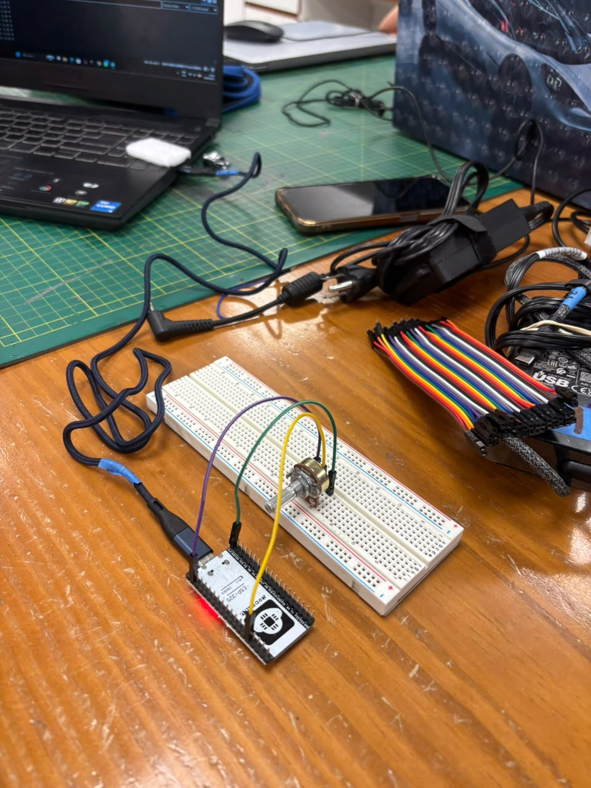
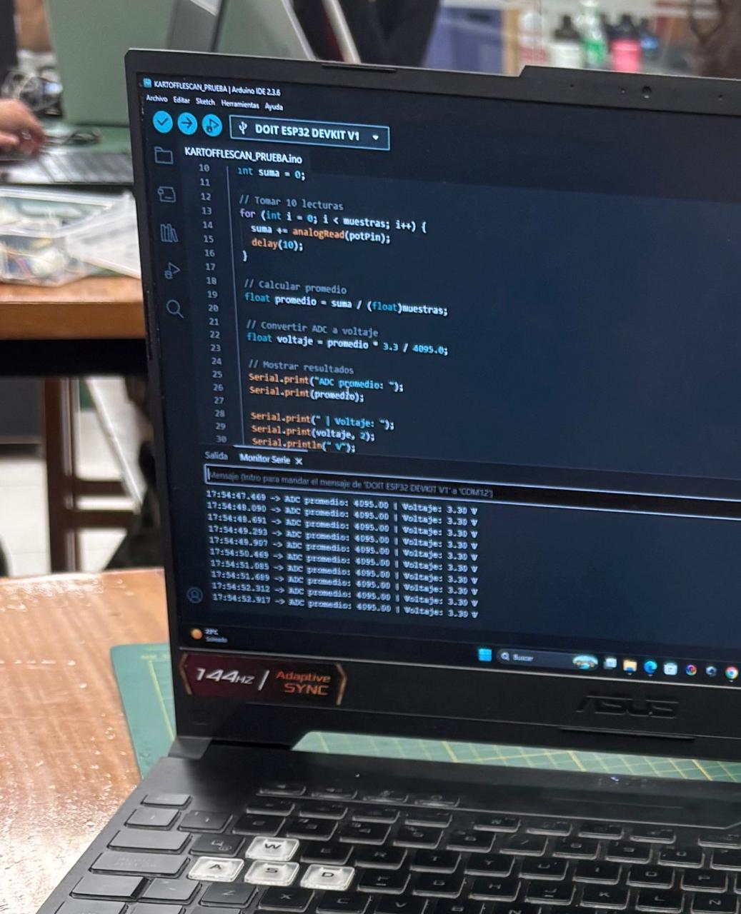
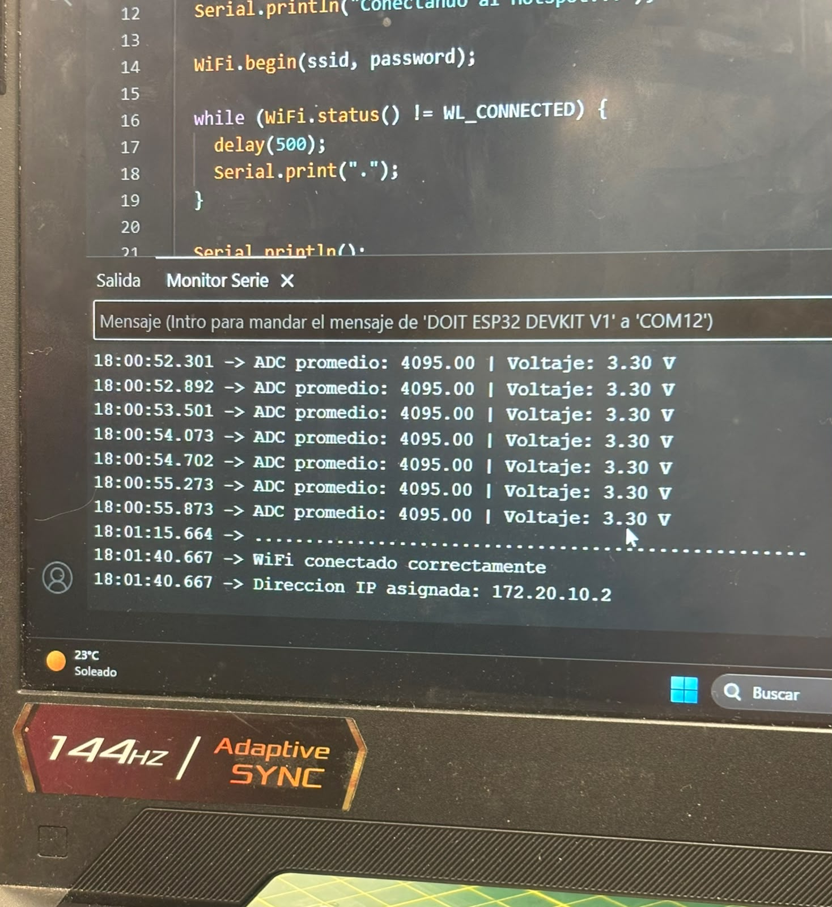
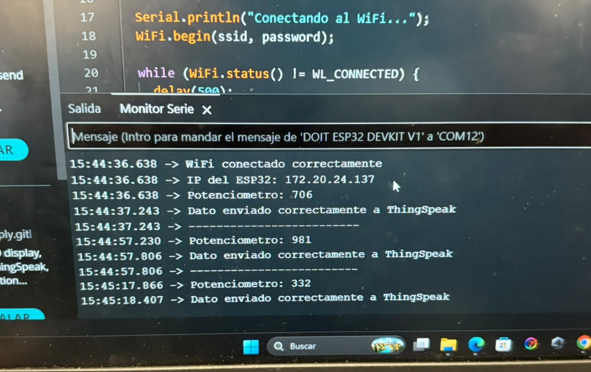
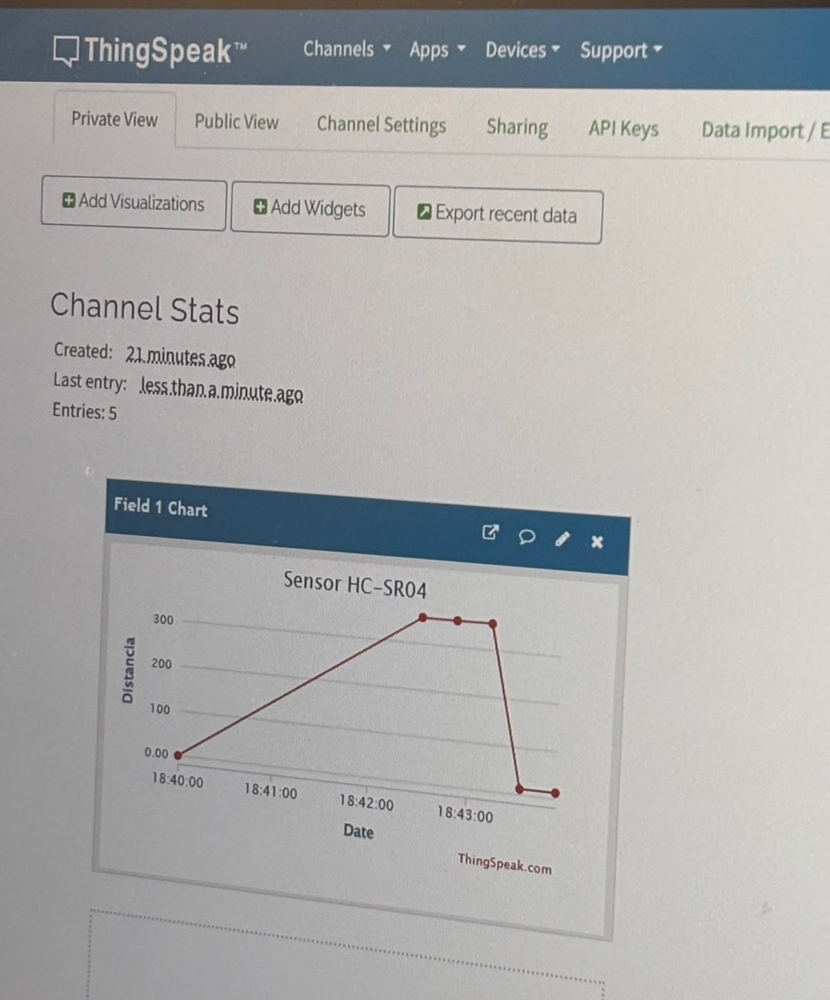
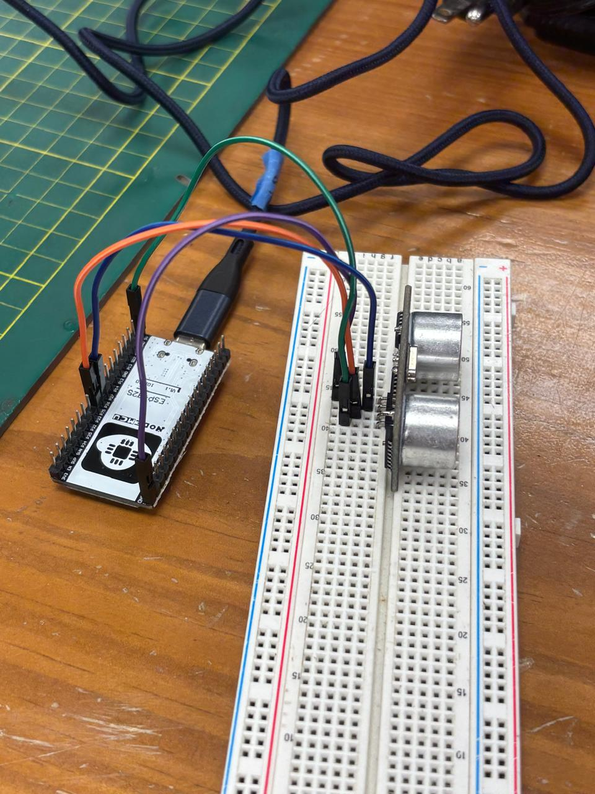
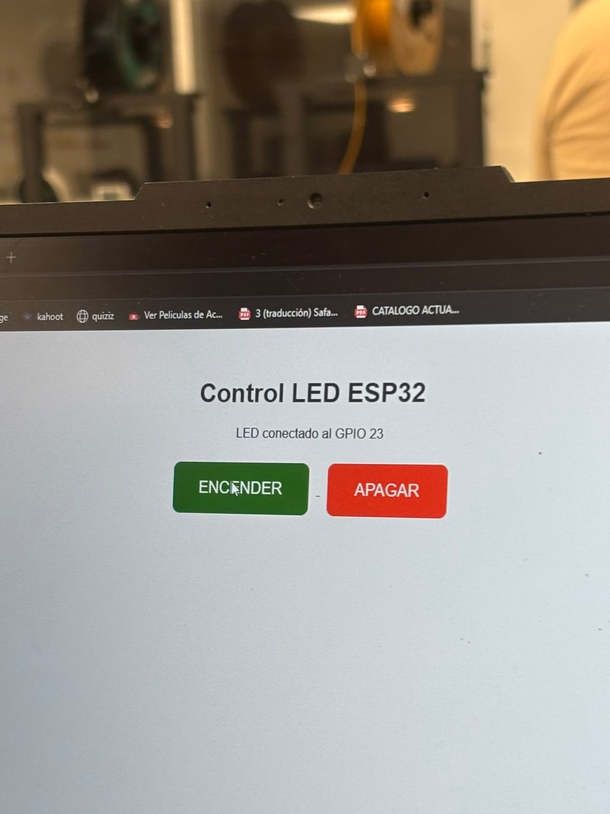
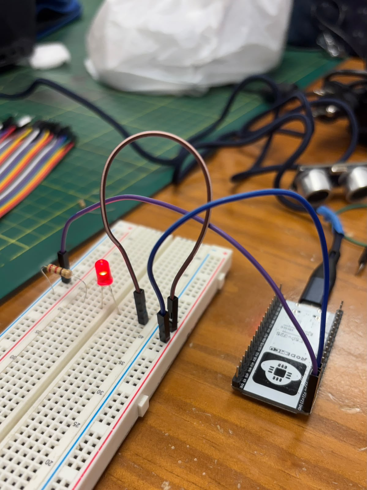
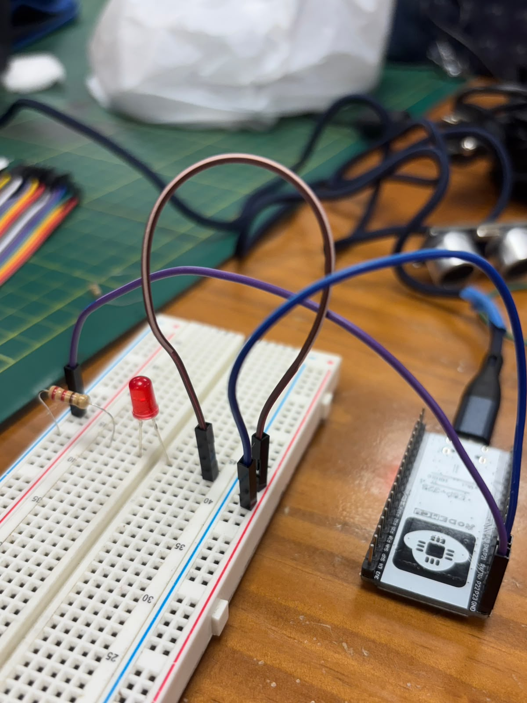

## Taller de Internet de las Cosas (IoT)
En el presente taller se trabajó la tecnología de IoT, es una tecnología que conecta objetos físicos como sensores, 
a Internet para recoger, procesar y transmitir datos.

En la clase se trabajó con:
01 ESP32 Dev Kit 1
● 01 Arduino EXPLORE IOT KIT
● 01 Kit de sensores Keystudio 48 en 1
● 01 Multímetro
● 01 Protoboard

## Actividad 01: Lectura de un Potenciómetro con ESP32
Mejorar el código proporcionado haciendo uso de un promediado de los datos y convirtiendo los
valores del ADC a valores de voltaje 

Para esta primera actividad, se utilizó un protoboard a través del cual se conectó el potenciómetro al ESP-32.
Se realizaron las siguientes conecciones:
-  Extremo 1 se conectó a 3.3V
-  Extremo 2	se conectó a GND
-  Pin central	se conectó a GPIO 34

<p align="center">
  
</p>


nota: Un potenciómetro sirve para regular y controlar de forma manual el nivel de corriente o el voltaje en un circuito eléctrico o electrónico.

Entonces se obtuvo la señal analógica del potenciómetro mediante el ADC del ESP32. Con el fin de mejorar la estabilidad de la medición, se realizaron 10 lecturas y se calculó su valor promedio. Finalmente, este resultado se transformó a su equivalente en voltios.

## *Código utilizado*

```cpp
const int potPin = 34;
const int numeroLecturas = 10;

void setup() {
  Serial.begin(115200);
}

void loop() {

  long suma = 0;

  for (int i = 0; i < numeroLecturas; i++) {
    suma += analogRead(potPin);
    delay(10);
  }

  float promedio = suma / (float)numeroLecturas;

  float voltaje = promedio * 3.3 / 4095.0;

  Serial.print("ADC promedio: ");
  Serial.print(promedio);

  Serial.print(" | Voltaje: ");
  Serial.print(voltaje, 2);

  Serial.println(" V");

  delay(500);
}
```

<p align="center">
  
</p>


## Actividad 02:
Crear una red WIFI usando su Smartphone como Hotspot, y conectarse a ella con el ESP32. En el
monitor serial se deberá visualizar la dirección IP asignada.

En esta segunda actividad, se activó el mobile hotstop de mi celular
Luego, para conectar el ESP32 con la red que se observa en la imagen 
se configuró el ESP utilizando la librería "Wifi.h"

## Código Utilizado

```cpp
#include <WiFi.h>

const char* ssid = "NOMBRE_DE_LA_RED";
const char* password = "CONTRASEÑA_DE_LA_RED";

void setup() {

  Serial.begin(115200);

  Serial.println("Conectando al WiFi...");

  WiFi.begin(ssid, password);

  while (WiFi.status() != WL_CONNECTED) {
    delay(500);
    Serial.print(".");
  }

  Serial.println();
  Serial.println("WiFi conectado correctamente");

  Serial.print("Direccion IP asignada: ");
  Serial.println(WiFi.localIP());
}

void loop() {

}
```

Luego, de que se realizara correctamente la conexión, se visualizó la IP en el monitor serial

<p align="center">
  
</p>

## Actividad 03: Lectura de un Potenciómetro con ESP32
Escribir un código que muestre en tiempo real la variación del potenciómetro conectado al
ESP32 en las siguientes plataformas de IoT: Arduino Cloud, ThingSpeak y Ubidots

Para esta tercera actividad, se utilizó nuevamente el potenciómetro y su extremo medio se conectó al GPIO 34.
Previamente, se conectó el ESP32 a la red Wifi, para poder enviar los datos recopilados hacia el Field 1 de la plataforma ThingSpeak.
El envío se repitió cada 20 segundos

Se realizaron las siguientes conexiones 
- VCC a 3.3V
- GND a GND

<p align="center">
  
</p>

En Thinkspeak se podía observar como cambiaba la gráfica segun los datos que recopilaba el potenciómetro

<p align="center">
  
</p>


## Código utilizado

```cpp
#include <WiFi.h>
#include <ThingSpeak.h>

const char* ssid = "NOMBRE_DE_LA_RED";
const char* password = "CONTRASEÑA_DE_LA_RED";

unsigned long channelID = TU_CHANNEL_ID;
const char* writeAPIKey = "TU_WRITE_API_KEY";

WiFiClient client;

const int potPin = 34;

void setup() {

  Serial.begin(115200);

  Serial.println("Conectando al WiFi...");

  WiFi.begin(ssid, password);

  while (WiFi.status() != WL_CONNECTED) {
    delay(500);
    Serial.print(".");
  }

  Serial.println();
  Serial.println("WiFi conectado correctamente");

  Serial.print("IP del ESP32: ");
  Serial.println(WiFi.localIP());

  ThingSpeak.begin(client);
}

void loop() {

  int valorPotenciometro = analogRead(potPin);

  Serial.print("Potenciometro: ");
  Serial.println(valorPotenciometro);

  int respuesta = ThingSpeak.writeField(
    channelID,
    1,
    valorPotenciometro,
    writeAPIKey
  );

  if (respuesta == 200) {
    Serial.println("Dato enviado correctamente a ThingSpeak");
  } else {
    Serial.print("Error al enviar el dato. Codigo: ");
    Serial.println(respuesta);
  }

  Serial.println("------------------------");

  delay(20000);
}
```

## Actividad 4: Enviando datos a ThingSpeak

Escribir un código que muestre en tiempo real la variación de uno de los sensores del kit
Keystudio (LM35, LDR, etc) conectado al ESP32 en las siguientes plataformas de IoT: Arduino
Cloud, ThingSpeak y Ubidots.

Para esta cuarta actividad se utilizó un sensor Ultrasónico HC-SRO4. Este sensor mide distancias entre 2 cm y 400 cm 
con otros objetos utilizando ondas sonoras de alta frecuencia 

Se realizaron las siguientes conexiones: 
- VCC a 5V del ESP32.
- GND a GND.
- TRIG a GPIO 25.
- ECHO a GPIO 26.

<p align="center">
  
</p>

Entonces, el ESP32 recibe los datos de distancia en centimetros y envía los datos a ThingSpeak

<p align="center">
  
</p>

La grafica mostraba como cambian la distancia según la lejanía o cercanía de un objeto

## Código utilizado

```cpp
#include <WiFi.h>
#include <ThingSpeak.h>

const char* ssid = "NOMBRE_DE_LA_RED";
const char* password = "CONTRASEÑA_DE_LA_RED";

unsigned long channelID = TU_CHANNEL_ID;
const char* writeAPIKey = "TU_WRITE_API_KEY";

WiFiClient client;

const int TRIG = 25;
const int ECHO = 26;

void setup() {

  Serial.begin(115200);

  pinMode(TRIG, OUTPUT);
  pinMode(ECHO, INPUT);

  Serial.println("Conectando al WiFi...");

  WiFi.begin(ssid, password);

  while (WiFi.status() != WL_CONNECTED) {
    delay(500);
    Serial.print(".");
  }

  Serial.println();
  Serial.println("WiFi conectado correctamente");

  Serial.print("IP del ESP32: ");
  Serial.println(WiFi.localIP());

  ThingSpeak.begin(client);
}

void loop() {

  digitalWrite(TRIG, LOW);
  delayMicroseconds(2);

  digitalWrite(TRIG, HIGH);
  delayMicroseconds(10);

  digitalWrite(TRIG, LOW);

  long duracion = pulseIn(ECHO, HIGH, 30000);

  float distancia = duracion * 0.0343 / 2.0;

  Serial.print("Distancia: ");
  Serial.print(distancia);
  Serial.println(" cm");

  int respuesta = ThingSpeak.writeField(
    channelID,
    1,
    distancia,
    writeAPIKey
  );

  if (respuesta == 200) {
    Serial.println("Dato enviado correctamente a ThingSpeak");
  } else {
    Serial.print("Error al enviar el dato. Codigo: ");
    Serial.println(respuesta);
  }

  Serial.println("------------------------");

  delay(20000);
}
```

## Actividad 5: Controlando desde la Nube

Conectar un LED en uno de los pines digitales del ESP32 y controlar su encendido desde alguna
de las plataformas web de su preferencia.

En esta ultima actividad, se utilizó el ESP32 como servidor web. Esto, para poder apagar y prender un foco led,
desde una pagina web

<p align="center">
  
</p>

A continuación, fotos del encendido y apagado del foco led

<p align="center">
  
</p>

<p align="center">
  
</p>

## Código utilizado

```cpp
#include <WiFi.h>
#include <WebServer.h>

const char* ssid = "NOMBRE_DE_LA_RED";
const char* password = "CONTRASEÑA_DE_LA_RED";

const int ledPin = 23;

WebServer server(80);

String pagina() {

  String html = R"rawliteral(
  <!DOCTYPE html>
  <html>

  <head>

    <meta charset="UTF-8">

    <meta name="viewport"
    content="width=device-width, initial-scale=1.0">

    <title>ESP32 - Control Web</title>

    <style>

      body {
        font-family: Arial, sans-serif;
        text-align: center;
        margin-top: 50px;
      }

      h1 {
        color: #333;
      }

      button {
        width: 200px;
        padding: 15px;
        margin: 10px;
        border: none;
        border-radius: 8px;
        color: white;
        font-size: 18px;
        cursor: pointer;
      }

      .encender {
        background-color: green;
      }

      .apagar {
        background-color: red;
      }

    </style>

  </head>

  <body>

    <h1>ESP32 - Control Web</h1>

    <h2>Actividad 05 - IoT</h2>

    <p>Control del LED integrado del ESP32</p>

    <p>
      <a href="/encender">
        <button class="encender">
          ENCENDER LED
        </button>
      </a>
    </p>

    <p>
      <a href="/apagar">
        <button class="apagar">
          APAGAR LED
        </button>
      </a>
    </p>

  </body>

  </html>
  )rawliteral";

  return html;
}

void inicio() {

  server.send(
    200,
    "text/html",
    pagina()
  );

}

void encenderLED() {

  digitalWrite(ledPin, HIGH);

  Serial.println("LED encendido");

  server.send(
    200,
    "text/html",
    pagina()
  );

}

void apagarLED() {

  digitalWrite(ledPin, LOW);

  Serial.println("LED apagado");

  server.send(
    200,
    "text/html",
    pagina()
  );

}

void setup() {

  Serial.begin(115200);

  pinMode(ledPin, OUTPUT);

  digitalWrite(ledPin, LOW);

  Serial.println("Conectando al WiFi...");

  WiFi.begin(ssid, password);

  while (WiFi.status() != WL_CONNECTED) {

    delay(500);

    Serial.print(".");

  }

  Serial.println();

  Serial.println(
    "WiFi conectado correctamente"
  );

  Serial.print(
    "Direccion IP del ESP32: "
  );

  Serial.println(
    WiFi.localIP()
  );

  server.on(
    "/",
    inicio
  );

  server.on(
    "/encender",
    encenderLED
  );

  server.on(
    "/apagar",
    apagarLED
  );

  server.begin();

  Serial.println(
    "Servidor web iniciado"
  );

}

void loop() {

  server.handleClient();

}
```

## Conclusiones

Este taller permitió conocer sobre la tecnología IoT
Algo innovador a mi parecer
En primer lugar, se realizaron varias recopilaciones de datos con el ADC del ESP32 para 
obtener un valor promedio más estable y convertirlo posteriormente a voltaje.

Luego, se comprobó la conectividad del ESP32 a una red WiFi, utilizando el hotspot de un celular. 
Para obtener la dirección IP

Posteriormente, se utilizó ThingSpeak para enviar y visualizar los datos obtenidos del potenciómetro y del sensor ultrasónico HC-SR04, 
permitiendo observar las mediciones en Gráficas y comprender el proceso de transmisión de datos hacia una plataforma en la nube.

Finalmente, se implementó un servidor web directamente en el ESP32, mediante el cual fue posible controlar un LED desde un navegador, demostrando cómo el dispositivo puede recibir comandos de manera remota y ejecutar una acción.

En conjunto, estas actividades permitieron comprender cómo un microcontrolador como el ESP32 puede capturar información de sensores, procesarla, conectarse a una red, enviar datos a una plataforma IoT y recibir comandos para controlar dispositivos.


 

