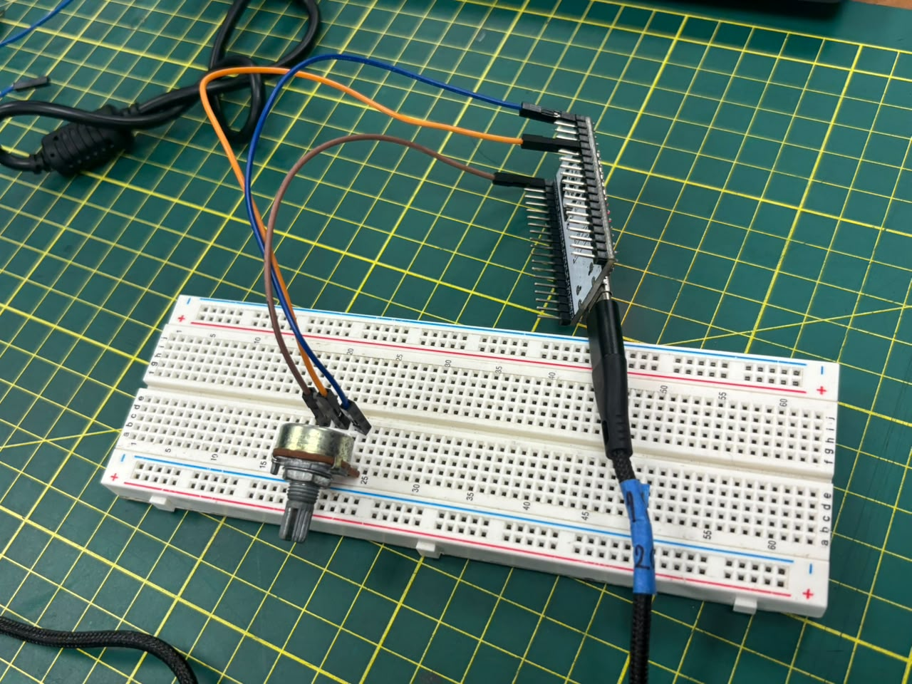
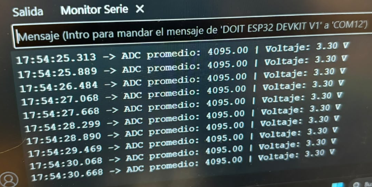
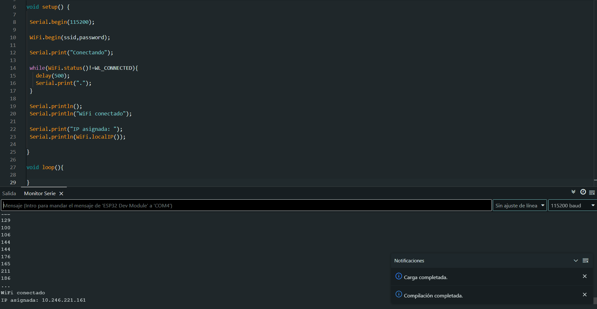
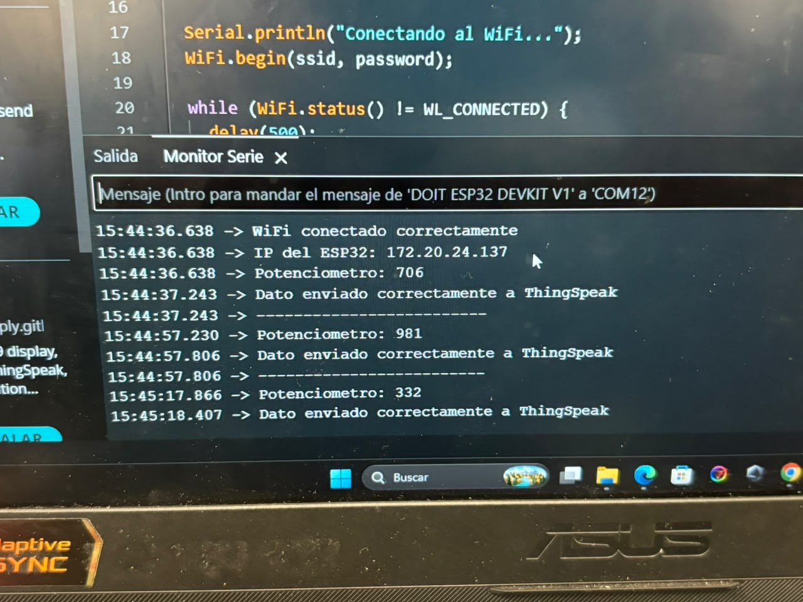
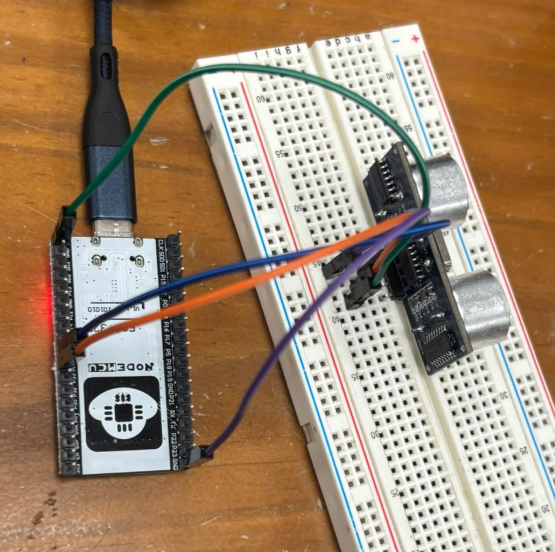
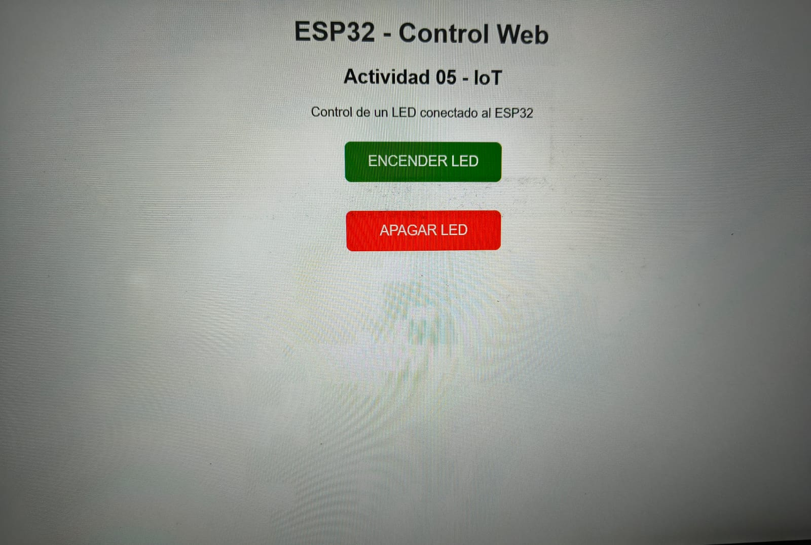

#  Práctica de IoT con ESP32

Documentación de las prácticas realizadas con una placa **ESP32**. En ellas se leen sensores, se conecta la placa a WiFi, se publican datos en la nube (ThingSpeak) y se controla un LED desde el navegador.

**Materiales usados:** ESP32, protoboard, potenciómetro, sensor ultrasónico HC-SR04, LED y cables.

---

##  Contenido

1. [Actividad 01 – Potenciómetro: promedio y voltaje](#actividad-01--potenciómetro-promedio-y-voltaje)
2. [Actividad 02 – Conexión a WiFi](#actividad-02--conexión-a-wifi)
3. [Actividad 03 – Potenciómetro hacia ThingSpeak](#actividad-03--potenciómetro-hacia-thingspeak)
4. [Actividad 04 – HC-SR04 hacia ThingSpeak](#actividad-04--hc-sr04-hacia-thingspeak)
5. [Actividad 05 – LED controlado desde una página web](#actividad-05--led-controlado-desde-una-página-web)
6. [Conclusiones](#conclusiones)

---

## Actividad 01 – Potenciómetro: promedio y voltaje

Se leyó la señal analógica de un potenciómetro con el ADC del ESP32. Para obtener un valor más estable se toman 10 muestras, se calcula el promedio y después se convierte a voltios.

**Conexiones:**

| Potenciómetro | ESP32 |
|---|---|
| Pata 1 | 3.3V |
| Pata 2 | GND |
| Pin central | GPIO 34 |

**Circuito armado:**



**Salida en el monitor serial:**



El monitor muestra el ADC promedio (0–4095) y su equivalente en voltaje (0–3.3 V).

**Código:**

```cpp
const int pinPot = 34;
const int totalMuestras = 10;

void setup() {
  Serial.begin(115200);
}

void loop() {
  long acumulado = 0;

  // Se toman varias muestras para suavizar la lectura
  for (int i = 0; i < totalMuestras; i++) {
    acumulado += analogRead(pinPot);
    delay(10);
  }

  float adcPromedio = acumulado / (float)totalMuestras;
  float voltios = adcPromedio * 3.3 / 4095.0;

  Serial.print("ADC promedio: ");
  Serial.print(adcPromedio);
  Serial.print(" | Voltaje: ");
  Serial.print(voltios, 2);
  Serial.println(" V");

  delay(500);
}
```

---

## Actividad 02 – Conexión a WiFi

Se activó el **hotspot de un celular** y se programó el ESP32 para unirse a esa red con la librería `WiFi.h`. Al conectarse, la placa imprime en el monitor serial la IP que le asignó la red.

**Resultado:**



La conexión fue exitosa y la IP quedó visible en el monitor serial.

**Código:**

```cpp
#include <WiFi.h>

const char* ssid = "NOMBRE_DE_LA_RED";
const char* password = "CONTRASEÑA_DE_LA_RED";

void setup() {
  Serial.begin(115200);
  Serial.println("Intentando conectar al WiFi...");

  WiFi.begin(ssid, password);

  while (WiFi.status() != WL_CONNECTED) {
    delay(500);
    Serial.print(".");
  }

  Serial.println();
  Serial.println("Conexión WiFi establecida");
  Serial.print("IP asignada: ");
  Serial.println(WiFi.localIP());
}

void loop() {
}
```

>  Los datos reales de la red (nombre y contraseña) fueron reemplazados por marcadores por seguridad.

---

## Actividad 03 – Potenciómetro hacia ThingSpeak

Se reutilizó el potenciómetro en el **GPIO 34**, pero ahora el valor leído se envía por WiFi al **Field 1** de un canal de **ThingSpeak**. El envío se repite cada 20 segundos.

**Conexiones:** extremos a 3.3V y GND, pin central al GPIO 34.

**Monitor serial** (confirmación de cada envío):


**Gráfica en ThingSpeak** (cambia al girar el potenciómetro):



**Código:**

```cpp
#include <WiFi.h>
#include <ThingSpeak.h>

const char* ssid = "NOMBRE_DE_LA_RED";
const char* password = "CONTRASEÑA_DE_LA_RED";

unsigned long channelID = TU_CHANNEL_ID;
const char* writeAPIKey = "TU_WRITE_API_KEY";

WiFiClient client;

const int pinPot = 34;

void setup() {
  Serial.begin(115200);
  Serial.println("Intentando conectar al WiFi...");

  WiFi.begin(ssid, password);

  while (WiFi.status() != WL_CONNECTED) {
    delay(500);
    Serial.print(".");
  }

  Serial.println();
  Serial.println("Conexión WiFi establecida");
  Serial.print("IP del ESP32: ");
  Serial.println(WiFi.localIP());

  ThingSpeak.begin(client);
}

void loop() {
  int lectura = analogRead(pinPot);

  Serial.print("Potenciómetro: ");
  Serial.println(lectura);

  int codigo = ThingSpeak.writeField(channelID, 1, lectura, writeAPIKey);

  if (codigo == 200) {
    Serial.println("Dato enviado a ThingSpeak");
  } else {
    Serial.print("Falló el envío. Código: ");
    Serial.println(codigo);
  }

  Serial.println("------------------------");
  delay(20000);
}
```

>  Tampoco se publican la contraseña del WiFi ni la API Key real de ThingSpeak.

---

## Actividad 04 – HC-SR04 hacia ThingSpeak

El **HC-SR04** mide la distancia a un objeto enviando un pulso ultrasónico y midiendo cuánto tarda el eco. El ESP32 calcula la distancia en centímetros y la publica en ThingSpeak.

**Conexiones:**

| HC-SR04 | ESP32 |
|---|---|
| VCC | 5V |
| GND | GND |
| TRIG | GPIO 25 |
| ECHO | GPIO 26 |

**Circuito armado:**



**Distancia registrada en ThingSpeak** (varía al acercar o alejar un objeto):


**Código:**

```cpp
#include <WiFi.h>
#include <ThingSpeak.h>

const char* ssid = "NOMBRE_DE_LA_RED";
const char* password = "CONTRASEÑA_DE_LA_RED";

unsigned long channelID = TU_CHANNEL_ID;
const char* writeAPIKey = "TU_WRITE_API_KEY";

WiFiClient client;

const int pinTrig = 25;
const int pinEcho = 26;

void setup() {
  Serial.begin(115200);

  pinMode(pinTrig, OUTPUT);
  pinMode(pinEcho, INPUT);

  Serial.println("Intentando conectar al WiFi...");
  WiFi.begin(ssid, password);

  while (WiFi.status() != WL_CONNECTED) {
    delay(500);
    Serial.print(".");
  }

  Serial.println();
  Serial.println("Conexión WiFi establecida");
  Serial.print("IP del ESP32: ");
  Serial.println(WiFi.localIP());

  ThingSpeak.begin(client);
}

void loop() {
  // Pulso de disparo de 10 µs
  digitalWrite(pinTrig, LOW);
  delayMicroseconds(2);
  digitalWrite(pinTrig, HIGH);
  delayMicroseconds(10);
  digitalWrite(pinTrig, LOW);

  // Tiempo del eco (máx. 30 ms)
  long tiempoEco = pulseIn(pinEcho, HIGH, 30000);

  // Velocidad del sonido ≈ 0.0343 cm/µs; se divide entre 2 (ida y vuelta)
  float distanciaCm = tiempoEco * 0.0343 / 2.0;

  Serial.print("Distancia: ");
  Serial.print(distanciaCm);
  Serial.println(" cm");

  int codigo = ThingSpeak.writeField(channelID, 1, distanciaCm, writeAPIKey);

  if (codigo == 200) {
    Serial.println("Dato enviado a ThingSpeak");
  } else {
    Serial.print("Falló el envío. Código: ");
    Serial.println(codigo);
  }

  Serial.println("------------------------");
  delay(20000);
}
```

---

## Actividad 05 – LED controlado desde una página web

Aquí el ESP32 funciona como **servidor web**. Un LED conectado al **GPIO 23** se enciende o apaga desde una página con dos botones: **ENCENDER LED** y **APAGAR LED**.

Al conectarse al WiFi, la placa muestra su IP en el monitor serial; esa IP se escribe en el navegador de una computadora o celular que esté en la misma red.

**Conexión del LED:**


**Página de control:**



Al pulsar un botón, el ESP32 recibe la ruta (`/encender` o `/apagar`) y cambia el estado del pin.

**Código:**

```cpp
#include <WiFi.h>
#include <WebServer.h>

const char* ssid = "NOMBRE_DE_LA_RED";
const char* password = "CONTRASEÑA_DE_LA_RED";

const int pinLed = 23;

WebServer servidor(80);

String construirPagina() {
  String html = R"rawliteral(
  <!DOCTYPE html>
  <html>
  <head>
    <meta charset="UTF-8">
    <meta name="viewport" content="width=device-width, initial-scale=1.0">
    <title>ESP32 - Control Web</title>
    <style>
      body { font-family: Arial, sans-serif; text-align: center; margin-top: 50px; }
      h1 { color: #333; }
      button {
        width: 200px; padding: 15px; margin: 10px;
        border: none; border-radius: 8px;
        color: white; font-size: 18px; cursor: pointer;
      }
      .encender { background-color: green; }
      .apagar { background-color: red; }
    </style>
  </head>
  <body>
    <h1>ESP32 - Control Web</h1>
    <h2>Actividad 05 - IoT</h2>
    <p>Control de un LED conectado al ESP32</p>
    <p><a href="/encender"><button class="encender">ENCENDER LED</button></a></p>
    <p><a href="/apagar"><button class="apagar">APAGAR LED</button></a></p>
  </body>
  </html>
  )rawliteral";

  return html;
}

void paginaInicio() {
  servidor.send(200, "text/html", construirPagina());
}

void ledOn() {
  digitalWrite(pinLed, HIGH);
  Serial.println("LED encendido");
  servidor.send(200, "text/html", construirPagina());
}

void ledOff() {
  digitalWrite(pinLed, LOW);
  Serial.println("LED apagado");
  servidor.send(200, "text/html", construirPagina());
}

void setup() {
  Serial.begin(115200);

  pinMode(pinLed, OUTPUT);
  digitalWrite(pinLed, LOW);

  Serial.println("Intentando conectar al WiFi...");
  WiFi.begin(ssid, password);

  while (WiFi.status() != WL_CONNECTED) {
    delay(500);
    Serial.print(".");
  }

  Serial.println();
  Serial.println("Conexión WiFi establecida");
  Serial.print("IP del ESP32: ");
  Serial.println(WiFi.localIP());

  servidor.on("/", paginaInicio);
  servidor.on("/encender", ledOn);
  servidor.on("/apagar", ledOff);

  servidor.begin();
  Serial.println("Servidor web iniciado");
}

void loop() {
  servidor.handleClient();
}
```

---

## Conclusiones

Estas prácticas permitieron recorrer el flujo básico de un proyecto IoT con el ESP32:

- **Lectura analógica:** con el potenciómetro se aprendió a promediar muestras del ADC y a convertirlas a voltaje.
- **Conectividad:** el ESP32 se unió a una red WiFi (hotspot de un celular) y obtuvo una dirección IP.
- **Nube:** los datos del potenciómetro y del HC-SR04 se enviaron a ThingSpeak y se visualizaron en gráficas casi en tiempo real.
- **Control remoto:** con un servidor web embebido se encendió y apagó un LED desde el navegador.

En conjunto, se vio cómo una misma placa puede medir, comunicar y actuar, que son las tres bases de cualquier sistema IoT.
