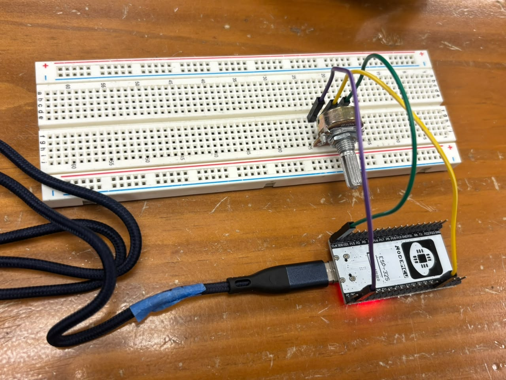
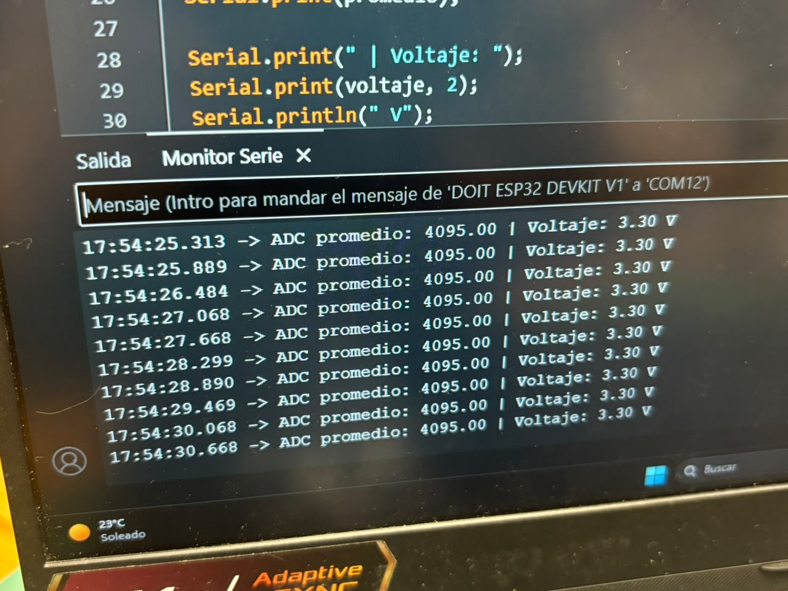
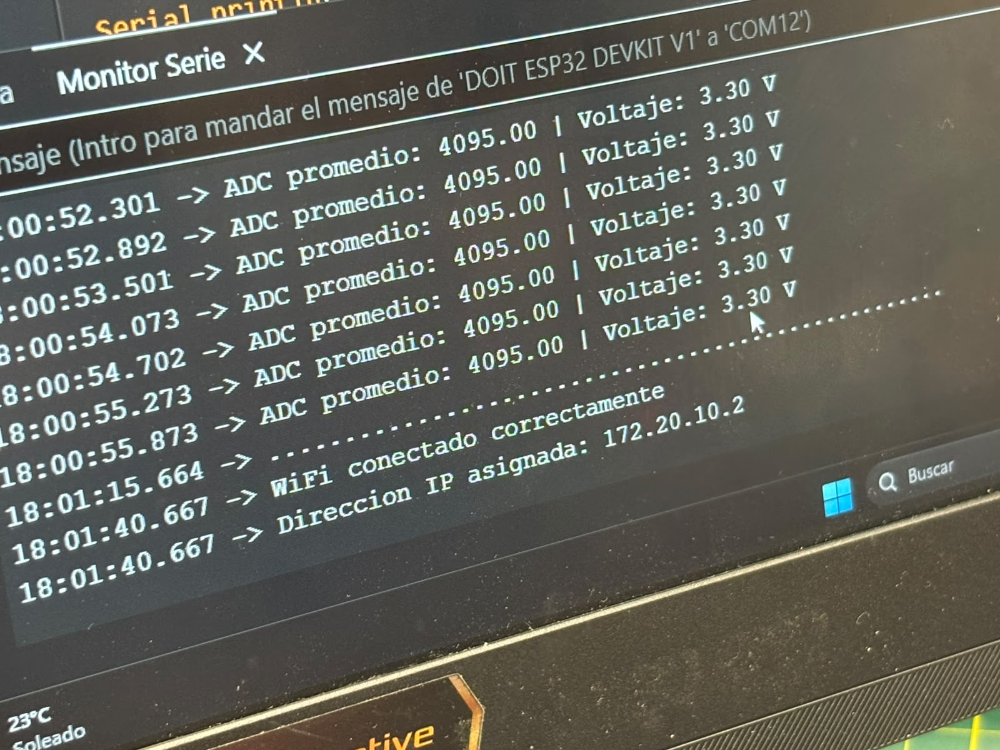
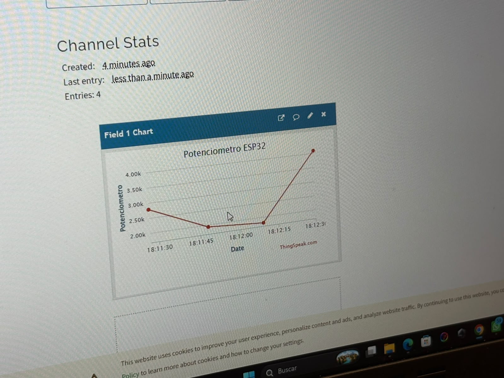
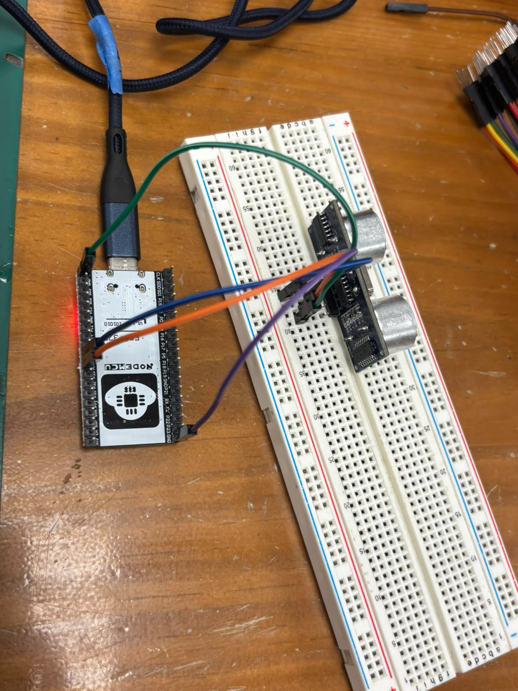
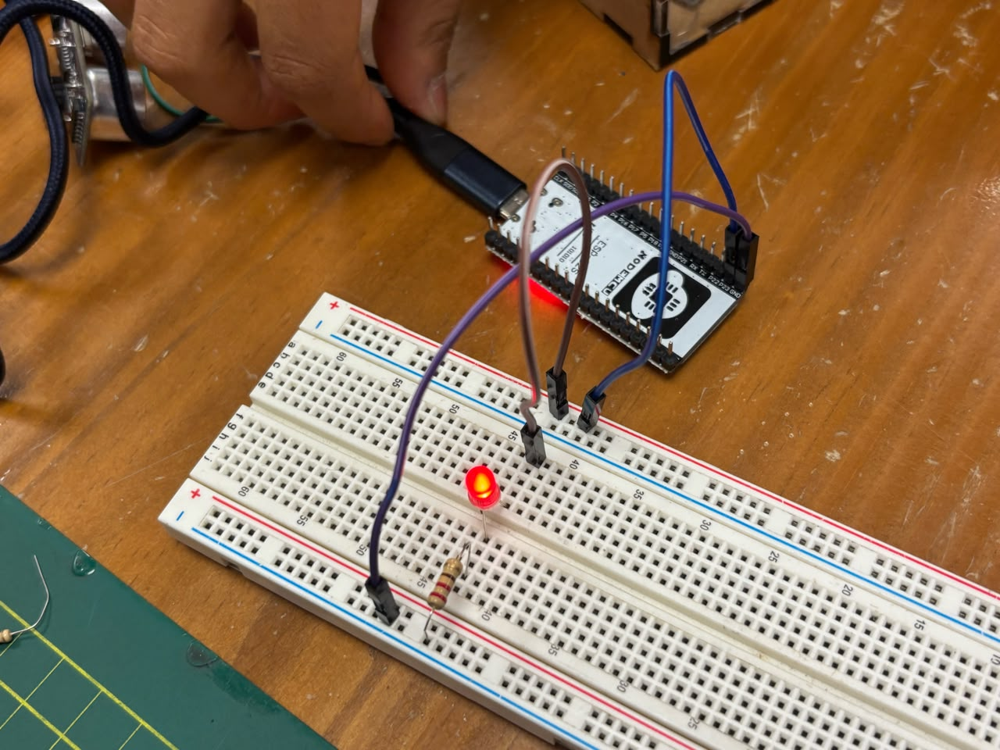
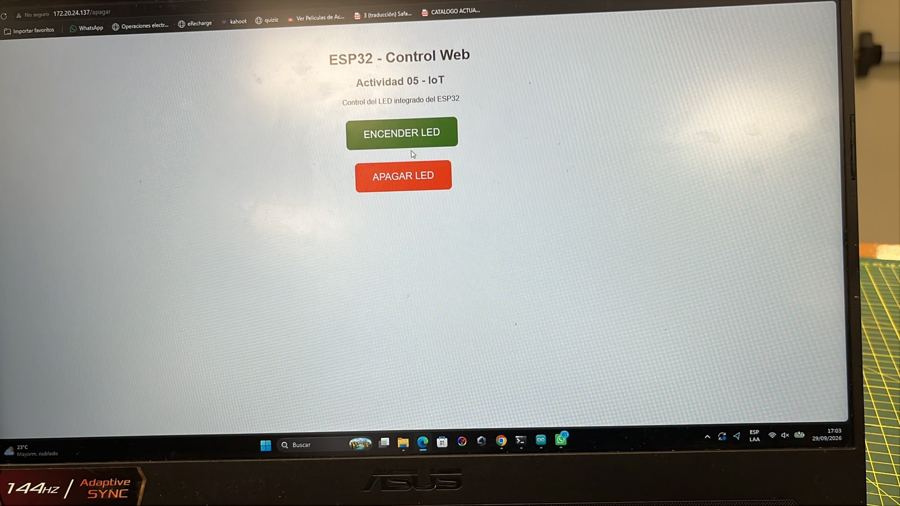

# Taller de Internet de las Cosas (IoT)

En este taller trabajé con una tarjeta **ESP32** realizando diferentes actividades relacionadas con lectura de sensores, conexión WiFi, envío de datos a la nube y control de dispositivos desde una página web.

Para las pruebas utilicé principalmente el ESP32, una protoboard, un potenciómetro y un sensor ultrasónico HC-SR04.

---

# Actividad 01 - Lectura del potenciómetro, promedio y voltaje

En esta actividad conecté un **potenciómetro al ESP32** para leer su valor analógico.

La conexión que utilicé fue:

- Un extremo del potenciómetro a **3.3V**.
- El otro extremo a **GND**.
- El pin central del potenciómetro al **GPIO 34** del ESP32.

En vez de mostrar solamente una lectura, realicé varias lecturas y calculé un promedio. Después convertí el valor obtenido por el ADC a voltaje.

## Conexión realizada

<p align="center">
  
</p>

## Resultado en el monitor serial

<p align="center">
  
</p>

En el monitor serial se puede observar el valor promedio del ADC y su equivalente en voltios.

## Código utilizado

```cpp
const int potPin = 34;
const int numeroLecturas = 10;

void setup() {
  Serial.begin(115200);
}

void loop() {

  long suma = 0;

  for (int i = 0; i < numeroLecturas; i++) {
    suma += analogRead(potPin);
    delay(10);
  }

  float promedio = suma / (float)numeroLecturas;

  float voltaje = promedio * 3.3 / 4095.0;

  Serial.print("ADC promedio: ");
  Serial.print(promedio);

  Serial.print(" | Voltaje: ");
  Serial.print(voltaje, 2);

  Serial.println(" V");

  delay(500);
}
```

---

# Actividad 02 - Conexión del ESP32 a una red WiFi

En esta actividad creé una red WiFi utilizando el **Hotspot de un celular**.

Después configuré el ESP32 para conectarse a esta red utilizando la librería `WiFi.h`.

Cuando la conexión fue realizada correctamente, el ESP32 mostró en el monitor serial la dirección IP que le fue asignada por la red.

## Resultado obtenido

<p align="center">
  
</p>

En mi caso, el ESP32 se conectó correctamente y se pudo visualizar la IP asignada en el monitor serial.

## Código utilizado

```cpp
#include <WiFi.h>

const char* ssid = "NOMBRE_DE_LA_RED";
const char* password = "CONTRASEÑA_DE_LA_RED";

void setup() {

  Serial.begin(115200);

  Serial.println("Conectando al WiFi...");

  WiFi.begin(ssid, password);

  while (WiFi.status() != WL_CONNECTED) {
    delay(500);
    Serial.print(".");
  }

  Serial.println();
  Serial.println("WiFi conectado correctamente");

  Serial.print("Direccion IP asignada: ");
  Serial.println(WiFi.localIP());
}

void loop() {

}
```

Por seguridad no coloqué la contraseña real de la red en el README.

---

# Actividad 03 - Envío de datos del potenciómetro a ThingSpeak

En esta actividad volví a utilizar el **potenciómetro conectado al GPIO 34**, pero esta vez los datos obtenidos fueron enviados por WiFi hacia la plataforma **ThingSpeak**.

La conexión del potenciómetro fue:

- VCC a **3.3V**.
- GND a **GND**.
- Salida del potenciómetro al **GPIO 34**.

Primero el ESP32 se conecta al WiFi, luego lee el valor del potenciómetro y finalmente envía ese valor al **Field 1** de un canal de ThingSpeak.

Los datos se envían aproximadamente cada 20 segundos.

## Monitor serial

<p align="center">
  
</p>

En el monitor serial se podía comprobar cada vez que el dato era enviado correctamente a ThingSpeak.

## Visualización en ThingSpeak

<p align="center">
  
</p>

En ThingSpeak se puede observar cómo cambia la gráfica conforme se mueve el potenciómetro.

## Código utilizado

```cpp
#include <WiFi.h>
#include <ThingSpeak.h>

const char* ssid = "NOMBRE_DE_LA_RED";
const char* password = "CONTRASEÑA_DE_LA_RED";

unsigned long channelID = TU_CHANNEL_ID;
const char* writeAPIKey = "TU_WRITE_API_KEY";

WiFiClient client;

const int potPin = 34;

void setup() {

  Serial.begin(115200);

  Serial.println("Conectando al WiFi...");

  WiFi.begin(ssid, password);

  while (WiFi.status() != WL_CONNECTED) {
    delay(500);
    Serial.print(".");
  }

  Serial.println();
  Serial.println("WiFi conectado correctamente");

  Serial.print("IP del ESP32: ");
  Serial.println(WiFi.localIP());

  ThingSpeak.begin(client);
}

void loop() {

  int valorPotenciometro = analogRead(potPin);

  Serial.print("Potenciometro: ");
  Serial.println(valorPotenciometro);

  int respuesta = ThingSpeak.writeField(
    channelID,
    1,
    valorPotenciometro,
    writeAPIKey
  );

  if (respuesta == 200) {
    Serial.println("Dato enviado correctamente a ThingSpeak");
  } else {
    Serial.print("Error al enviar el dato. Codigo: ");
    Serial.println(respuesta);
  }

  Serial.println("------------------------");

  delay(20000);
}
```

Por seguridad no coloqué en el README la contraseña del WiFi ni la API Key real de ThingSpeak.

---

# Actividad 04 - Sensor HC-SR04 conectado a ThingSpeak

Para esta actividad utilicé un **sensor ultrasónico HC-SR04**.

Este sensor permite calcular la distancia entre el sensor y un objeto mediante ondas ultrasónicas.

La conexión utilizada fue:

- **VCC** → 5V del ESP32.
- **GND** → GND.
- **TRIG** → GPIO 25.
- **ECHO** → GPIO 26.

El ESP32 obtiene la distancia utilizando los pines TRIG y ECHO y posteriormente envía el resultado a ThingSpeak.

## Conexión del HC-SR04

<p align="center">
  
</p>

El sensor se conectó al ESP32 utilizando los pines digitales para TRIG y ECHO.

## Datos enviados a ThingSpeak

<p align="center">
  
</p>

En la gráfica se puede observar cómo cambia la distancia cuando acerco o alejo un objeto del sensor.

## Código utilizado

```cpp
#include <WiFi.h>
#include <ThingSpeak.h>

const char* ssid = "NOMBRE_DE_LA_RED";
const char* password = "CONTRASEÑA_DE_LA_RED";

unsigned long channelID = TU_CHANNEL_ID;
const char* writeAPIKey = "TU_WRITE_API_KEY";

WiFiClient client;

const int TRIG = 25;
const int ECHO = 26;

void setup() {

  Serial.begin(115200);

  pinMode(TRIG, OUTPUT);
  pinMode(ECHO, INPUT);

  Serial.println("Conectando al WiFi...");

  WiFi.begin(ssid, password);

  while (WiFi.status() != WL_CONNECTED) {
    delay(500);
    Serial.print(".");
  }

  Serial.println();
  Serial.println("WiFi conectado correctamente");

  Serial.print("IP del ESP32: ");
  Serial.println(WiFi.localIP());

  ThingSpeak.begin(client);
}

void loop() {

  digitalWrite(TRIG, LOW);
  delayMicroseconds(2);

  digitalWrite(TRIG, HIGH);
  delayMicroseconds(10);

  digitalWrite(TRIG, LOW);

  long duracion = pulseIn(ECHO, HIGH, 30000);

  float distancia = duracion * 0.0343 / 2.0;

  Serial.print("Distancia: ");
  Serial.print(distancia);
  Serial.println(" cm");

  int respuesta = ThingSpeak.writeField(
    channelID,
    1,
    distancia,
    writeAPIKey
  );

  if (respuesta == 200) {
    Serial.println("Dato enviado correctamente a ThingSpeak");
  } else {
    Serial.print("Error al enviar el dato. Codigo: ");
    Serial.println(respuesta);
  }

  Serial.println("------------------------");

  delay(20000);
}
```

---

# Actividad 05 - Control de un LED desde una página web

En esta última actividad utilicé el ESP32 para crear un pequeño **servidor web**.

Conecté un LED a uno de los pines digitales del ESP32 y desde una página web pude encenderlo y apagarlo.

La página cuenta con dos botones:

- **ENCENDER LED**
- **APAGAR LED**

El ESP32 se conecta al WiFi y muestra su dirección IP en el monitor serial. Luego se coloca esa dirección IP en el navegador de una computadora o celular conectado a la misma red.

## Conexión del LED al ESP32

<p align="center">
  
</p>

## Página web de control

<p align="center">
  
</p>

Al presionar **ENCENDER LED**, el ESP32 activa el pin del LED y al presionar **APAGAR LED** lo desactiva.

## Código utilizado

```cpp
#include <WiFi.h>
#include <WebServer.h>

const char* ssid = "NOMBRE_DE_LA_RED";
const char* password = "CONTRASEÑA_DE_LA_RED";

const int ledPin = 23;

WebServer server(80);

String pagina() {

  String html = R"rawliteral(
  <!DOCTYPE html>
  <html>

  <head>

    <meta charset="UTF-8">

    <meta name="viewport"
    content="width=device-width, initial-scale=1.0">

    <title>ESP32 - Control Web</title>

    <style>

      body {
        font-family: Arial, sans-serif;
        text-align: center;
        margin-top: 50px;
      }

      h1 {
        color: #333;
      }

      button {
        width: 200px;
        padding: 15px;
        margin: 10px;
        border: none;
        border-radius: 8px;
        color: white;
        font-size: 18px;
        cursor: pointer;
      }

      .encender {
        background-color: green;
      }

      .apagar {
        background-color: red;
      }

    </style>

  </head>

  <body>

    <h1>ESP32 - Control Web</h1>

    <h2>Actividad 05 - IoT</h2>

    <p>Control del LED integrado del ESP32</p>

    <p>
      <a href="/encender">
        <button class="encender">
          ENCENDER LED
        </button>
      </a>
    </p>

    <p>
      <a href="/apagar">
        <button class="apagar">
          APAGAR LED
        </button>
      </a>
    </p>

  </body>

  </html>
  )rawliteral";

  return html;
}

void inicio() {

  server.send(
    200,
    "text/html",
    pagina()
  );

}

void encenderLED() {

  digitalWrite(ledPin, HIGH);

  Serial.println("LED encendido");

  server.send(
    200,
    "text/html",
    pagina()
  );

}

void apagarLED() {

  digitalWrite(ledPin, LOW);

  Serial.println("LED apagado");

  server.send(
    200,
    "text/html",
    pagina()
  );

}

void setup() {

  Serial.begin(115200);

  pinMode(ledPin, OUTPUT);

  digitalWrite(ledPin, LOW);

  Serial.println("Conectando al WiFi...");

  WiFi.begin(ssid, password);

  while (WiFi.status() != WL_CONNECTED) {

    delay(500);

    Serial.print(".");

  }

  Serial.println();

  Serial.println(
    "WiFi conectado correctamente"
  );

  Serial.print(
    "Direccion IP del ESP32: "
  );

  Serial.println(
    WiFi.localIP()
  );

  server.on(
    "/",
    inicio
  );

  server.on(
    "/encender",
    encenderLED
  );

  server.on(
    "/apagar",
    apagarLED
  );

  server.begin();

  Serial.println(
    "Servidor web iniciado"
  );

}

void loop() {

  server.handleClient();

}
```

---

# Conclusión

Con estas actividades pude probar diferentes funciones del ESP32 relacionadas con IoT.

Primero trabajé con la lectura de datos analógicos mediante un potenciómetro y realicé el cálculo del promedio y del voltaje.

Después conecté el ESP32 a una red WiFi creada mediante el Hotspot de un celular y pude visualizar la dirección IP que recibió el dispositivo.

También utilicé **ThingSpeak** para enviar y visualizar los datos obtenidos tanto del potenciómetro como del sensor ultrasónico **HC-SR04**.

Finalmente realicé el control de un LED mediante una página web alojada directamente en el ESP32.

Estas actividades me permitieron entender de manera práctica cómo un ESP32 puede leer sensores, conectarse a una red WiFi, enviar datos hacia una plataforma IoT y recibir comandos desde una interfaz web.