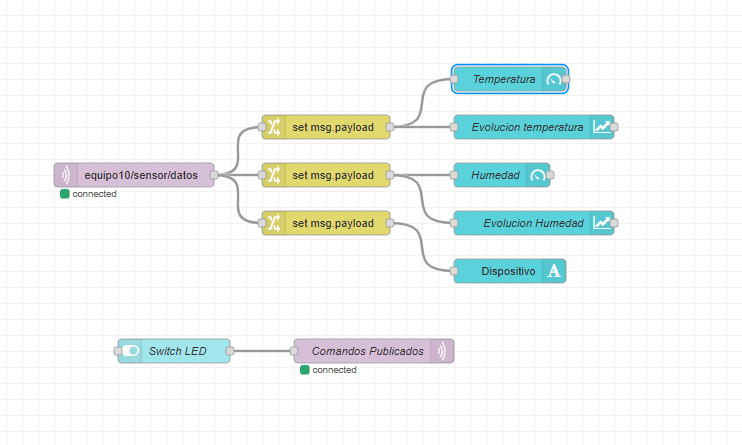
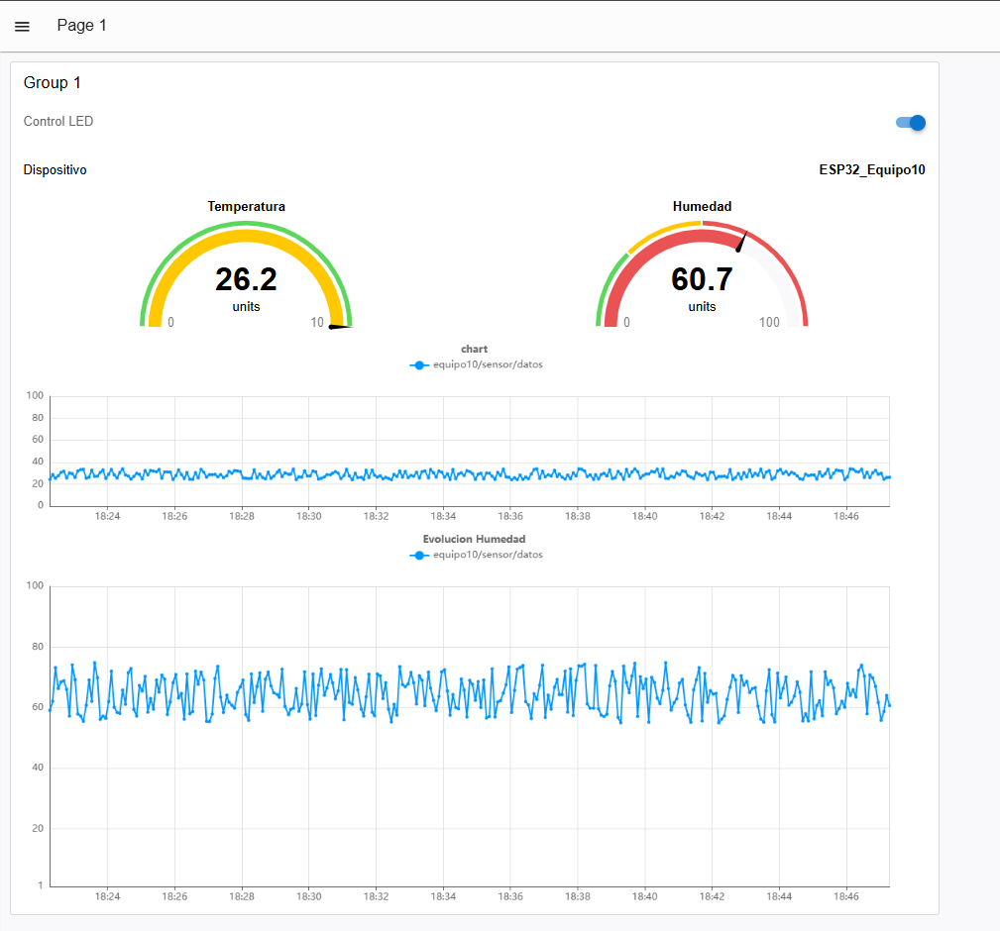

# Mini proyecto Node-RED - Kartoffelmachine

En esta actividad se implementó un sistema de monitoreo utilizando un **ESP32**, un sensor **DHT11**, comunicación mediante **MQTT** y una interfaz gráfica desarrollada en **Node-RED Dashboard**.

La actividad fue adaptada al proyecto **Kartoffelmachine**, utilizando el sensor DHT11 para obtener la temperatura y humedad del ambiente. Estos datos son enviados desde el ESP32 hacia un broker MQTT y posteriormente son recibidos y visualizados desde Node-RED.

Además, se agregó un control mediante MQTT para encender y apagar un LED conectado al ESP32 desde el Dashboard.

---

## 1. Materiales utilizados

Para realizar la actividad se utilizaron los siguientes componentes:

- ESP32
- Sensor DHT11
- Protoboard
- Cables jumper
- Computadora con Arduino IDE
- Node-RED
- Node-RED Dashboard 2.0
- Broker MQTT proporcionado para el taller

---

## 2. Conexión del sensor DHT11

El sensor DHT11 se conectó al ESP32 utilizando el GPIO 4 para la lectura de datos.

La conexión utilizada fue:

| DHT11 | ESP32 |
|---|---|
| VCC | 3.3V |
| DATA | GPIO 4 |
| GND | GND |

Para el control del LED se utilizó el GPIO 2 del ESP32.

---

## 3. Configuración del broker MQTT

Para comunicar el ESP32 con Node-RED se utilizó el broker MQTT proporcionado para el taller.

Los datos utilizados fueron:

```text
HOST: mqtt.rcr-labs.com
PORT: 1883
USER: alumno
PASSWORD: UPCH2026
```

Como nuestro grupo corresponde al **Equipo 10**, se utilizaron los siguientes tópicos:

```text
equipo10/sensor/datos
equipo10/actuadores/led
```

El primer tópico se utiliza para publicar los valores obtenidos por el sensor DHT11.

```text
equipo10/sensor/datos
```

El segundo tópico se utiliza para controlar el LED del ESP32 desde Node-RED.

```text
equipo10/actuadores/led
```

---

## 4. Programación del ESP32

En el ESP32 se utilizaron las librerías necesarias para realizar la conexión WiFi, comunicación MQTT, creación del mensaje JSON y lectura del sensor DHT11.

Las principales librerías utilizadas fueron:

```cpp
#include <WiFi.h>
#include <PubSubClient.h>
#include <ArduinoJson.h>
#include <DHT.h>
```

El código completo utilizado fue el siguiente:

```cpp
#include <WiFi.h>
#include <PubSubClient.h>
#include <ArduinoJson.h>
#include <DHT.h>

// ================= CONFIGURACIÓN WIFI =================
const char* WIFI_SSID = "Galaxy A36 5G BF8B";
const char* WIFI_PASS = "12345678";

// ================= CONFIGURACIÓN MQTT =================
const char* MQTT_SERVER = "mqtt.rcr-labs.com";
const int MQTT_PORT = 1883;

const char* MQTT_USER = "alumno";
const char* MQTT_PASSWORD = "UPCH2026";

// Equipo 10
const char* CLIENT_ID = "ESP32_Equipo10";

// Topics MQTT
const char* TOPIC_PUB = "equipo10/sensor/datos";
const char* TOPIC_SUB = "equipo10/actuadores/led";

// ================= CONFIGURACIÓN DHT11 =================
#define DHTPIN 4
#define DHTTYPE DHT11

DHT dht(DHTPIN, DHTTYPE);

// ================= LED =================
#define LED_PIN 2

// ================= OBJETOS =================
WiFiClient espClient;
PubSubClient client(espClient);

// ================= TEMPORIZADOR =================
unsigned long ultimoEnvio = 0;
const long intervaloEnvio = 5000;


// =====================================================
// CONEXIÓN WIFI
// =====================================================
void setupWiFi() {

  delay(10);

  Serial.println();
  Serial.print("Conectando a WiFi: ");
  Serial.println(WIFI_SSID);

  WiFi.mode(WIFI_STA);
  WiFi.begin(WIFI_SSID, WIFI_PASS);

  while (WiFi.status() != WL_CONNECTED) {
    delay(500);
    Serial.print(".");
  }

  Serial.println();
  Serial.println("WiFi conectado con exito");

  Serial.print("Direccion IP local: ");
  Serial.println(WiFi.localIP());
}


// =====================================================
// RECEPCIÓN DE MENSAJES MQTT
// =====================================================
void callback(char* topic, byte* payload, unsigned int length) {

  Serial.print("Mensaje recibido en topic [");
  Serial.print(topic);
  Serial.print("]: ");

  String mensaje = "";

  for (unsigned int i = 0; i < length; i++) {
    mensaje += (char)payload[i];
  }

  Serial.println(mensaje);

  // Control del LED desde Node-RED
  if (String(topic) == TOPIC_SUB) {

    if (mensaje == "ON") {

      digitalWrite(LED_PIN, HIGH);

      Serial.println("Comando recibido: LED ENCENDIDO");

    }

    else if (mensaje == "OFF") {

      digitalWrite(LED_PIN, LOW);

      Serial.println("Comando recibido: LED APAGADO");

    }
  }
}


// =====================================================
// RECONEXIÓN MQTT
// =====================================================
void reconnect() {

  while (!client.connected()) {

    Serial.print("Intentando conectar con broker MQTT...");

    if (client.connect(CLIENT_ID, MQTT_USER, MQTT_PASSWORD)) {

      Serial.println(" Conectado!");

      client.subscribe(TOPIC_SUB);

      Serial.print("Suscrito a: ");
      Serial.println(TOPIC_SUB);

    }

    else {

      Serial.print(" Fallo. Codigo rc=");
      Serial.print(client.state());

      Serial.println(" Reintentando en 5 segundos...");

      delay(5000);
    }
  }
}


// =====================================================
// SETUP
// =====================================================
void setup() {

  Serial.begin(115200);

  pinMode(LED_PIN, OUTPUT);
  digitalWrite(LED_PIN, LOW);

  dht.begin();

  setupWiFi();

  client.setServer(MQTT_SERVER, MQTT_PORT);
  client.setCallback(callback);

  Serial.println();
  Serial.println("Sistema Kartoffelmachine iniciado");
  Serial.println("--------------------------------");
}


// =====================================================
// LOOP
// =====================================================
void loop() {

  if (!client.connected()) {
    reconnect();
  }

  client.loop();

  unsigned long ahora = millis();

  if (ahora - ultimoEnvio >= intervaloEnvio) {

    ultimoEnvio = ahora;

    // Lectura del DHT11
    float temperatura = dht.readTemperature();
    float humedad = dht.readHumidity();

    // Verificación de lectura
    if (isnan(temperatura) || isnan(humedad)) {

      Serial.println("Error al leer el sensor DHT11");

      return;
    }

    // Crear JSON
    StaticJsonDocument<200> doc;

    doc["dispositivo"] = CLIENT_ID;
    doc["temperatura"] = temperatura;
    doc["humedad"] = humedad;

    char jsonBuffer[256];

    serializeJson(doc, jsonBuffer);

    // Publicar datos
    Serial.println();
    Serial.print("Publicando en: ");
    Serial.println(TOPIC_PUB);

    Serial.print("Datos: ");
    Serial.println(jsonBuffer);

    client.publish(TOPIC_PUB, jsonBuffer);

    Serial.print("Temperatura: ");
    Serial.print(temperatura);
    Serial.println(" °C");

    Serial.print("Humedad: ");
    Serial.print(humedad);
    Serial.println(" %");

    Serial.println("--------------------------------");
  }
}
```

---

## 5. Envío de información mediante JSON

El ESP32 obtiene los valores de temperatura y humedad del sensor DHT11 y genera un mensaje en formato JSON.

Un ejemplo del mensaje enviado es:

```json
{
  "dispositivo": "ESP32_Equipo10",
  "temperatura": 26.2,
  "humedad": 60.7
}
```

Este mensaje es publicado cada 5 segundos en el tópico:

```text
equipo10/sensor/datos
```

---

# Configuración de Node-RED

## 6. Nodo MQTT de entrada

En Node-RED se agregó un nodo **MQTT IN** para recibir los mensajes enviados por el ESP32.

Se configuró el broker con los siguientes datos:

```text
Server: mqtt.rcr-labs.com
Port: 1883
Username: alumno
Password: UPCH2026
```

El tópico utilizado fue:

```text
equipo10/sensor/datos
```

Cuando la conexión con el broker se realizó correctamente, debajo del nodo MQTT apareció el mensaje:

```text
connected
```

Esto confirmó que Node-RED ya podía recibir la información publicada por el ESP32.

---

## 7. Separación de los datos recibidos

Después del nodo MQTT se utilizaron tres nodos tipo **change**.

Estos permitieron separar las variables recibidas dentro del JSON.

### Temperatura

En el primer nodo se obtuvo el valor:

```text
msg.payload.temperatura
```

y se guardó nuevamente en:

```text
msg.payload
```

Este dato se envió al indicador y al gráfico de temperatura.

---

### Humedad

En el segundo nodo se obtuvo:

```text
msg.payload.humedad
```

Este valor se utilizó para el indicador y el gráfico de humedad.

---

### Dispositivo

En el tercer nodo se obtuvo:

```text
msg.payload.dispositivo
```

Este dato se mostró en el Dashboard para identificar el dispositivo que estaba enviando la información.

---

## 8. Indicador de temperatura

Para mostrar la temperatura se agregó un nodo **Gauge** del Dashboard.

Este recibe el valor:

```text
msg.payload
```

El indicador permite observar de forma visual la temperatura medida por el DHT11.

También se agregó un gráfico para poder observar cómo cambia la temperatura con el tiempo.

---

## 9. Indicador de humedad

Se agregó otro nodo **Gauge** para mostrar la humedad relativa.

El valor utilizado también fue:

```text
msg.payload
```

El rango utilizado para la humedad fue de:

```text
0 % - 100 %
```

Además, se agregó un gráfico para observar la evolución de la humedad.

---

## 10. Identificación del dispositivo

Se agregó un nodo de texto para mostrar el dispositivo conectado.

El ESP32 envía el siguiente identificador:

```text
ESP32_Equipo10
```

De esta manera es posible identificar desde qué equipo se están recibiendo los datos.

---

## 11. Control del LED

También se agregó un **Switch** dentro del Dashboard para controlar el LED conectado al GPIO 2 del ESP32.

El switch envía dos posibles mensajes:

```text
ON
```

para encender el LED y:

```text
OFF
```

para apagarlo.

Estos mensajes son enviados mediante un nodo **MQTT OUT** al tópico:

```text
equipo10/actuadores/led
```

El ESP32 se encuentra suscrito a este tópico y ejecuta la acción dependiendo del mensaje recibido.

---

## 12. Flujo final en Node-RED

Finalmente, el flujo quedó formado por:

- Un nodo MQTT para recibir los datos.
- Tres nodos para separar temperatura, humedad y dispositivo.
- Dos indicadores Gauge.
- Dos gráficos.
- Un indicador de texto.
- Un Switch para controlar el LED.
- Un nodo MQTT de salida.

El flujo final desarrollado en Node-RED se muestra a continuación:

<p align="center">
  
</p>

En la imagen se observa que el tópico:

```text
equipo10/sensor/datos
```

se encuentra conectado correctamente al broker.

Los datos recibidos se separan en:

```text
Temperatura
Humedad
Dispositivo
```

Posteriormente, cada dato es enviado al elemento correspondiente del Dashboard.

En la parte inferior se encuentra el switch encargado del control del LED, conectado al nodo MQTT de publicación.

---

# Dashboard de Kartoffelmachine

## 13. Visualización de resultados

Después de realizar la configuración se ingresó al Dashboard de Node-RED.

En esta interfaz se pueden observar en tiempo real los datos provenientes del sensor DHT11.

<p align="center">
  
</p>

Durante la prueba mostrada en la imagen se obtuvieron aproximadamente los siguientes valores:

```text
Temperatura: 26.2 °C
Humedad: 60.7 %
Dispositivo: ESP32_Equipo10
```

Los gráficos permiten visualizar cómo varían la temperatura y la humedad conforme el ESP32 continúa realizando mediciones.

El Dashboard también incluye el control del LED en la parte superior.

---

## 14. Funcionamiento general

El funcionamiento completo del sistema es el siguiente:

```text
DHT11
   |
   v
ESP32
   |
   | Temperatura y humedad
   v
Broker MQTT
mqtt.rcr-labs.com
   |
   | equipo10/sensor/datos
   v
Node-RED
   |
   +----> Temperatura
   |        |
   |        +----> Gauge
   |        +----> Gráfico
   |
   +----> Humedad
   |        |
   |        +----> Gauge
   |        +----> Gráfico
   |
   +----> Dispositivo
            |
            +----> Texto
```

Para el control del LED el proceso ocurre en sentido contrario:

```text
Dashboard Node-RED
       |
       v
Switch LED
       |
       v
MQTT OUT
       |
       | equipo10/actuadores/led
       v
Broker MQTT
       |
       v
ESP32
       |
       v
GPIO 2
       |
       v
LED
```

---

## 15. Relación con Kartoffelmachine

Esta actividad fue adaptada al proyecto **Kartoffelmachine**.

El sensor DHT11 permite monitorear las condiciones ambientales cercanas al sistema de inspección, principalmente:

- Temperatura.
- Humedad.

Node-RED permite observar estos datos de forma remota mediante un Dashboard.

La utilización de MQTT también permite que diferentes dispositivos del proyecto puedan intercambiar información mediante tópicos.

El control del LED utilizado en esta práctica sirve como una demostración del control remoto de un actuador. Posteriormente, este mismo principio puede utilizarse para controlar otros componentes de Kartoffelmachine, como motores, indicadores o mecanismos de la máquina.

---

## 16. Resultado

Se logró establecer correctamente la comunicación entre:

```text
ESP32 <-> MQTT <-> Node-RED
```

El ESP32 pudo publicar los valores obtenidos mediante el DHT11, mientras que Node-RED recibió y mostró la información mediante indicadores y gráficos.

También se logró enviar comandos desde Node-RED hacia el ESP32 mediante MQTT para controlar el estado del LED.

De esta manera se comprobó el funcionamiento de la comunicación bidireccional utilizando MQTT dentro del proyecto Kartoffelmachine.