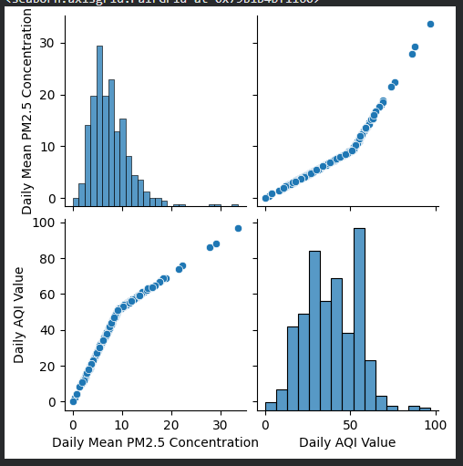
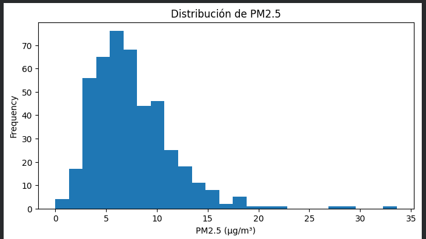
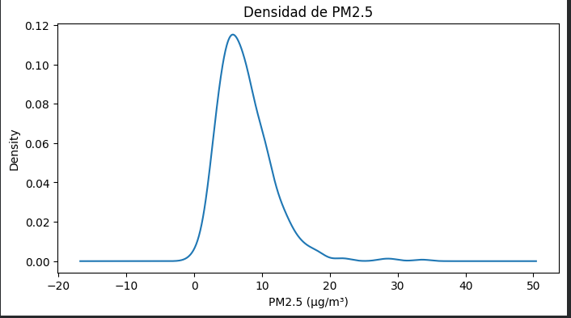
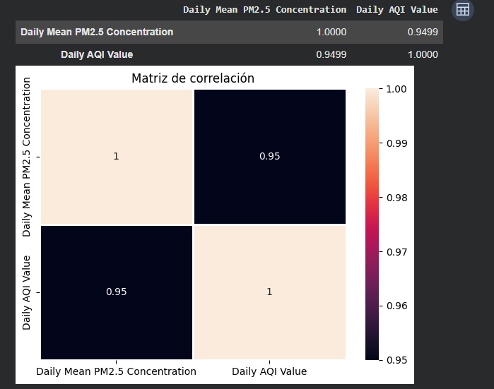
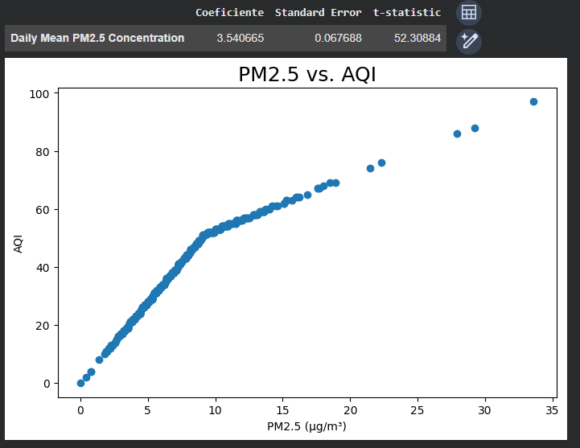
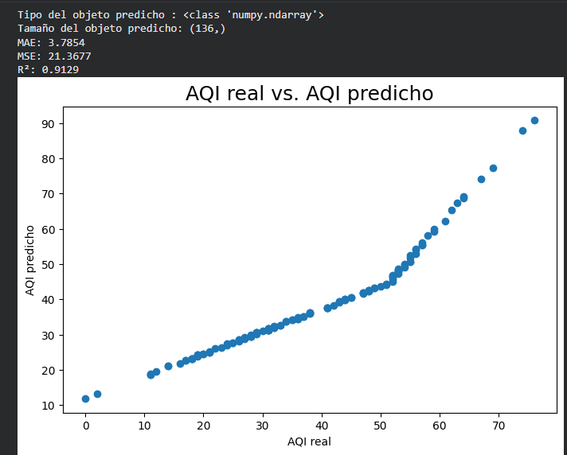
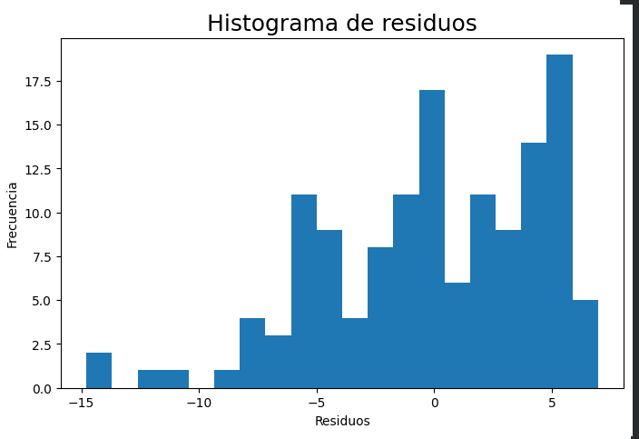
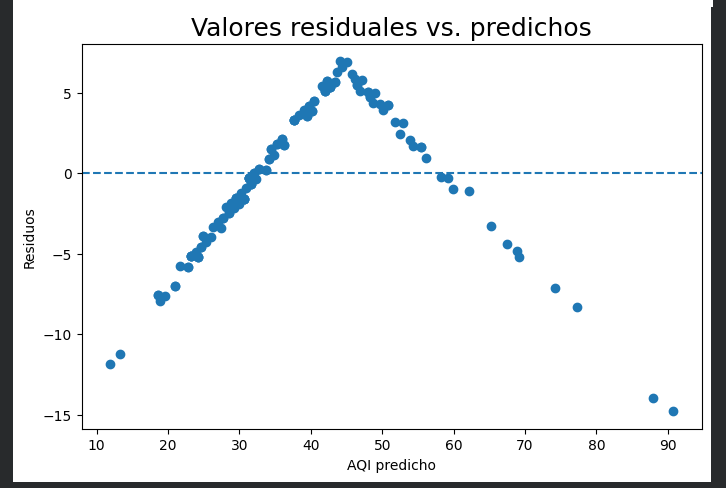
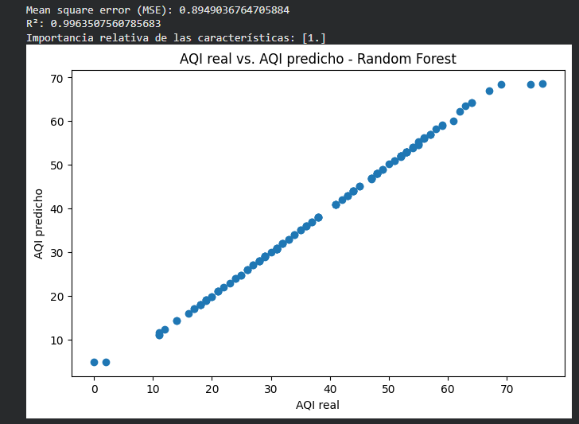

# Análisis de la concentración de PM2.5 y su relación con el AQI

## Introducción

El material particulado fino **PM2.5** está compuesto por partículas suspendidas en el aire con un diámetro aerodinámico menor o igual a 2.5 micrómetros. Su concentración es una de las variables utilizadas para estudiar la calidad del aire.

En este trabajo se analizaron datos diarios de **PM2.5** obtenidos del sistema **Air Quality System (AQS)** de la **United States Environmental Protection Agency (EPA)**.

Para la obtención de los datos se seleccionaron los siguientes parámetros:

- **Contaminante:** PM2.5
- **Ubicación:** Baldwin County, Alabama
- **Sitio de monitoreo:** FAIRHOPE, Alabama
- **Site ID:** 010030010
- **Periodo seleccionado:** enero de 2022 a diciembre de 2023
- **Número de registros:** 451

Aunque el periodo seleccionado comprende desde enero de 2022 hasta diciembre de 2023, los registros disponibles en el archivo utilizado van desde el **2 de enero de 2022 hasta el 26 de diciembre de 2023**.

Las principales variables utilizadas para el análisis fueron:

- **Daily Mean PM2.5 Concentration:** concentración media diaria de PM2.5 expresada en µg/m³.
- **Daily AQI Value:** valor diario del Índice de Calidad del Aire (AQI).

El objetivo principal fue analizar el comportamiento de las concentraciones de PM2.5 y determinar la relación existente entre estas concentraciones y los valores diarios del AQI mediante herramientas estadísticas, visualizaciones y modelos de regresión.

---

# Metodología

El análisis fue desarrollado utilizando **Python** en un entorno de Jupyter Notebook/Google Colab.

Para el procesamiento, análisis y visualización de los datos se utilizaron las siguientes bibliotecas:

- **NumPy:** operaciones numéricas.
- **pandas:** organización y análisis de datos.
- **Matplotlib:** elaboración de gráficos.
- **Seaborn:** visualización estadística.
- **Scikit-learn:** implementación y evaluación de modelos de regresión.
- **Statsmodels:** análisis estadístico mediante mínimos cuadrados ordinarios.

La metodología estuvo dividida en varias etapas.

### Análisis descriptivo

Primero se revisaron las características principales del conjunto de datos y se calcularon estadísticas descriptivas como:

- Media.
- Mediana.
- Desviación estándar.
- Valores mínimos.
- Valores máximos.
- Cuartiles.

Esto permitió conocer inicialmente el comportamiento de las variables PM2.5 y AQI.

### Análisis gráfico

Posteriormente se utilizaron diferentes representaciones gráficas para observar la distribución de los datos y la relación entre las variables.

Se utilizaron:

- Diagrama conjunto de variables.
- Histograma.
- Curva de densidad.
- Matriz de correlación.
- Diagramas de dispersión.
- Histogramas de residuos.

### Correlación

Se calculó la **correlación de Pearson** entre la concentración diaria de PM2.5 y el AQI.

Esta medida permite identificar la intensidad de la relación lineal existente entre dos variables.

### Regresión lineal

Se utilizó un modelo de regresión lineal donde:

- **Variable independiente (X):** concentración media diaria de PM2.5.
- **Variable dependiente (Y):** AQI diario.

El conjunto de datos fue dividido en:

- **70 % para entrenamiento:** 315 observaciones.
- **30 % para prueba:** 136 observaciones.

Para evaluar el modelo se utilizaron las métricas:

- **MAE:** Error Absoluto Medio.
- **MSE:** Error Cuadrático Medio.
- **R²:** Coeficiente de determinación.

### Random Forest

También se implementó un modelo **Random Forest Regressor** compuesto por 100 árboles.

Su rendimiento fue comparado con el modelo de regresión lineal mediante el MSE y el coeficiente R².

### Mínimos cuadrados ordinarios

Finalmente se utilizó el método **Ordinary Least Squares (OLS)** para analizar estadísticamente la relación entre PM2.5 y AQI, obteniendo información sobre los coeficientes, errores estándar y significancia estadística.

---

# Resultados

## 1. Distribución y relación entre PM2.5 y AQI

  

La visualización conjunta permite observar tanto la distribución de cada variable como la relación entre ellas.

En los diagramas de dispersión se observa claramente una tendencia creciente. A medida que aumenta la concentración diaria de **PM2.5**, también aumenta el valor del **AQI**.

La distribución de PM2.5 presenta una mayor concentración de observaciones en valores bajos y medios, mientras que existen pocos registros con concentraciones considerablemente mayores.

El AQI presenta un comportamiento similar, concentrándose principalmente en valores intermedios.

Esta primera visualización permite identificar una relación positiva evidente entre las dos variables.

---

## 2. Distribución de PM2.5

  

El histograma muestra la frecuencia con la que aparecen las diferentes concentraciones de PM2.5.

La concentración media diaria obtenida fue aproximadamente:

**7.54 µg/m³**

Mientras que la mediana fue:

**6.90 µg/m³**

El valor máximo observado fue:

**33.60 µg/m³**

Se puede observar que la mayor cantidad de registros se concentra aproximadamente entre valores bajos y medios de PM2.5.

También existen algunos valores considerablemente mayores que se encuentran alejados de la mayor concentración de observaciones.

Por esta razón, la distribución presenta una extensión hacia valores altos de PM2.5.

---

## 3. Densidad de PM2.5

  

La curva de densidad permite observar de manera continua cómo se distribuyen las concentraciones de PM2.5.

La mayor densidad se encuentra alrededor de las concentraciones bajas y medias, aproximadamente entre **5 y 10 µg/m³**.

Después de este intervalo, la densidad disminuye progresivamente.

También pueden observarse pequeñas variaciones en concentraciones mayores, aunque estas representan una cantidad mucho menor de observaciones.

Este resultado coincide con lo observado anteriormente en el histograma.

---

## 4. Matriz de correlación

  

La matriz de correlación permite medir la relación existente entre las variables PM2.5 y AQI.

El coeficiente de correlación obtenido fue:

**r = 0.9499**

Este valor se encuentra muy próximo a 1, por lo que indica una **relación lineal positiva fuerte**.

Esto significa que, dentro del conjunto de datos analizado, cuando aumenta la concentración diaria de PM2.5, normalmente también aumenta el valor diario del AQI.

La matriz permite confirmar numéricamente la tendencia que anteriormente se podía observar en los diagramas de dispersión.

---

## 5. PM2.5 vs. AQI

  

El diagrama de dispersión permite observar directamente la relación entre la concentración diaria de PM2.5 y el AQI.

Los puntos presentan una tendencia claramente ascendente.

La mayor cantidad de observaciones se encuentra en concentraciones menores a aproximadamente **20 µg/m³**, mientras que existen algunos registros con concentraciones mayores que también presentan valores elevados de AQI.

Mediante la regresión lineal se obtuvo el siguiente coeficiente para PM2.5:

**3.540665**

Esto indica que, dentro del modelo obtenido, un aumento de **1 µg/m³ de PM2.5** se encuentra asociado con un incremento promedio aproximado de **3.54 puntos en el AQI**.

También se obtuvo:

- **Error estándar:** 0.067688
- **Estadístico t:** 52.30884

El elevado valor del estadístico t muestra una asociación lineal marcada entre PM2.5 y AQI dentro de los datos analizados.

---

## 6. AQI real vs. AQI predicho mediante regresión lineal

  

Después de entrenar el modelo de regresión lineal, se utilizaron los **136 registros correspondientes al conjunto de prueba** para evaluar las predicciones.

Se obtuvieron los siguientes resultados:

| Métrica | Resultado |
|---|---:|
| MAE | 3.7854 |
| MSE | 21.3677 |
| R² | 0.9129 |

El **MAE de 3.7854** significa que, en promedio, las predicciones presentan una diferencia aproximada de 3.79 puntos respecto al AQI real.

El **MSE de 21.3677** representa el promedio de los errores elevados al cuadrado.

El modelo obtuvo un:

**R² = 0.9129**

Esto indica que aproximadamente el **91.29 % de la variabilidad del AQI** en los datos de prueba puede ser explicada mediante la concentración de PM2.5 utilizando el modelo lineal.

En el gráfico se observa que los valores predichos siguen de manera cercana el comportamiento de los valores reales.

---

## 7. Histograma de residuos

  

Los residuos representan la diferencia entre el valor real y el valor predicho por el modelo:

**Residuo = Valor real - Valor predicho**

El histograma permite estudiar cómo se distribuyen estos errores.

Se observa que una gran cantidad de residuos se encuentra alrededor de valores cercanos a cero, aunque también existen errores positivos y negativos de mayor magnitud.

Los residuos negativos indican casos en los que el modelo predijo un AQI mayor que el valor real.

Los residuos positivos indican casos en los que el modelo predijo un AQI menor que el valor realmente observado.

---

## 8. Residuos vs. valores predichos

  

Este gráfico compara los valores predichos por el modelo con sus respectivos residuos.

La línea horizontal representa un residuo igual a cero.

Los puntos próximos a esta línea representan predicciones con un error pequeño.

Sin embargo, los residuos no se encuentran distribuidos completamente de forma aleatoria alrededor de cero. Se observa un patrón curvo: inicialmente los residuos aumentan y posteriormente disminuyen a medida que aumenta el AQI predicho.

Esto indica que la relación entre PM2.5 y AQI no es completamente lineal en todo el rango de valores.

Este comportamiento ayuda a explicar por qué un modelo más flexible, como Random Forest, logra un mejor ajuste sobre este conjunto de datos.

---

## 9. AQI real vs. AQI predicho mediante Random Forest

  

Como segundo método se utilizó un modelo **Random Forest Regressor** con 100 árboles.

Los resultados obtenidos fueron:

| Métrica | Resultado |
|---|---:|
| MSE | 0.8949 |
| R² | 0.9964 |

El valor de:

**R² = 0.9964**

indica que el modelo logró explicar aproximadamente el **99.64 % de la variabilidad del AQI** en el conjunto de prueba.

En el gráfico se observa que los valores predichos se encuentran muy próximos a los valores reales.

Además, debido a que solamente se utilizó una característica de entrada, PM2.5 presenta una importancia relativa de:

**1.0**

Esto representa el 100 % de la importancia de las características utilizadas por el modelo.

Random Forest presentó un ajuste considerablemente mayor que la regresión lineal para estos datos.

---

## 10. Mínimos cuadrados ordinarios

Finalmente se aplicó un modelo de **Mínimos Cuadrados Ordinarios (OLS)** utilizando los 451 registros disponibles.

El modelo obtuvo:

**R² = 0.902**

El coeficiente correspondiente a PM2.5 fue:

**3.6121**

Mientras que el término constante obtenido fue:

**11.2693**

Además, el valor *p* correspondiente al coeficiente de PM2.5 fue menor a 0.001.

Estos resultados muestran nuevamente una asociación estadísticamente significativa entre la concentración diaria de PM2.5 y el AQI dentro del conjunto analizado.

---

# Discusión

Los diferentes métodos utilizados muestran resultados consistentes respecto a la relación entre PM2.5 y AQI.

La correlación de Pearson obtuvo un valor de **0.9499**, indicando una relación positiva fuerte entre ambas variables.

La regresión lineal obtuvo un **R² de 0.9129**, mostrando que el modelo puede representar gran parte de la variabilidad del AQI utilizando únicamente la concentración de PM2.5.

Sin embargo, el análisis de los residuos muestra la existencia de un patrón curvo, lo que indica que la relación entre ambas variables no se representa perfectamente mediante una única línea recta.

Esto se refleja en los resultados obtenidos con **Random Forest**, que alcanzó un **R² de 0.9964** y un MSE considerablemente menor.

Por lo tanto, dentro de este conjunto de datos, Random Forest logra representar con mayor precisión la relación existente entre PM2.5 y AQI.

No obstante, estos resultados corresponden específicamente a los **451 registros obtenidos del sitio de monitoreo FAIRHOPE, Alabama**, durante el periodo analizado.

Por ello, los resultados no deben generalizarse directamente a otras ciudades, periodos de tiempo o estaciones de monitoreo sin realizar un nuevo análisis.

---

# Conclusiones

A partir del análisis realizado se puede concluir que existe una relación positiva fuerte entre las concentraciones diarias de PM2.5 y los valores del AQI.

La correlación obtenida fue de **0.9499**, lo que evidencia que ambas variables presentan un comportamiento estrechamente relacionado.

La regresión lineal permitió explicar aproximadamente el **91.29 % de la variabilidad del AQI**, mientras que Random Forest obtuvo aproximadamente un **99.64 %** para el conjunto de prueba utilizado.

Los gráficos de residuos mostraron que la relación entre ambas variables presenta un comportamiento que no es completamente lineal, lo que ayuda a explicar el mejor desempeño obtenido por Random Forest.

En general, las herramientas de análisis estadístico, visualización y aprendizaje automático utilizadas permitieron describir adecuadamente el comportamiento de los datos y analizar la relación existente entre PM2.5 y AQI.

---

# Referencias

[1] U.S. Environmental Protection Agency, “Download Daily Data,” *Outdoor Air Quality Data*. [En línea]. Disponible en: https://www.epa.gov/outdoor-air-quality-data/download-daily-data. [Accedido: 18-sep-2026].

[2] U.S. Environmental Protection Agency, “AirData: Air Quality Data Collected at Outdoor Monitors Across the US,” *U.S. EPA*. [En línea]. Disponible en: https://www.epa.gov/outdoor-air-quality-data. [Accedido: 18-sep-2026].

[3] F. Pedregosa *et al*., “Scikit-learn: Machine Learning in Python,” *Journal of Machine Learning Research*, vol. 12, pp. 2825–2830, 2011.

