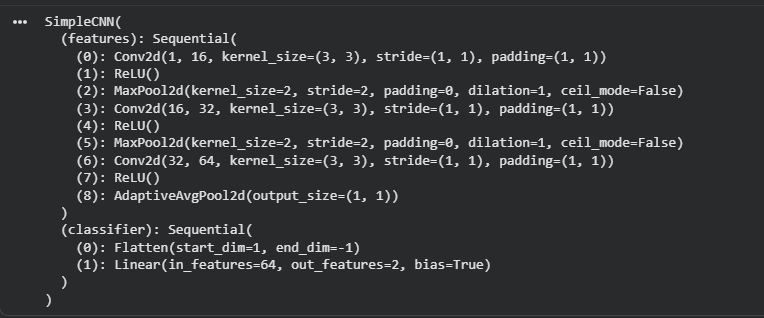

# Redes neuronales: CNN, Keras y Perceptrón

En este trabajo se presentan tres conceptos relacionados con las redes neuronales: **CNN, Keras y Perceptrón**. Para cada uno se utiliza un ejemplo realizado en Python y se muestran los resultados obtenidos al ejecutar el código.

---

# 1. CNN

## ¿Qué es una CNN?

Una **CNN (Convolutional Neural Network)** o red neuronal convolucional es un tipo de red neuronal que se utiliza principalmente para trabajar con imágenes.

En nuestro caso, utilizamos una CNN con imágenes del conjunto de datos **TrashNet**. El objetivo es que el modelo pueda aprender a reconocer y diferenciar las distintas clases de residuos.

## Construcción de la CNN

En nuestro código se crea una clase llamada `SimpleCNN`, donde se define la estructura de la red y las diferentes capas que se van a utilizar.

### Interpretación

En esta parte se define cómo va a funcionar nuestra red. Las capas convolucionales ayudan al modelo a reconocer diferentes características de las imágenes.

Primero puede identificar cosas simples, como bordes y formas, y luego utiliza esa información para poder clasificar las imágenes.

## Entrenamiento de la CNN

Después de crear el modelo, se procede a entrenarlo utilizando los datos del dataset. Durante este proceso, la red aprende a reconocer las características de las imágenes para poder clasificarlas correctamente.
