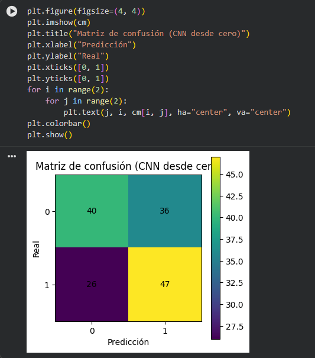

Redes neuronales: CNN, Keras y Perceptrón

**1. CNN**

Una CNN (Convolutional Neural Network) o red neuronal convolucional es un tipo de red neuronal que se utiliza principalmente para trabajar con imágenes. La idea es que el modelo pueda encontrar características dentro de una imagen y utilizarlas para poder clasificarla.

En nuestro caso, utilizamos una CNN para trabajar con imágenes de residuos y poder reconocer las diferentes clases del conjunto de datos TrashNet.

**¿Cómo funciona en nuestro código?**

En esta parte se crea la estructura de nuestra red usando la clase `SimpleCNN`. La red tiene capas convolucionales que ayudan a reconocer las características de las imágenes y después utiliza esas características para poder clasificarlas.

**Interpretación:**

En esta parte podemos observar cómo está formada la CNN. Las capas convolucionales permiten que el modelo identifique diferentes características de las imágenes, como bordes, formas y patrones. Luego, utiliza estas características para reconocer a qué clase pertenece cada imagen.

Además, se evaluó el modelo con imágenes que no se usaron directamente durante el entrenamiento, para comprobar cómo funciona con imágenes nuevas.

**Interpretación:**

Aquí podemos ver los resultados que obtuvo el modelo al clasificar las imágenes de prueba. La **accuracy** muestra el porcentaje de imágenes que el modelo clasificó correctamente. Además, la matriz de confusión nos permite ver en qué clases tuvo más errores y qué imágenes llegó a confundir.

