# Redes neuronales - CNN, Keras y Perceptrón

En esta práctica revisé tres temas principales: CNN, Keras y Perceptrón. La idea fue entender de manera general cómo funcionan y ver qué parte nos podría servir para Kartoffelmachine.

---

## CNN

Las CNN son redes neuronales utilizadas principalmente para trabajar con imágenes. Yo lo entendí como una red que va buscando características pequeñas de una imagen, como bordes o texturas, y poco a poco junta esa información para poder clasificarla.

  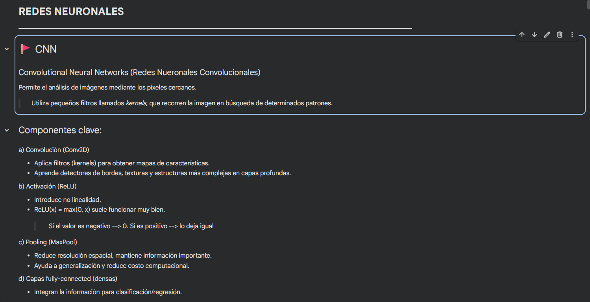

Las partes principales que vimos fueron Conv2D, ReLU, MaxPool y las capas densas. Cada una cumple una función diferente durante el análisis de la imagen.

### Dataset

Para practicar se utilizó TrashNet, usando imágenes de vidrio y plástico.

  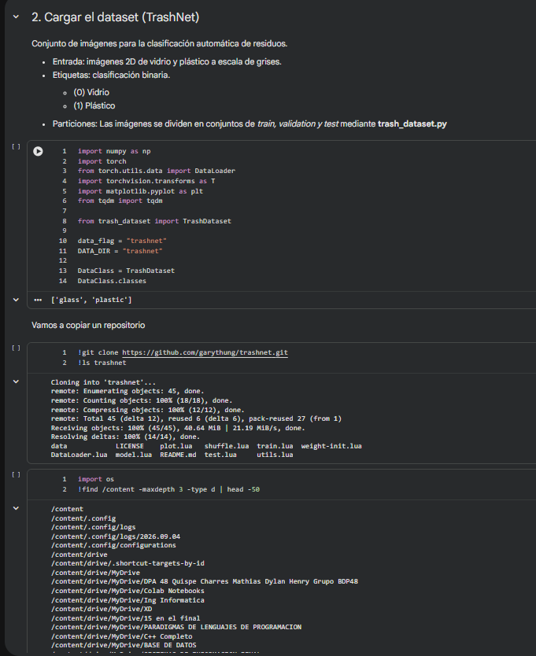

  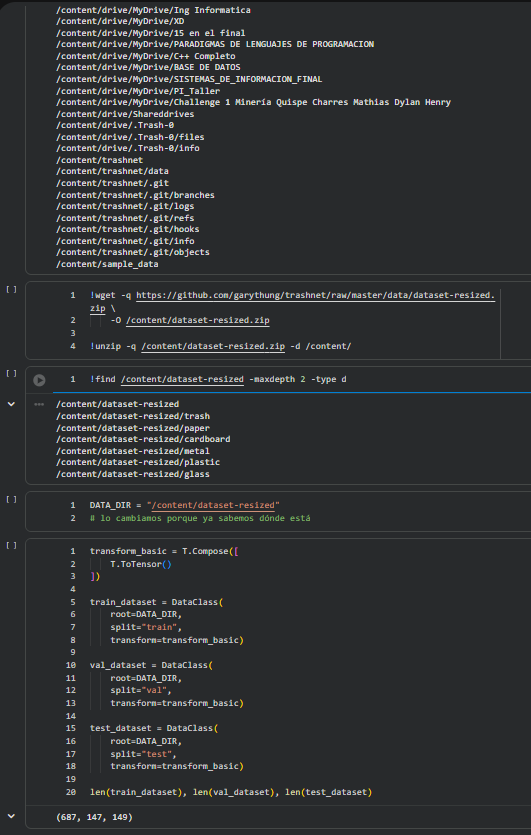

Los datos se separaron en entrenamiento, validación y prueba.

También se mostraron algunos ejemplos para comprobar que las imágenes se habían cargado correctamente.

  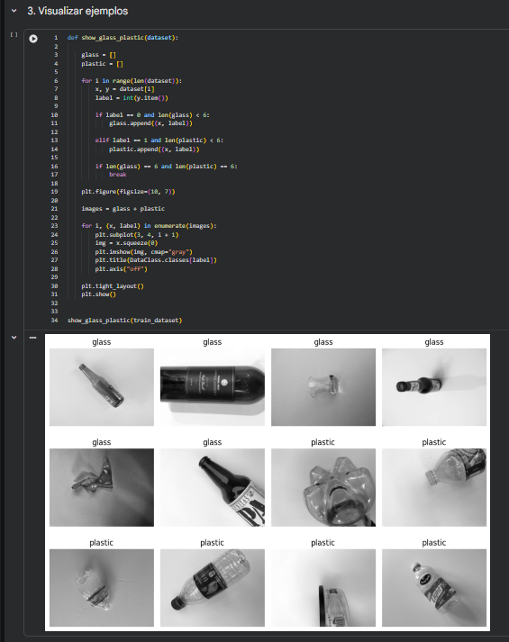

### Modelo CNN

Después se creó una CNN desde cero.

  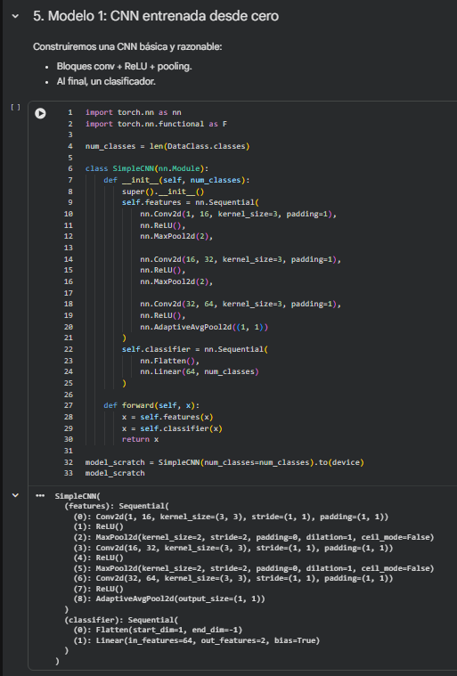

El modelo comienza con 16 filtros, luego pasa a 32 y finalmente a 64. La idea es que mientras avanza por las capas pueda reconocer características cada vez más importantes.

### Entrenamiento

El modelo se entrenó durante 8 épocas.

  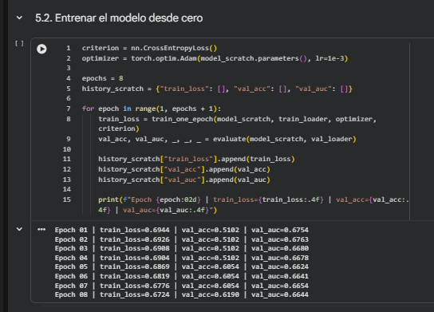

Luego se graficaron los resultados para observar si realmente estaba aprendiendo.

  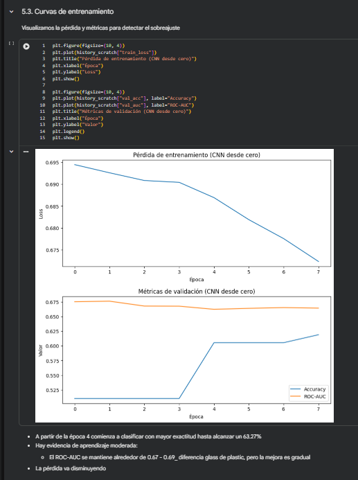

A partir de la época 4 se nota una mejora y se llega aproximadamente a 63.27% de accuracy. El ROC-AUC se mantiene alrededor de 0.67 a 0.69.

Para mí esto indica que sí existe aprendizaje, aunque todavía el modelo comete varios errores.

### Evaluación

Al final se prueba el modelo con datos que no utilizó directamente durante el entrenamiento.

  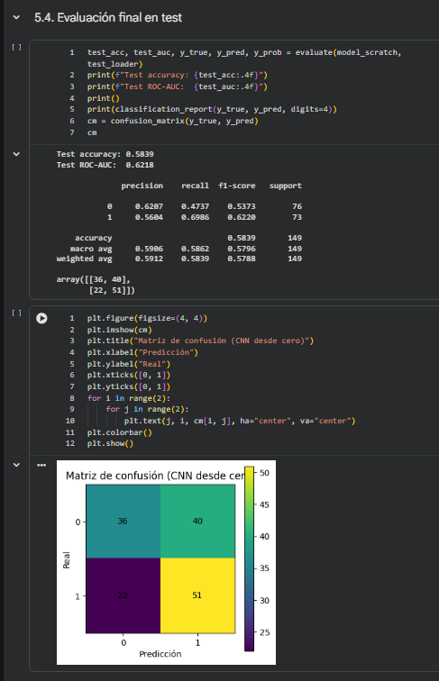

La matriz de confusión permite ver cuántas imágenes clasificó correctamente y en cuáles se equivocó.

### Grad-CAM

Grad-CAM fue una de las partes que más me llamó la atención porque permite ver qué zona de una imagen tomó más en cuenta la red para hacer una predicción.

  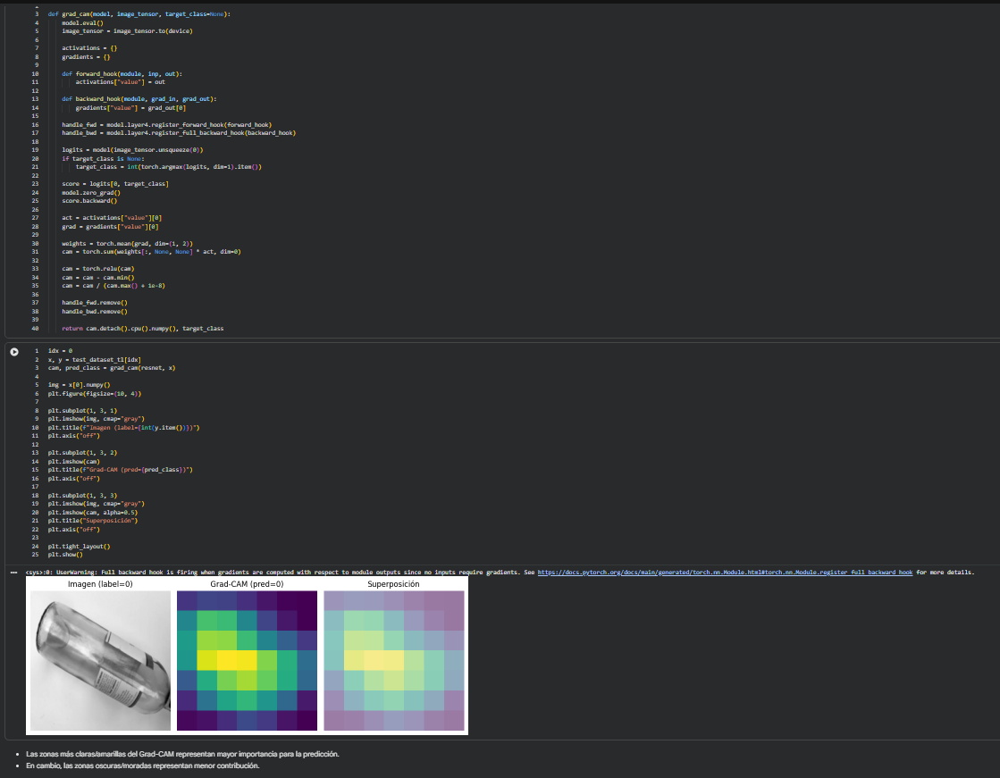

Esto sería útil porque no solo tenemos el resultado, sino que también podemos revisar si la IA está observando la parte correcta de la imagen.

---

## Keras

Keras permite crear y entrenar redes neuronales de una forma más sencilla.

En este ejemplo ya no se usaron imágenes, sino reseñas de películas que tenían que clasificarse como positivas o negativas.

  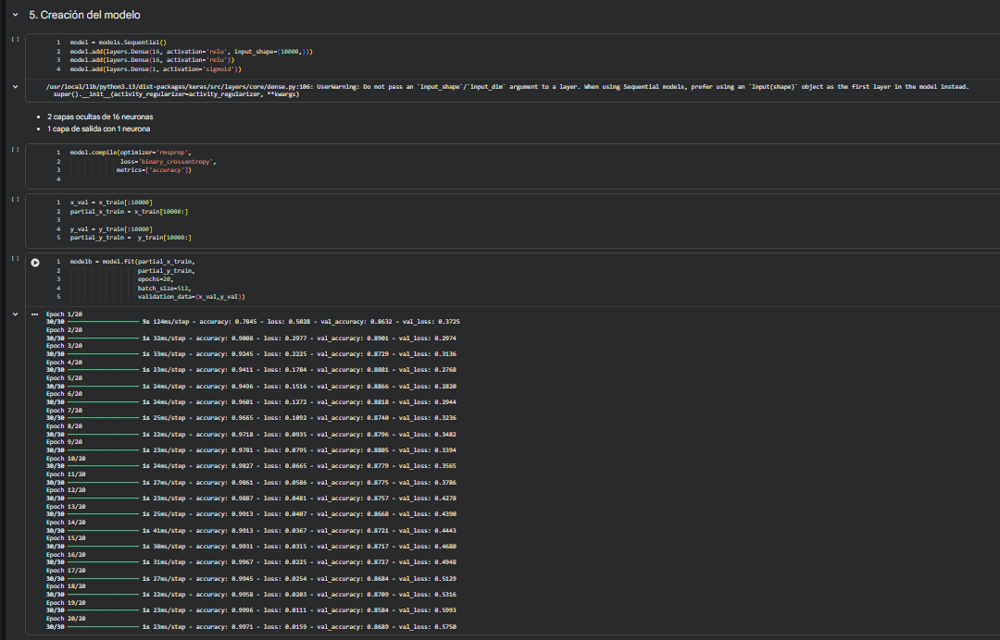

Se utilizaron dos capas de 16 neuronas y una capa final para realizar la clasificación.

### Sobreajuste

También vimos el problema del sobreajuste.

  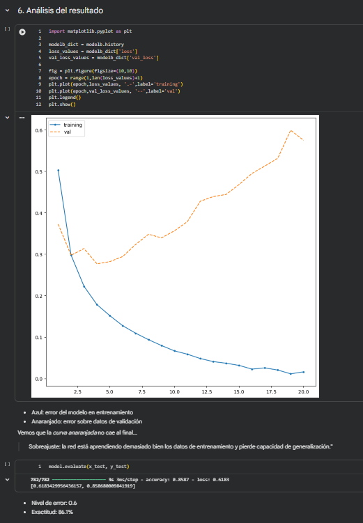

Yo lo entendí como cuando el modelo aprende demasiado bien los datos con los que entrenó, pero después empieza a fallar cuando recibe datos nuevos.

En este ejemplo se obtuvo aproximadamente 86.1% de exactitud.

### Dropout

Para reducir el sobreajuste también se utilizó Dropout.

  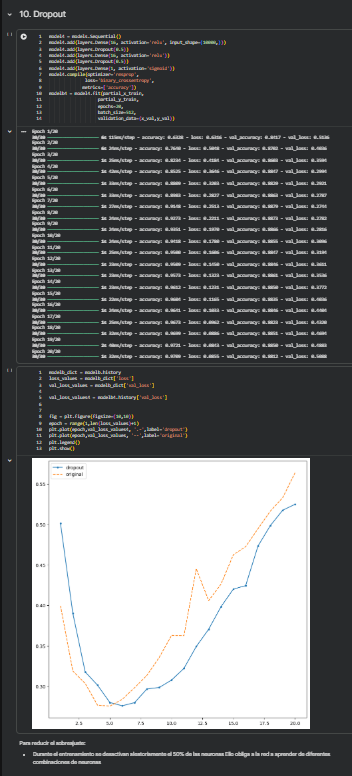

Durante el entrenamiento algunas neuronas se desactivan temporalmente para que la red no dependa siempre de las mismas.

Finalmente también se hicieron predicciones.

  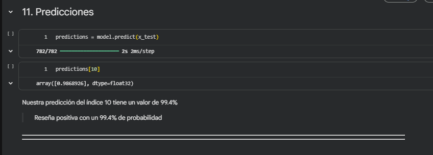

En este caso una de las reseñas obtuvo aproximadamente 99.4% de probabilidad de ser positiva.

---

## Perceptrón

El perceptrón fue la parte más sencilla de entender porque funciona como una neurona básica.

Recibe entradas, utiliza pesos y un bias, y finalmente genera una salida.

  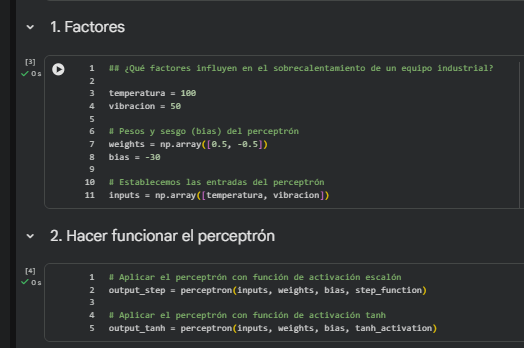

En el ejemplo se utilizaron temperatura y vibración como entradas.

Después se probaron dos funciones de activación diferentes.

  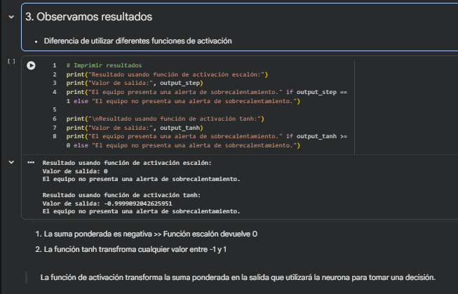

La función escalón devuelve 0 o 1, mientras que tanh puede devolver valores entre -1 y 1.

### AND y OR

También se probó el perceptrón con las compuertas AND y OR.

  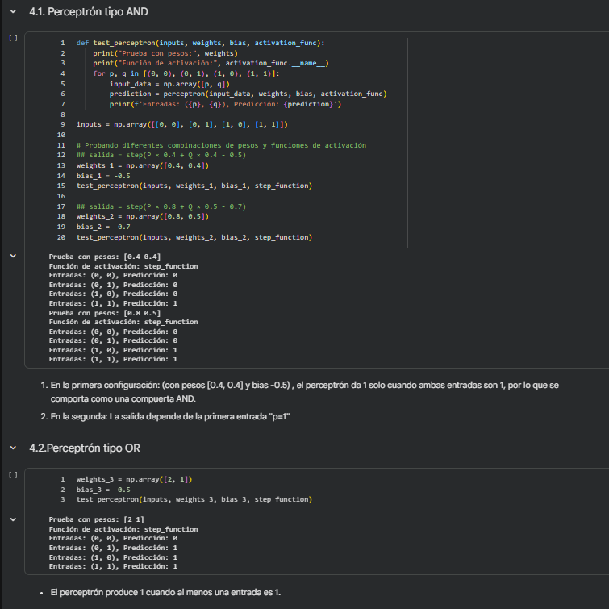

Con estos ejemplos se puede ver cómo una neurona separa datos dependiendo de sus entradas.

### XOR

Finalmente se probó XOR.

  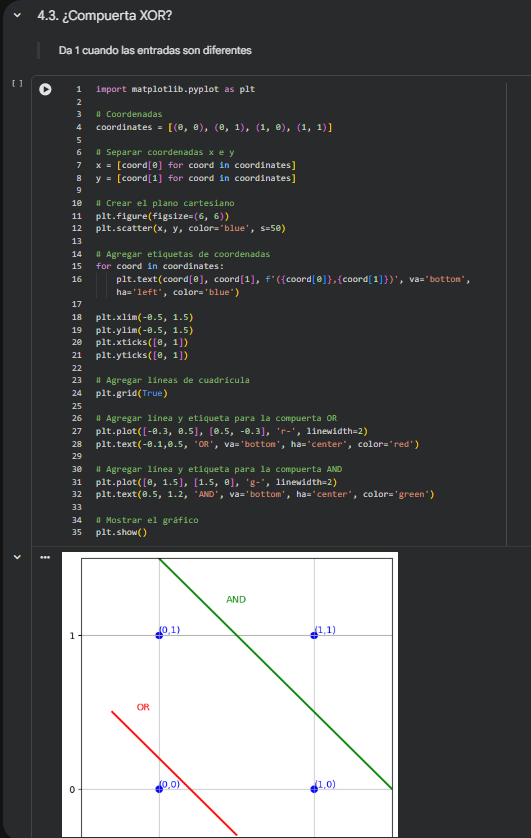

  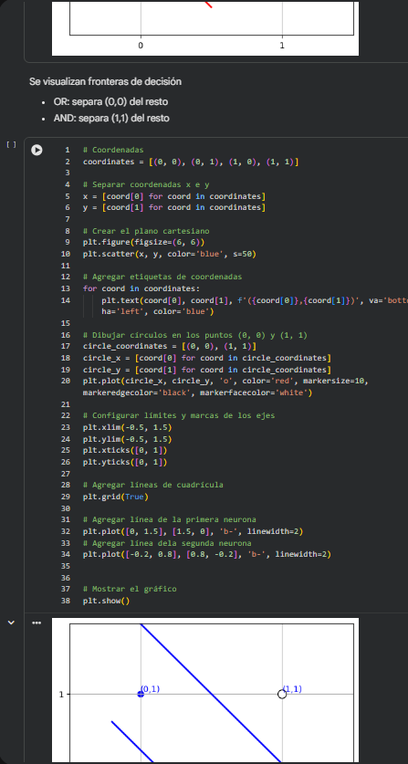

  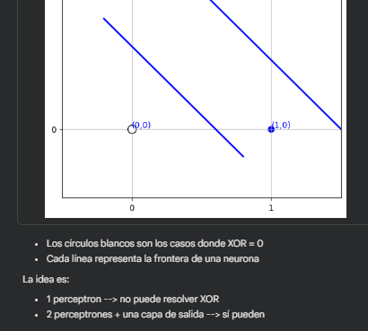

La conclusión principal fue que un solo perceptrón no puede resolver XOR. Se necesitan más neuronas y una capa de salida.

Esto ayuda a entender por qué las redes neuronales reales utilizan varias neuronas y varias capas.

---

## Qué aprendí

De esta práctica me quedo principalmente con lo siguiente:

- El perceptrón ayuda a entender cómo funciona una neurona artificial.
- Keras facilita la creación de redes neuronales.
- Las CNN son muy útiles cuando trabajamos con imágenes.
- No siempre basta con revisar el accuracy.
- El sobreajuste puede hacer que un modelo funcione bien entrenando, pero mal con datos nuevos.
- Grad-CAM permite entender mejor qué está observando una CNN.

---

## Aplicación en Kartoffelmachine

De todo lo visto, la CNN es lo que más relación tiene con nuestro proyecto.

La idea sería reemplazar las imágenes de vidrio y plástico por imágenes reales de papas Chaucha.

El funcionamiento sería:

1. La papa entra a la zona de inspección.
2. Los rodillos hacen que la papa rote.
3. La cámara toma imágenes mientras gira.
4. Las imágenes se preparan para ingresar al modelo.
5. La CNN analiza características como manchas, forma, textura o daños.
6. Se determina si la papa es buena o mala.
7. La Raspberry Pi recibe y procesa la decisión.
8. El mecanismo dirige la papa al contenedor correspondiente.

  

Para aplicarlo realmente tendríamos que crear nuestro propio dataset con fotos de papas buenas y malas.

También sería importante tomar las imágenes con una iluminación parecida a la que tendrá el módulo real, para que el modelo no tenga problemas cuando se implemente en Kartoffelmachine.

---

## Conclusión

Esta práctica me ayudó a entender mejor cómo una red neuronal puede aprender a partir de datos.

Para Kartoffelmachine lo más útil sería trabajar con una CNN, porque nuestro sistema necesita analizar imágenes de las papas para poder clasificarlas.

Más adelante tendríamos que tomar nuestras propias fotos, entrenar el modelo y probar qué tan bien logra diferenciar una papa buena de una mala.
