# Redes neuronales: CNN, Keras y Perceptrón

En este trabajo se presentan tres conceptos relacionados con las redes neuronales: **CNN, Keras y Perceptrón**. Para cada uno se utiliza un ejemplo realizado en Python y se muestran los resultados obtenidos al ejecutar el código.

---

# 1. CNN

## ¿Qué es una CNN?

Una **CNN (Convolutional Neural Network)** o red neuronal convolucional es un tipo de red neuronal que se utiliza principalmente para trabajar con imágenes.

En nuestro caso, utilizamos una CNN con imágenes del conjunto de datos **TrashNet**. El objetivo es que el modelo pueda aprender a reconocer y diferenciar las distintas clases de residuos.

## Construcción de la CNN

En nuestro código se crea una clase llamada `SimpleCNN`, donde se define la estructura de la red y las diferentes capas que se van a utilizar.

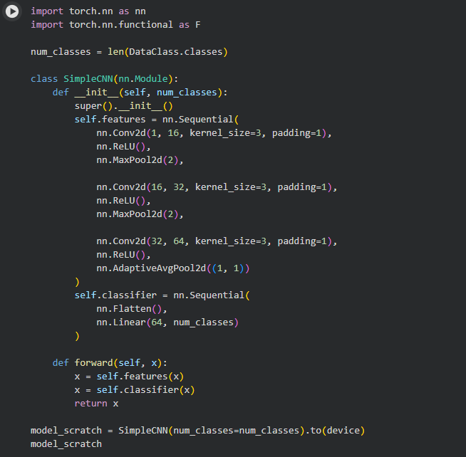

### Interpretación

En esta parte se define cómo va a funcionar nuestra red. Las capas convolucionales ayudan al modelo a reconocer diferentes características de las imágenes.

Primero puede identificar cosas simples, como bordes y formas, y luego utiliza esa información para poder clasificar las imágenes.

## Entrenamiento de la CNN

Después de crear el modelo, se procede a entrenarlo utilizando los datos del dataset. Durante este proceso, la red aprende a reconocer las características de las imágenes para poder clasificarlas correctamente.

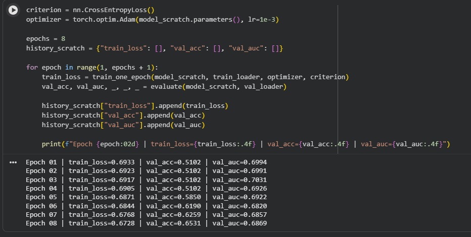

### Interpretación

En esta parte se define cómo va a aprender el modelo. La función `CrossEntropyLoss` ayuda a calcular el error que tiene al clasificar las imágenes, mientras que el optimizador `Adam` se encarga de ir ajustando el modelo durante el entrenamiento.

## Curvas de entrenamiento

El notebook también muestra las curvas de entrenamiento, las cuales nos permiten observar cómo va mejorando el modelo durante el proceso de entrenamiento.

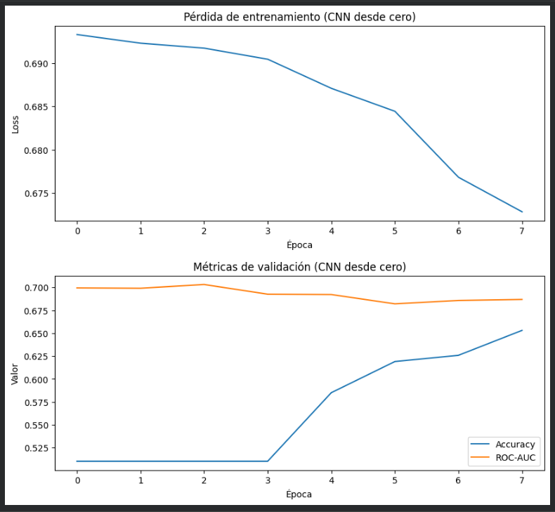

### Interpretación del gráfico

En este gráfico podemos ver cómo va cambiando el modelo durante las épocas de entrenamiento.

A medida que se entrena, el modelo va aprendiendo a reconocer mejor las características de las imágenes. También podemos comparar las curvas de entrenamiento y validación para ver si existe una diferencia grande entre ellas, lo que podría indicar un sobreajuste.

En nuestro notebook se observa que el modelo mejora durante las primeras épocas y luego su rendimiento se vuelve más estable.

## Evaluación de la CNN

Después de terminar el entrenamiento, se evalúa el modelo utilizando los datos de prueba. De esta manera, podemos comprobar qué tan bien funciona con imágenes que no utilizó durante el entrenamiento.

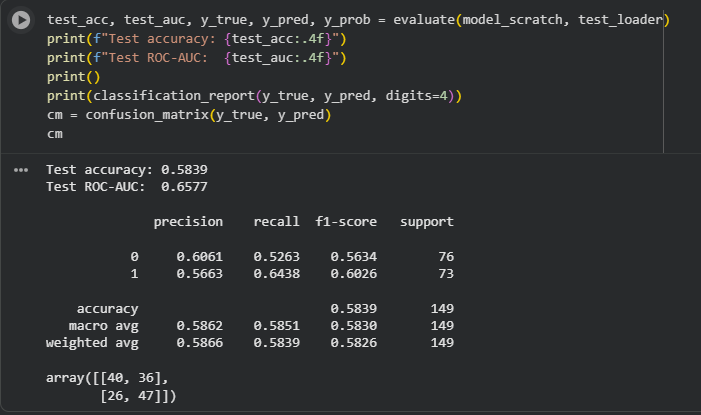

### Interpretación

La accuracy indica qué porcentaje de las imágenes fueron clasificadas correctamente.

Este resultado nos ayuda a saber cómo funciona el modelo con imágenes que no utilizó directamente durante el entrenamiento.

## Matriz de confusión

### Interpretación del gráfico

La matriz de confusión nos permite observar con más detalle los aciertos y errores del modelo.

Los valores de la diagonal representan las imágenes que fueron clasificadas correctamente. Los valores que están fuera de la diagonal representan las imágenes que el modelo confundió con otra clase.

Por eso, este gráfico nos permite identificar qué clases fueron más fáciles de reconocer y en cuáles tuvo más errores.

## Grad-CAM

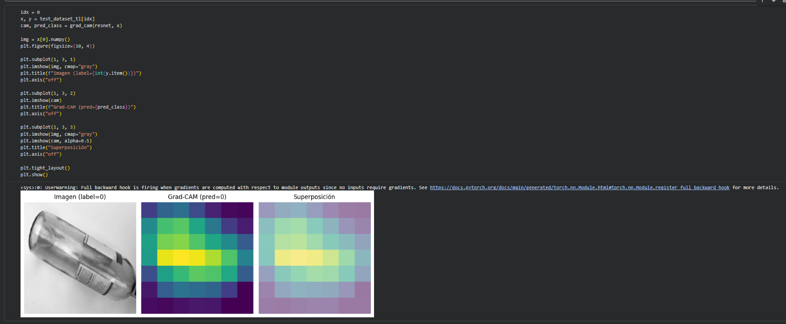

### Interpretación

El Grad-CAM utiliza un mapa de calor para mostrar qué partes de la imagen fueron más importantes para la predicción del modelo.

Las zonas que aparecen con mayor intensidad representan las partes que tuvieron más influencia en la decisión.

Esto nos ayuda a entender no solo qué predijo el modelo, sino también en qué partes de la imagen se basó para hacerlo.

---

# 2. Keras

## ¿Qué es Keras?

**Keras** es una herramienta que facilita la creación y entrenamiento de redes neuronales.

En nuestro ejemplo utilizamos Keras para clasificar reseñas de películas utilizando el dataset **IMDB**.

El objetivo es clasificar las reseñas en dos categorías: **positivas o negativas**.

## Carga de los datos

Primero se importan las herramientas necesarias y se carga el dataset de IMDB.

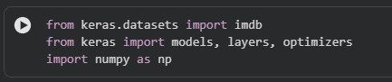

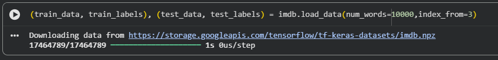

### Interpretación

En esta parte se carga el conjunto de datos que vamos a utilizar. Las reseñas están representadas mediante números y cada una tiene una etiqueta que indica si corresponde a una opinión positiva o negativa.

## Preparación de los datos

Después se transforman las reseñas para que puedan ser utilizadas por la red neuronal.

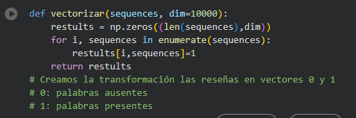
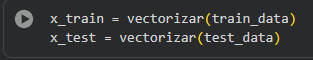

### Interpretación

La red neuronal necesita recibir los datos de una forma que pueda procesar. Por eso, las reseñas se convierten a una representación que permite que el modelo pueda utilizarlas.

De esta manera, los datos quedan preparados para ingresar al modelo.

## Construcción del modelo

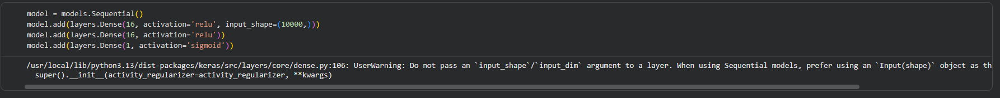

### Interpretación

En esta parte se construye la red utilizando `Sequential`, lo que permite agregar las capas una después de otra.

También se utilizan capas `Dense`, que ayudan a procesar la información hasta obtener la clasificación de la reseña.

Una ventaja de Keras es que permite crear este tipo de modelos de una manera más sencilla, sin tener que programar manualmente todo el funcionamiento de la red.

## Entrenamiento

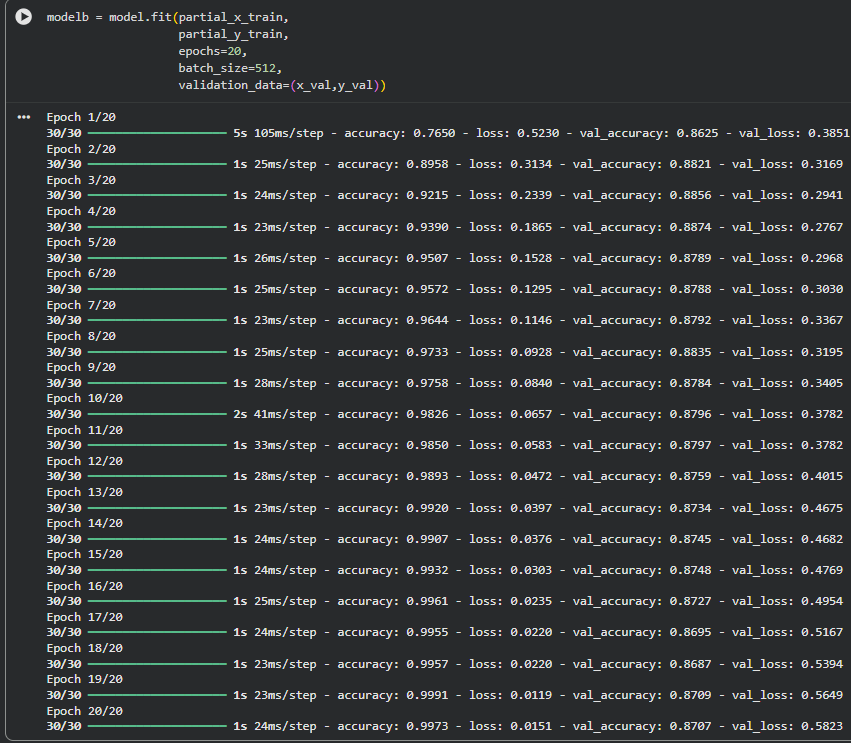

### Interpretación

En esta parte el modelo aprende utilizando los datos de entrenamiento. Se realizan varias épocas para que la red pueda ajustar sus parámetros y mejorar sus resultados.

## Gráfica de pérdida

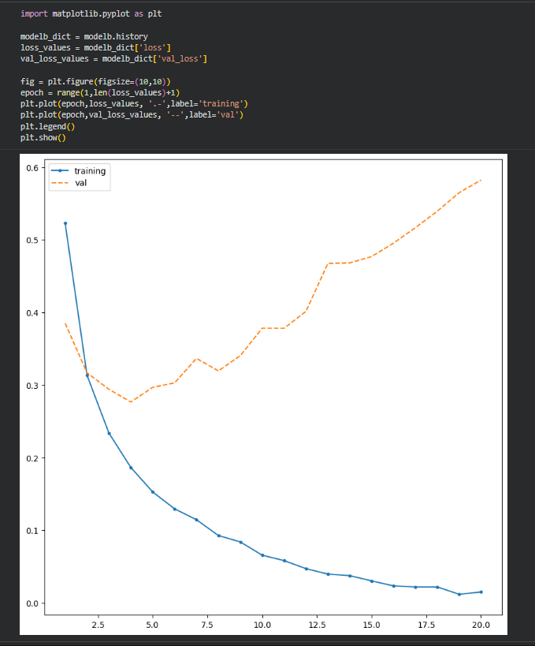

### Interpretación

En esta gráfica podemos comparar el error que obtiene el modelo durante el entrenamiento y la validación.

Esto nos permite observar cómo va aprendiendo el modelo y también identificar si puede existir sobreajuste.

En nuestro caso, podemos observar cómo cambia la pérdida a medida que avanzan las épocas.

## Evaluación del modelo

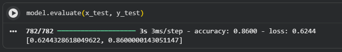

En nuestro notebook se obtiene una exactitud de **86.1 %** en los datos de prueba.

### Interpretación

El modelo logró clasificar correctamente una parte importante de las reseñas de prueba. La exactitud nos muestra el porcentaje de reseñas que fueron clasificadas correctamente, mientras que la pérdida indica el error obtenido durante la evaluación.

## Comparación con un modelo más pequeño

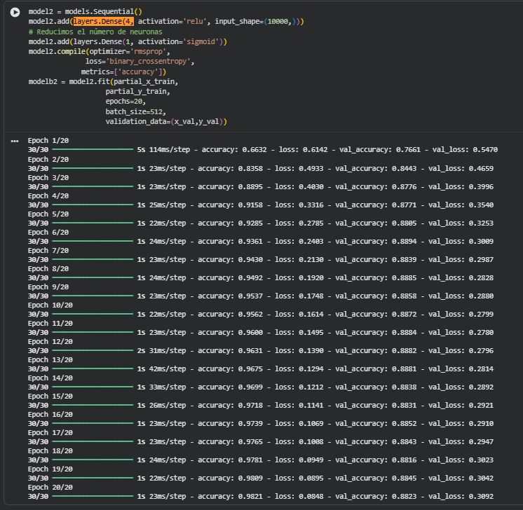

### Interpretación

En este caso se utiliza un modelo con menos neuronas para observar cómo cambia su rendimiento.

Esto nos permite comparar los resultados de un modelo con mayor cantidad de neuronas con uno más pequeño.

## Regularización y Dropout

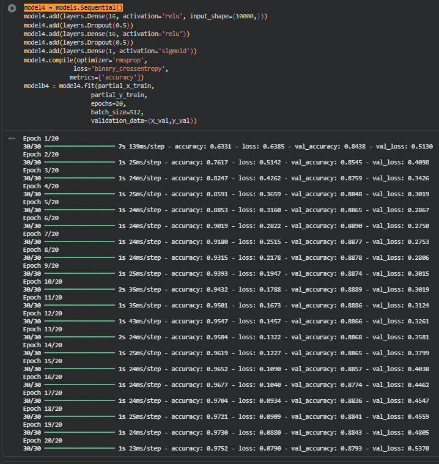

### Interpretación

El **Dropout** desactiva algunas neuronas de manera aleatoria durante el entrenamiento.

Esto ayuda a evitar que el modelo dependa demasiado de algunas neuronas y puede ayudar a que funcione mejor con datos nuevos.

---

# 3. Perceptrón

## ¿Qué es un perceptrón?

El **perceptrón** es un modelo sencillo que representa una neurona artificial.

Recibe diferentes entradas, utiliza pesos para determinar la importancia de cada una y finalmente produce una salida.

En nuestro ejemplo se utiliza para trabajar con factores que pueden influir en el sobrecalentamiento de un equipo industrial.

## Funcionamiento del perceptrón

.png)

### Interpretación

La función de activación transforma el resultado obtenido por el perceptrón en una salida.

En este caso se utiliza una función escalón, por lo que la salida puede ser **0 o 1**.

Esto permite representar una decisión sencilla.

## Entradas del ejemplo

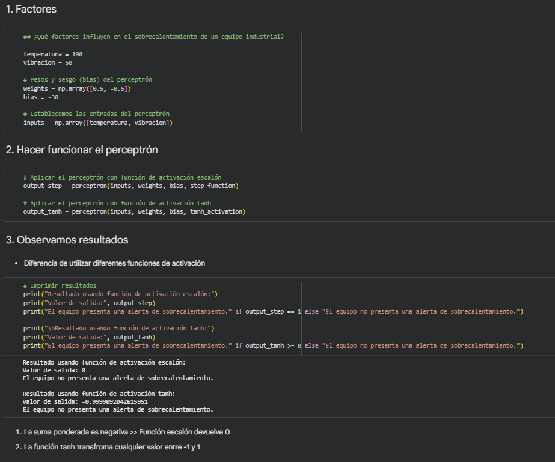

### Interpretación

En este ejemplo se utilizan la temperatura y la vibración como entradas.

Cada entrada tiene un peso que indica cuánto influye en el resultado final. También se utiliza un `bias`, que permite ajustar la decisión del perceptrón.

## Resultado del perceptrón

### Interpretación

Aquí podemos observar el resultado obtenido después de pasar las entradas por el perceptrón.

La función de activación transforma el resultado y finalmente se obtiene una decisión representada mediante 0 o 1.

---

# 4. Perceptrón y compuertas lógicas

Para entender mejor cómo funciona un perceptrón, en el notebook también se realizan pruebas con las compuertas **AND, OR y XOR**.

## AND

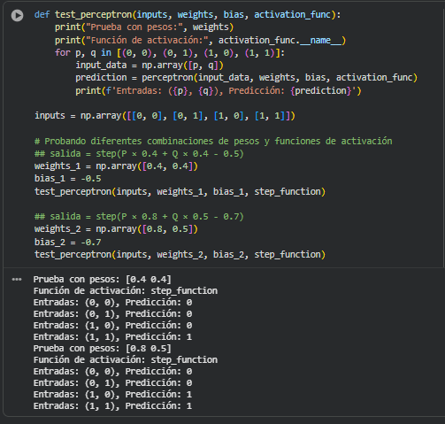

### Interpretación

En la compuerta AND, la salida es 1 solamente cuando las dos entradas son 1.

Esto permite observar cómo se pueden utilizar los pesos y el bias para obtener este comportamiento.

## OR

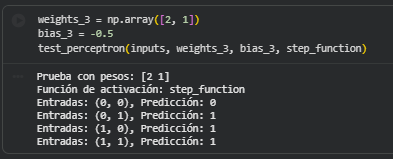

### Interpretación

En la compuerta OR, la salida es 1 cuando al menos una de las entradas es 1.

Al cambiar los pesos y el bias podemos hacer que el perceptrón represente este comportamiento.

## XOR

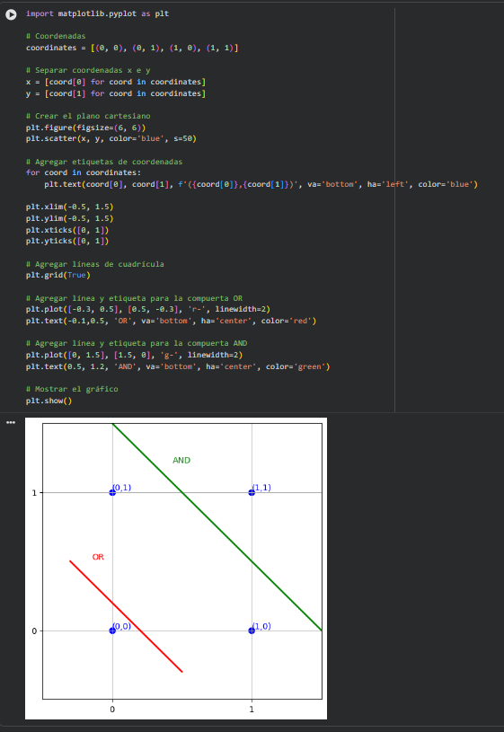

### Interpretación

En la compuerta XOR, la salida es 1 cuando las dos entradas son diferentes.

Este ejemplo permite observar una limitación del perceptrón simple, ya que una sola frontera de decisión no es suficiente para representar directamente XOR. Para resolver este tipo de problema se necesita combinar varias neuronas.

---
## Aplicación en Kartoffelmachine

De todo lo visto, la CNN es lo que más relación tiene con nuestro proyecto.

La idea sería reemplazar las imágenes de vidrio y plástico por imágenes reales de papas Chaucha.

El funcionamiento sería:
- La papa entra a la zona de inspección.
- Los rodillos hacen que la papa rote.
- La cámara toma imágenes mientras gira.
- Las imágenes se preparan para ingresar al modelo.
- La CNN analiza características como manchas, forma, textura o daños.
- Se determina si la papa es buena o mala.
- La Raspberry Pi recibe y procesa la decisión.
- El mecanismo dirige la papa al contenedor correspondiente.

Para aplicarlo realmente tendríamos que crear nuestro propio dataset con fotos de papas buenas y malas.
También sería importante tomar las imágenes con una iluminación parecida a la que tendrá el módulo real, para que el modelo no tenga problemas cuando se implemente en Kartoffelmachine.

---
# Conclusión

Con estos ejemplos podemos observar diferentes formas de utilizar las redes neuronales.

La **CNN** nos permitió trabajar con imágenes y clasificarlas según sus características. También pudimos analizar sus resultados mediante las curvas de entrenamiento, la matriz de confusión y Grad-CAM.

Con **Keras** pudimos crear una red neuronal de una manera más sencilla y utilizarla para clasificar reseñas de películas. Además, pudimos observar sus resultados y probar diferentes configuraciones del modelo.

Finalmente, el **perceptrón** nos permitió entender de una forma más básica cómo funciona una neurona artificial, utilizando entradas, pesos y una función de activación.

En general, estos ejemplos nos ayudaron a comprender cómo funcionan diferentes tipos de modelos de redes neuronales y cómo pueden utilizarse para resolver distintos problemas.
