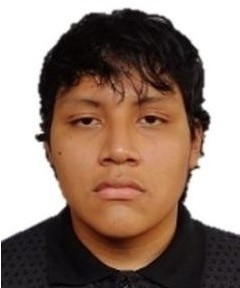
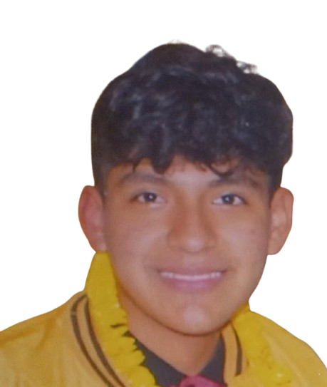
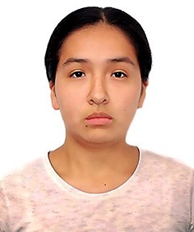
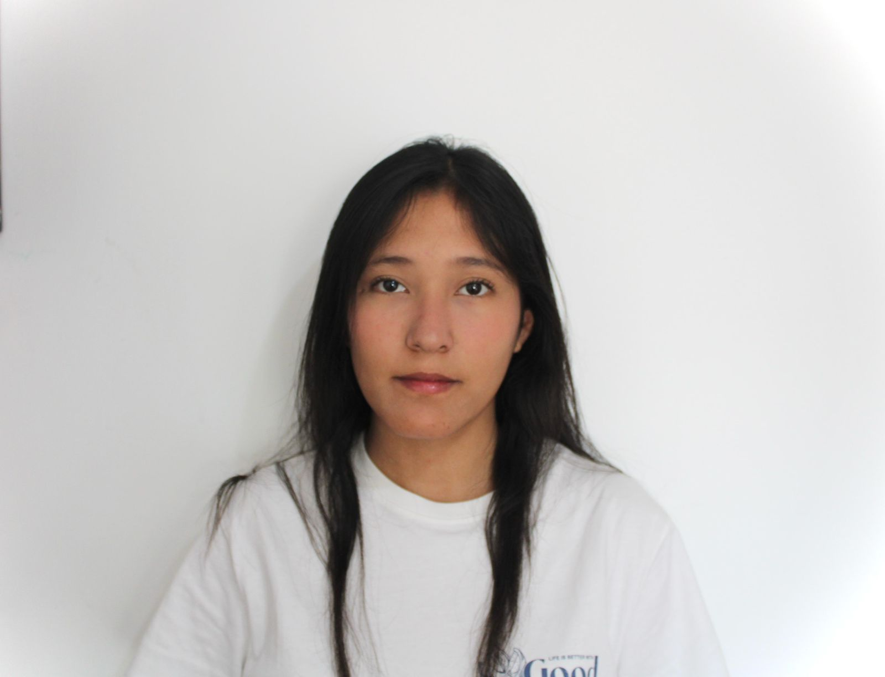

<!-- Encabezado Kartoffelmachine -->

  

  

  
  
  

  
  

  
  
  
  
  

 

## 🌍 Descripción del Equipo

El **Equipo 10** del curso **Proyecto Integrador 2026-2** está conformado por estudiantes de las carreras de **Ingeniería Informática e Ingeniería Ambiental**.

Nuestro proyecto se denomina **Kartoffelmachine**, un clasificador inteligente de papas canchan, el cual utiliza herramientas de **programación, diseño de prototipado y machine learning, una rama de la inteligencia artificial**.

Este tiene la finalidad de optimizar el proceso de clasificación de papas y evitar su desperdicio en posibles ventas.

De acuerdo con lo expresado, nuestro proyecto está relacionado principalmente con los siguientes **Objetivos de Desarrollo Sostenible (ODS):**

### ♻️ ODS 12: Producción y Consumo Responsables

**Meta específica:**

* **12.3:** De aquí a 2030, reducir a la mitad el desperdicio de alimentos per cápita mundial en la venta al por menor y a nivel de los consumidores, y reducir las pérdidas de alimentos en las cadenas de producción y suministro, incluidas las pérdidas posteriores a la cosecha.

### 💡 ODS 9: Industria, Innovación e Infraestructura

* **9.5:** Aumentar la investigación científica y mejorar la capacidad tecnológica de los sectores industriales de todos los países, en particular los países en desarrollo, entre otras cosas fomentando la innovación y aumentando considerablemente, de aquí a 2030, el número de personas que trabajan en investigación y desarrollo por millón de habitantes y los gastos de los sectores público y privado en investigación y desarrollo

## 📸 Fotografía del Equipo

  
   
  <em>Figura 1. Fotografía del Equipo 10</em>

---

## 👥 Integrantes del Equipo

| Foto                                                  | Nombre                                    | Rol                          | Intereses                                        |
| ----------------------------------------------------- | ----------------------------------------- | ---------------------------- | ------------------------------------------------ |
|    | **Josue Cristhian Mateo Mogollon Flores** | Líder del equipo             | Innovación, tecnología y sostenibilidad          |
|  | **Mathias Dylan Henry Quispe Charres**    | Diseñador / Modelador        | Diseño de prototipos, modelado 3D y programación |
|    | **Nicole Jacqueline Anyosa Barrientos**   | Responsable de investigación | Investigación y desarrollo sostenible            |
|    | **Dayra Martina Kuang Mauricio**          | Encargada de documentación   | Documentación y comunicación                     |

---

## 📌 Resumen Final

Este README presenta al **Equipo 10**, sus integrantes y el proyecto **Kartoffelmachine**, el cual continuaremos desarrollando durante el curso de **Proyecto Integrador 2026-2**, con énfasis en tecnología, innovación y producción responsable.
