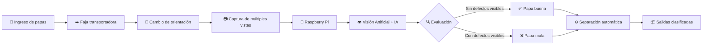

<!-- Encabezado Kartoffelmachine -->

<p align="center">
  
</p>

<p align="center">
  
</p>

<p align="center">
  
  
  
</p>

<p align="center">
  
  
</p>

<p align="center">
  
  
  
  
  
</p>

<br>


---

<!--                DESCRIPCIÓN DEL PROYECTO                      -->

<div align="center">

## 🌍 Kartoffelmachine


<br>


<br><br>

> 🥔 **Sistema inteligente para inspeccionar, analizar y clasificar papas de manera automática.**

</div>

---

## 👥 Sobre nosotros

El **Equipo 10** del curso **Proyecto Integrador 2026-2** está conformado por estudiantes de las carreras de **Ingeniería Informática e Ingeniería Ambiental** de la **Universidad Peruana Cayetano Heredia (UPCH)**.

Nuestro proyecto se denomina **Kartoffelmachine** y consiste en el desarrollo de un sistema mecatrónico de **inspección continua de papas** que integra:

<div align="center">

| ⚙️ Mecatrónica | 👁️ Visión Artificial | 🧠 Inteligencia Artificial | 💻 Computación |
|:---:|:---:|:---:|:---:|
| Transporte y separación | Captura de imágenes | Machine Learning | Raspberry Pi |

</div>

El sistema está orientado principalmente a la inspección de papas del **grupo Phureja**, como la papa **criolla o chaucha**, buscando identificar **defectos externos visibles** mientras los tubérculos avanzan continuamente por el sistema.

---

<details>
<summary><h2>🥔 ¿Qué es Kartoffelmachine?</h2></summary>

<br>

**Kartoffelmachine** es un sistema diseñado para automatizar parte del proceso de inspección y selección de papas.

A diferencia de una inspección estática en la que se analiza un tubérculo detenido, nuestra propuesta busca trabajar con un **flujo continuo de papas mediante una faja transportadora**.

Durante el recorrido:

1. 🥔 Las papas ingresan al sistema.
2. ➡️ Son transportadas mediante una **faja transportadora**.
3. 🔄 Cambian de orientación para exponer diferentes zonas de su superficie.
4. 📷 Una cámara captura **múltiples vistas** de cada papa.
5. 🧠 Una **Raspberry Pi** procesa las imágenes mediante visión artificial.
6. 🔍 El modelo de inteligencia artificial analiza posibles defectos visibles.
7. ✅❌ Cada tubérculo es clasificado como **papa buena** o **papa mala**.
8. 🚪 Un mecanismo de separación automática dirige cada papa hacia su salida correspondiente.

<br>

<div align="center">

### 🥔 ➜ ➡️ ➜ 🔄 ➜ 📷 ➜ 🧠 ➜ ✅ / ❌ ➜ 🚪

**Ingreso → Transporte → Giro → Captura → IA → Clasificación → Separación**

</div>

<br>

</details>

---

## ⚙️ ¿Cómo funciona?



---

<details>
<summary><h2>🎯 ¿Qué problema buscamos solucionar?</h2></summary>

<br>

La inspección de productos agrícolas puede depender en gran medida de una **evaluación visual**, especialmente cuando se busca identificar daños, alteraciones superficiales o características no deseadas.

Cuando este proceso se realiza manualmente puede presentar limitaciones relacionadas con:

- ⏱️ Tiempo empleado en la inspección.
- 👁️ Dependencia de la evaluación visual humana.
- 🔄 Dificultad para observar diferentes caras del tubérculo.
- 📦 Necesidad de procesar mayores cantidades de producto.
- 🥔 Separación manual de los productos evaluados.

Por ello, **Kartoffelmachine propone automatizar la inspección mediante visión artificial**, permitiendo analizar diferentes zonas de cada papa y realizar posteriormente su separación automática.

<br>

</details>

---

<details>
<summary><h2>💡 Nuestra solución</h2></summary>

<br>

Nuestra propuesta integra diferentes áreas de ingeniería en un único sistema:

| Componente | Función |
|---|---|
| 🥔 **Ingreso de papas** | Permitir el ingreso continuo de los tubérculos |
| ➡️ **Faja transportadora** | Desplazar las papas durante la inspección |
| 🔄 **Sistema de orientación** | Cambiar la posición de las papas durante el recorrido |
| 📷 **Cámara** | Capturar múltiples vistas de la superficie |
| 🍓 **Raspberry Pi** | Ejecutar el procesamiento de las imágenes |
| 👁️ **Visión artificial** | Analizar las características visibles |
| 🧠 **Machine Learning** | Determinar la clasificación de cada papa |
| ⚙️ **Actuador / Servo** | Ejecutar la separación automática |
| 📦 **Salidas** | Recibir las papas según su clasificación |

### Clasificación final

<div align="center">

| ✅ PAPA BUENA | ❌ PAPA MALA |
|:---:|:---:|
| Sin defectos externos considerados críticos | Con defectos externos detectados |
| Continúa hacia la salida correspondiente | Es desviada hacia otra salida |

</div>

<br>

</details>

---

## 🔬 Principio de inspección

Uno de los principales retos del proyecto es que una sola fotografía **no permite observar toda la superficie de una papa**.

Por esta razón, Kartoffelmachine plantea realizar un **cambio de orientación del tubérculo durante su desplazamiento**.


Esto permite proporcionar al sistema de visión artificial **más información visual sobre cada tubérculo** antes de determinar su clasificación.

---

## 🚀 Objetivos de Kartoffelmachine

<table>
<tr>
<td width="50%">

### 👁️ Inspección

Obtener diferentes vistas de la superficie de cada papa durante su recorrido.

</td>

<td width="50%">

### 🧠 Inteligencia

Utilizar visión artificial y Machine Learning para analizar los tubérculos.

</td>
</tr>

<tr>
<td width="50%">

### ⚡ Automatización

Reducir la intervención manual durante el proceso de inspección y clasificación.

</td>

<td width="50%">

### 📦 Clasificación

Separar automáticamente las papas según el resultado obtenido por el sistema.

</td>
</tr>
</table>

---

## 🧩 Tecnologías involucradas

<div align="center">

### 💻 Software


### ⚙️ Hardware


### 🧠 Inteligencia Artificial


</div>

---

# 🌱 Objetivos de Desarrollo Sostenible

<div align="center">

Kartoffelmachine se relaciona principalmente con los:

### ♻️ ODS 12 + 💡 ODS 9

</div>

---

<details>
<summary><h2>♻️ ODS 12 — Producción y Consumo Responsables</h2></summary>

<br>

### 🎯 Meta 12.3

> De aquí a 2030, reducir a la mitad el desperdicio de alimentos per cápita mundial en la venta al por menor y a nivel de los consumidores, y reducir las pérdidas de alimentos en las cadenas de producción y suministro, incluidas las pérdidas posteriores a la cosecha.

### 🔗 Relación con Kartoffelmachine

El proyecto busca contribuir a mejorar los procesos de **inspección y selección de productos agrícolas**, utilizando tecnologías que permitan identificar automáticamente las condiciones externas de los tubérculos.

Una clasificación más eficiente puede facilitar la toma de decisiones durante etapas posteriores a la cosecha y contribuir al aprovechamiento adecuado de los productos agrícolas.

<br>

<div align="center">

**🥔 Producción → 🔍 Inspección → 🧠 Evaluación → 📦 Clasificación → ♻️ Mejor aprovechamiento**

</div>

<br>

</details>

---

<details>
<summary><h2>💡 ODS 9 — Industria, Innovación e Infraestructura</h2></summary>

<br>

### 🎯 Meta 9.5

> Aumentar la investigación científica y mejorar la capacidad tecnológica de los sectores industriales, fomentando la innovación y aumentando las capacidades de investigación y desarrollo.

### 🔗 Relación con Kartoffelmachine

Kartoffelmachine integra diferentes tecnologías:

- 🧠 Inteligencia Artificial
- 👁️ Visión Artificial
- ⚙️ Mecatrónica
- 🍓 Sistemas embebidos
- 📷 Procesamiento de imágenes
- 🤖 Automatización

Estas herramientas permiten desarrollar una solución tecnológica aplicada al **sector agroalimentario**, promoviendo la investigación, innovación y aplicación de ingeniería en procesos agrícolas.

<br>

</details>

---

## 🧠 Kartoffelmachine en una mirada

<div align="center">

```text
             KARTOFFELMACHINE
                     │
                     ▼
                  🥔 🥔 🥔
                     │
                     ▼
           ┌─────────────────┐
           │      FAJA       │
           │ TRANSPORTADORA  │
           └────────┬────────┘
                    │
                    ▼
                  🔄 🥔
             Cambio de
             orientación
                    │
                    ▼
                  📷
          Captura de múltiples
                 vistas
                    │
                    ▼
             ┌────────────┐
             │ Raspberry  │
             │     Pi     │
             └──────┬─────┘
                    │
                    ▼
               🧠 IA / ML
                    │
             ┌──────┴──────┐
             ▼             ▼
          ✅ BUENA       ❌ MALA
             │             │
             └──────┬──────┘
                    ▼
             ⚙️ SEPARACIÓN
                AUTOMÁTICA
```

</div>

---

<div align="center">

## 🚀 Nuestra propuesta

> **Kartoffelmachine busca transformar la inspección convencional de papas en un proceso continuo, automatizado e inteligente mediante la integración de mecatrónica, visión artificial e inteligencia artificial.**

### 🥔 + ⚙️ + 📷 + 🧠 = Kartoffelmachine

<br>

**Equipo 10 · Proyecto Integrador 2026-2 · UPCH**

</div>

---


---
## 📸 Fotografía del Equipo

<p align="center">
  
  <br>
  <em>Figura 1. Fotografía del Equipo 10</em>
</p>

---

## 👥 Integrantes del Equipo

| Foto                                                  | Nombre                                    | Rol                          | Intereses                                        |
| ----------------------------------------------------- | ----------------------------------------- | ---------------------------- | ------------------------------------------------ |
|    | **Josue Cristhian Mateo Mogollon Flores** | Líder del equipo             | Innovación, tecnología y sostenibilidad          |
|  | **Mathias Dylan Henry Quispe Charres**    | Diseñador / Modelador        | Diseño de prototipos, modelado 3D y programación |
|    | **Nicole Jacqueline Anyosa Barrientos**   | Responsable de investigación | Investigación y desarrollo sostenible            |
|    | **Dayra Martina Kuang Mauricio**          | Encargada de documentación   | Documentación y comunicación                     |

---

## 📌 Resumen Final

Este README presenta al **Equipo 10**, sus integrantes y el proyecto **Kartoffelmachine**, el cual continuaremos desarrollando durante el curso de **Proyecto Integrador 2026-2**, con énfasis en tecnología, innovación y producción responsable.
