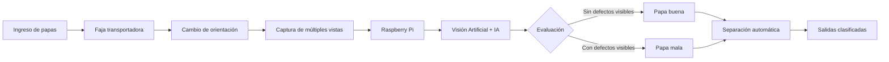
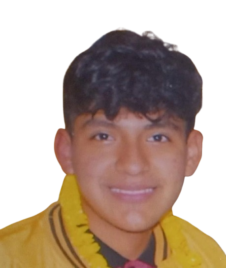
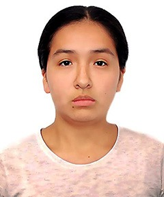
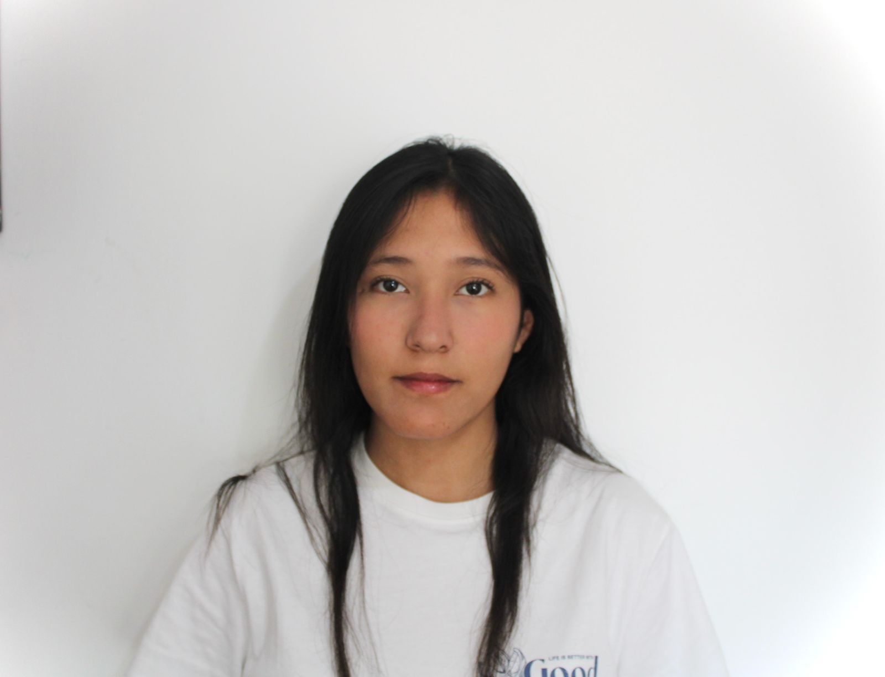

<!-- Encabezado Kartoffelmachine -->

<p align="center">
  
</p>

<p align="center">
  
</p>

<p align="center">
  
  
  
</p>

<p align="center">
  
  
</p>

<p align="center">
  
  
  
  
  
</p>

<br>

---

<!-- DESCRIPCIÓN DEL PROYECTO -->

<div align="center">

## Kartoffelmachine


<br>


<br><br>

> **Sistema inteligente para inspeccionar, analizar y clasificar papas de manera automática.**

------

</div>

---

<details>
<summary><h2>Problemática</h2></summary>

<br>

La papá es un tuberculo cuyo origen se remonta a Perú aproximadamente hace unos 7000 años. El banco de germoplasma del Centro Internacional de la Papa, considerado el más grande del mundo en su tipo, ha registrado más de 4 000 variedades de papa cultivada provenientes de diferentes partes del mundo. De estas, aproximadamente 3 000 fueron recolectadas en el Perú [7].

Consecuentemente, el cultivo de papa se convirtió en una estrategia de subsistencia de la población, en especial para las ubicadas en las zonas altoandinas [1]. Según Pradel, economista agrícola del CIP con sede en Lima: “La papa es un cultivo fundamental para la seguridad alimentaria, que sustenta los medios de subsistencia de 700,000 personas, pero cada vez es más difícil de cultivar”. [6]

El informe de la FAO (Food and Agriculture Organization of the United Nations) titulado *Strengthening Potato Value Chains* presenta una investigación relacionada con la post cosecha y las limitaciones presentes en la cadena de valor de la papa andina [1]. Según indica Manrique [1], debido a la ubicación geográfica existe una falta de asistencia técnica, lo que genera una cantidad limitada y variada de productos disponibles para la venta. Adicionalmente, su organización de venta está enfocada principalmente en las necesidades de la comunidad y no en las exigencias del mercado [1]. Esta situación incrementa los costos relacionados con la comercialización y las transacciones, así como los gastos por unidad asociados con la recolección, manipulación y transporte de los productos [1]. Esta situación se vió reflejada hasta 2019, año en el que la FAO indicó que en Perú se registraban perdidas (31.96%) de papa, desde el cultivo hasta la distribución [8]

Consideramos estas últimas situaciones las más controversiales, en las cuales se debe poner énfasis para buscar una solución. Como fue mencionado, se busca una mejora técnica que optimice y modernice el sistema de recolección y manipulación, que permita acelerar el transporte del tubérculo, para poder ofrecer una mayor cantidad de productos para la venta. En este sentido, para que sea aprovechable y se eviten mayores desperdicios a futuro.

Bajo estas ideas nació Kartoffelmaschine. Un sistema que busca resolver la problemática planteada.

<br>

</details>

---

<details>
<summary><h2>¿Qué es Kartoffelmachine?</h2></summary>

<br>

Nuestro proyecto se denomina **Kartoffelmaschine** y consiste en el desarrollo de un sistema mecatrónico de **inspección continua de papas** que integra:

<div align="center">

| Mecatrónica | Visión Artificial | Inteligencia Artificial | Computación |
|:---:|:---:|:---:|:---:|
| Transporte y separación | Captura de imágenes | Machine Learning | Raspberry Pi |

</div>

El sistema está orientado principalmente a la inspección de papas del **grupo Phureja**, como la papa **criolla o chaucha**, buscando identificar **defectos externos visibles** mientras los tubérculos avanzan continuamente por el sistema.

**Kartoffelmachine** es un sistema diseñado para automatizar parte del proceso de inspección y selección de papas.

A diferencia de una inspección estática en la que se analiza un tubérculo detenido, nuestra propuesta busca trabajar con un **flujo continuo de papas mediante una faja transportadora**.

Durante el recorrido:

1. Las papas ingresan al sistema.
2. Son transportadas mediante una **faja transportadora**.
3. Cambian de orientación para exponer diferentes zonas de su superficie.
4. Una cámara captura **múltiples vistas** de cada papa.
5. Una **Raspberry Pi** procesa las imágenes mediante visión artificial.
6. El modelo de inteligencia artificial analiza posibles defectos visibles.
7. Cada tubérculo es clasificado como **papa buena** o **papa mala**.
8. Un mecanismo de separación automática dirige cada papa hacia su salida correspondiente.

<br>

<div align="center">

### Ingreso → Transporte → Giro → Captura → IA → Clasificación → Separación

</div>

<br>

</details>

---

## ¿Cómo funciona?


```mermaid
flowchart LR

    A["Ingreso de papas"] --> B["Faja transportadora"]

    B --> C["Cambio de orientación"]

    C --> D["Captura de múltiples vistas"]

    D --> E["Raspberry Pi"]

    E --> F["Visión Artificial + IA"]

    F --> G{"Evaluación"}

    G -->|"Sin defectos visibles"| H["Papa buena"]

    G -->|"Con defectos visibles"| I["Papa mala"]

    H --> J["Separación automática"]

    I --> J

    J --> K["Salidas clasificadas"]
```
---

<details>
<summary><h2>Nuestra solución</h2></summary>

<br>

Nuestra propuesta integra diferentes áreas de ingeniería en un único sistema:

| Componente | Función |
|---|---|
| **Ingreso de papas** | Permitir el ingreso continuo de los tubérculos |
| **Faja transportadora** | Desplazar las papas durante la inspección |
| **Sistema de orientación** | Cambiar la posición de las papas durante el recorrido |
| **Cámara** | Capturar múltiples vistas de la superficie |
| **Raspberry Pi** | Ejecutar el procesamiento de las imágenes |
| **Visión artificial** | Analizar las características visibles |
| **Machine Learning** | Determinar la clasificación de cada papa |
| **Actuador / Servo** | Ejecutar la separación automática |
| **Salidas** | Recibir las papas según su clasificación |

### Clasificación final

<div align="center">

| PAPA BUENA | PAPA MALA |
|:---:|:---:|
| Sin defectos externos considerados críticos | Con defectos externos detectados |
| Continúa hacia la salida correspondiente | Es desviada hacia otra salida |

</div>

<br>

</details>

---

## Principio de inspección

Uno de los principales retos del proyecto es que una sola fotografía **no permite observar toda la superficie de una papa** [2][3].

Por esta razón, Kartoffelmachine plantea realizar un **cambio de orientación del tubérculo durante su desplazamiento**.


```mermaid
flowchart LR

    A["Vista inicial"] --> B["Giro"]
    B --> C["Vista lateral"]
    C --> D["Giro"]
    D --> E["Nueva superficie visible"]
    E --> F["Múltiples imágenes"]
    F --> G["Análisis conjunto"]
```

Esto permite proporcionar al sistema de visión artificial **más información visual sobre cada tubérculo** antes de determinar su clasificación [2][3].

---

## Objetivos de Kartoffelmachine

<table>
<tr>
<td width="50%">

### Inspección

Obtener diferentes vistas de la superficie de cada papa durante su recorrido.

</td>

<td width="50%">

### Inteligencia

Utilizar visión artificial y Machine Learning para analizar los tubérculos.

</td>
</tr>

<tr>
<td width="50%">

### Automatización

Reducir la intervención manual durante el proceso de inspección y clasificación.

</td>

<td width="50%">

### Clasificación

Separar automáticamente las papas según el resultado obtenido por el sistema.

</td>
</tr>
</table>

---

## Tecnologías involucradas

<div align="center">

### Software


### Hardware


### Inteligencia Artificial


</div>

---

# Objetivos de Desarrollo Sostenible

<div align="center">

Kartoffelmachine se relaciona principalmente con los:

### ODS 12 + ODS 9

</div>

<br>

<div align="center">


</div>

---

<details>
<summary><h2>ODS 9 — Industria, Innovación e Infraestructura</h2></summary>

<br>

### Meta 9.5

> Aumentar la investigación científica y mejorar la capacidad tecnológica de los sectores industriales de todos los países, en particular los países en desarrollo, entre otras cosas fomentando la innovación...” [5].

### Relación con Kartoffelmachine

El crecimiento económico, el desarrollo social y la acción por el clima van de la mano con las inversiones en infraestructura y en especial 
el desarrollo industrial sostenible y el proceso tecnológico. El gran crecimiento económico ha dejado evidente las desigualdades que existen 
en el mercado mundial. Por ello, se busca un crecimiento sostenible que implique una industrialización que permita oportunidades a todas las 
personas y apoyo en innovación tecnológica e infraestructuras resistentes [5]. 

En este sentido, Kartoffelmaschine busca brindar una asistencia técnica en el proceso de selección/filtro de papas. La optimización de este 
proceso es fundamental para evitar el aumento de gastos por unidad asociados con la recolección, manipulación y transporte de los productos. 
Y de igual manera, reducir las pérdidas registradas desde el cultivo hasta la distribución.

<br>
</details>

---

<details>
<summary><h2>ODS 12 — Producción y Consumo Responsables</h2></summary>

<br>

### Meta 12.3

> De aquí a 2030, reducir a la mitad el desperdicio de alimentos per cápita mundial en la venta al por menor y a nivel de los consumidores,
> y reducir las pérdidas de alimentos en las cadenas de producción y suministro, incluidas las pérdidas posteriores a la cosecha [4].

### Relación con Kartoffelmachine

Un indicio de consumo excesivo es el desperdicio de alimentos. Anualmente, se desperdicia una cantidad asombrosa de 931 millones de toneladas 
de alimentos. No obstante, es posible abordar esta problemática a través de inversiones en tecnologías, enseñanzas y supervisión. 

Por consiguiente, nuestro proyecto busca contribuir a mejorar los procesos de filtro y selección de la papa, utilizando tecnologías que permitan 
identificar automáticamente las condiciones externas del tuberculo. Una clasificación más eficiente puede facilitar la toma de decisiones durante
etapas posteriores a la cosecha y así acelerar el proceso de transporte y distribución, por ende, contribuir al aprovechamiento máximo del tubérculo.

<br>
</details>

----

## Kartoffelmachine en una mirada

<div align="center">

```text
             KARTOFFELMACHINE
                     │
                     ▼
                  PAPAS
                     │
                     ▼
           ┌─────────────────┐
           │      FAJA       │
           │ TRANSPORTADORA  │
           └────────┬────────┘
                    │
                    ▼
                  PAPA
             Cambio de
             orientación
                    │
                    ▼
                 CÁMARA
          Captura de múltiples
                 vistas
                    │
                    ▼
             ┌────────────┐
             │ Raspberry  │
             │     Pi     │
             └──────┬─────┘
                    │
                    ▼
                 IA / ML
                    │
             ┌──────┴──────┐
             ▼             ▼
           BUENA          MALA
             │             │
             └──────┬──────┘
                    ▼
               SEPARACIÓN
               AUTOMÁTICA
```

</div>

---

## Fotografía del Equipo

<p align="center">
  
  <br>
  <em>Figura 1. Fotografía del Equipo 10</em>
</p>

---

## Integrantes del Equipo

Somos el **Grupo 10** del curso **Proyecto Integrador**, semestre 2026-02. Nuestro equipo esta conformado por estudiantes de las carreras de **Ingeniería Informática e Ingeniería Ambiental** de la **Universidad Peruana Cayetano Heredia (UPCH)**.

| Foto | Nombre | Rol | Intereses |
|---|---|---|---|
|  | **Josue Cristhian Mateo Mogollon Flores** | Líder del equipo | Innovación, tecnología y sostenibilidad |
|  | **Mathias Dylan Henry Quispe Charres** | Diseñador / Modelador | Diseño de prototipos, modelado 3D y programación |
|  | **Nicole Jacqueline Anyosa Barrientos** | Responsable de investigación | Investigación y desarrollo sostenible |
|  | **Dayra Martina Kuang Mauricio** | Encargada de documentación | Documentación y comunicación |

---

## Referencias
[1] Cromme N, Prakash AB, Lutaladio N, Ezeta F, editores. Strengthening potato value chains: Technical and policy options for developing countries [Internet]. Rome: Food and Agriculture Organization of the United Nations; 2010. 
Disponible en: https://www.fao.org/4/i1710e/i1710e.pdf

[2] Su Q, Kondo N, Li M, Sun H, Al Riza DF, Habaragamuwa H. Potato quality grading based on machine vision and 3D shape analysis. Comput Electron Agric. 2018. 
Disponible en: https://doi.org/10.1016/j.compag.2018.07.012

[3] Su Q, Kondo N, Al Riza DF, Habaragamuwa H. Potato quality grading based on depth imaging and convolutional neural network. J Food Qual. 2020. 
en: https://doi.org/10.1155/2020/8815896

[4] United Nations. Goal 12: Ensure sustainable consumption and production patterns [Internet]. New York: United Nations; [citado 3 oct 2026]. 
Disponible en: https://www.un.org/sustainabledevelopment/es/sustainable-consumption-production/

[5] United Nations. Goal 9: Build resilient infrastructure, promote inclusive and sustainable industrialization and foster innovation [Internet]. New York: United Nations; [citado 3 oct 2026]. 
Disponible en: https://www.un.org/sustainabledevelopment/es/infrastructure/

[6] Centro Internacional de la Papa. Aumento de los beneficios de la papa en el Perú [Internet]. Lima: Centro Internacional de la Papa; [citado 3 oct 2026]. 
Disponible en: https://cipotato.org/es/cip_50/historias/aumento-beneficios-papa-peru/

[7] Ministerio de Agricultura y Riego, Instituto Nacional de Innovación Agraria. Catálogo de variedades de papa nativa [Internet]. Lima: Instituto Nacional de Innovación Agraria; 2017. 
Disponible en: https://cipotato.org/es/cip_50/historias/aumento-beneficios-papa-peru/

[8] Redacción. La papa es el tercer alimento que más se desperdicia en Perú [Internet]. Agraria.pe. 2019. [citado 3 oct 2026]. 
Disponible en: https://www.agraria.pe/noticias/la-papa-es-el-tercer-alimento-que-mas-se-desperdicia-en-peru-19781

---

## Resumen Final

Este README presenta al **Equipo 10**, sus integrantes y el proyecto **Kartoffelmachine**, el cual continuaremos desarrollando durante el curso de **Proyecto Integrador 2026-2**, con énfasis en tecnología, innovación y producción responsable.
